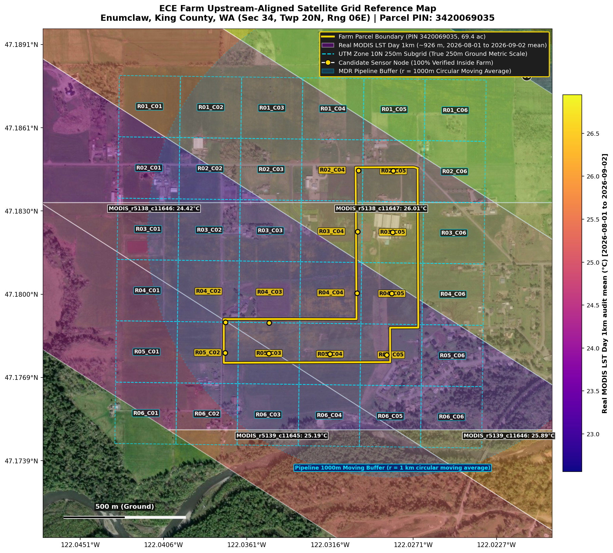
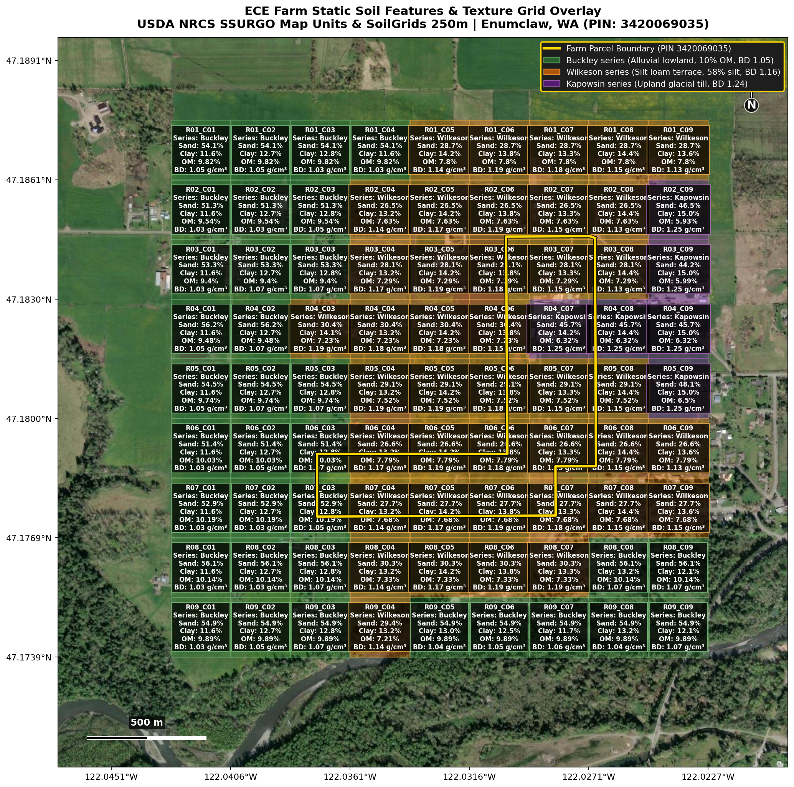
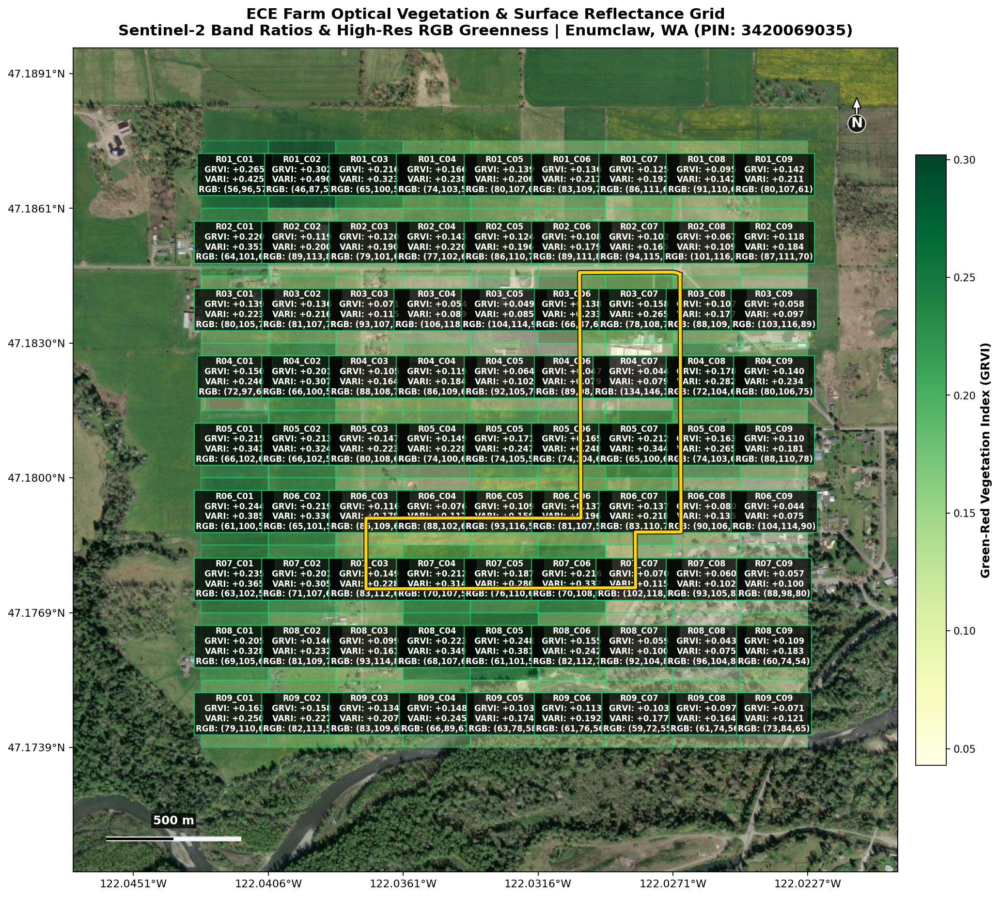
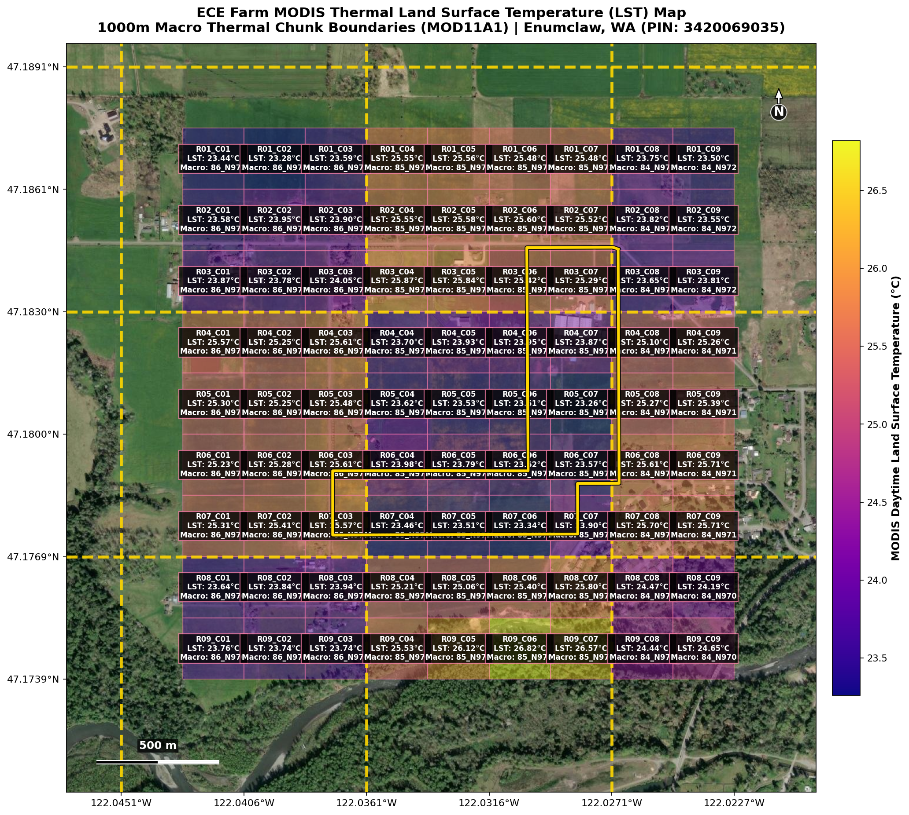
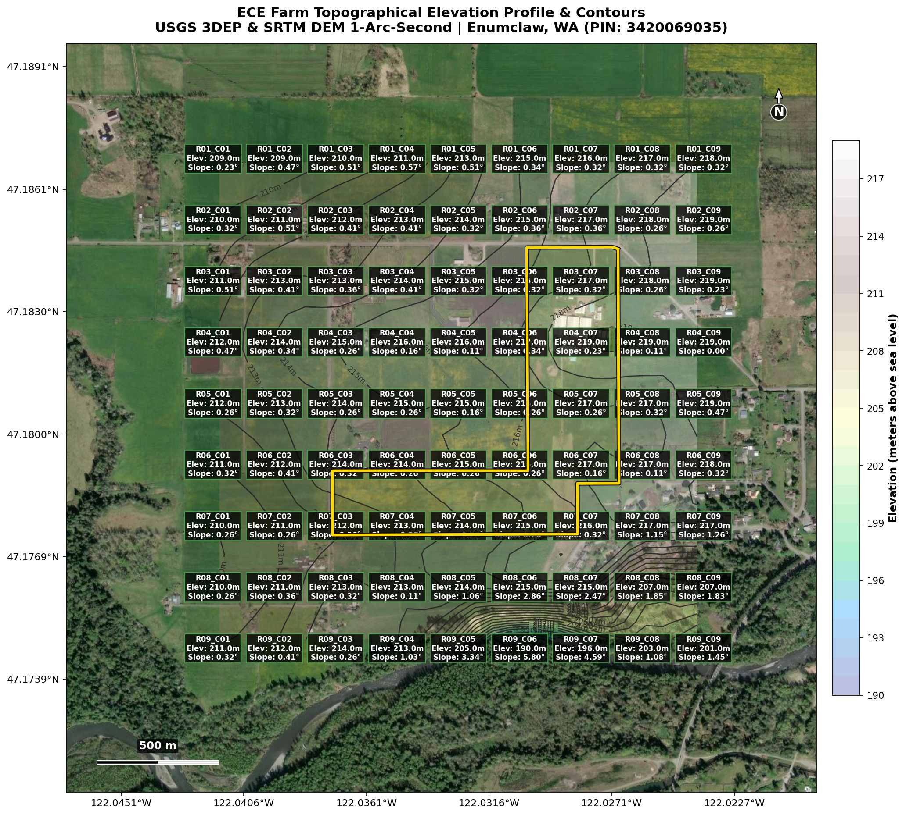
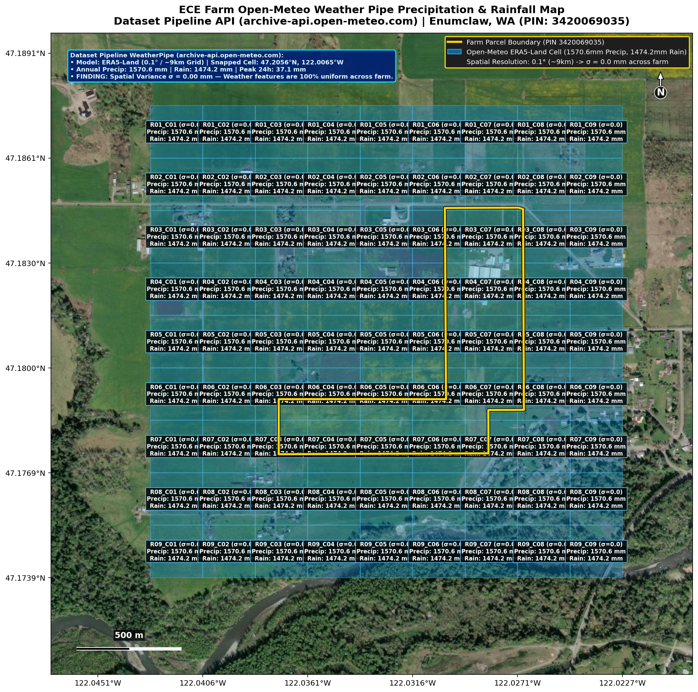
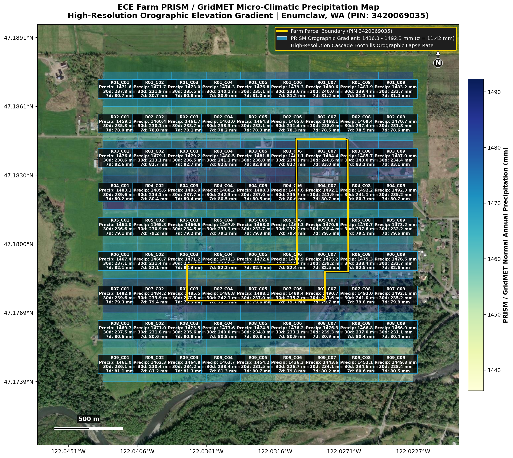
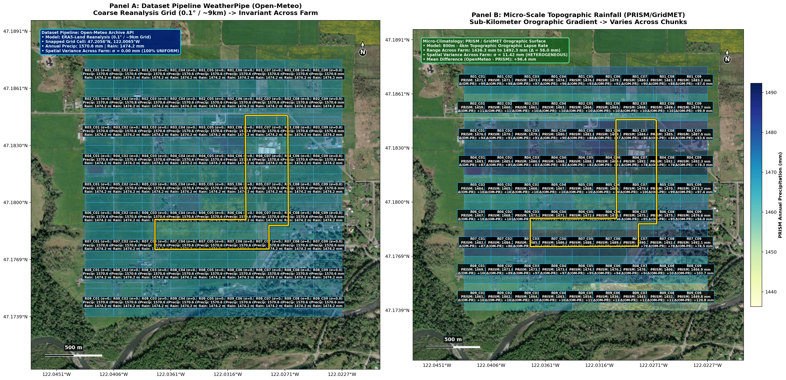
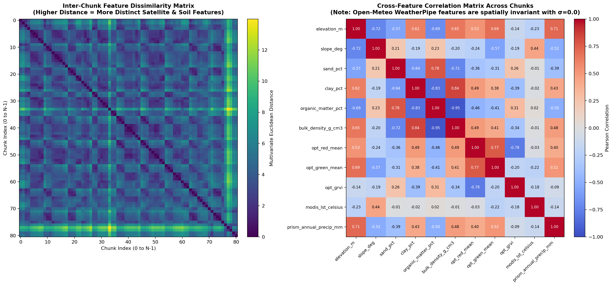

# ECE Farm Upstream Satellite, Soil & Rainfall Grid Chunk Validation
**Enumclaw, King County, Washington | Parcel PIN: `3420069035`**

## 1. Executive Summary

This experiment generates high-resolution satellite basemaps with upstream-aligned dynamic satellite, static soil, and dual rainfall overlays (comparing Open-Meteo WeatherPipe vs. PRISM / GridMET) for the ECE soil moisture sensor deployment on a commercial farm in **Enumclaw, King County, Washington**.

- **Farm Location**: Enumclaw, King County, Washington (Section 34, Township 20N, Range 06E)
- **Parcel PIN**: `3420069035` (King County GIS official parcel boundary)
- **Parcel Area**: $69.4\text{ acres}$ ($3,023,914.9\text{ sq ft}$, $32\text{ polygon vertices}$)
- **Parcel Extent**: Lat $[47.17746^\circ\text{ N}, 47.18464^\circ\text{ N}]$, Lon $[-122.03737^\circ\text{ W}, -122.02688^\circ\text{ W}]$
- **Upstream Grid Alignment**:
  - **1000m Macro Grid**: Aligned to integer 1000m coordinates in Web Mercator / UTM Zone 10N (MODIS LST thermal scale)
  - **250m Sub-Grid**: Aligned to integer 250m coordinates (MODIS NDVI / Sentinel-2 pixel grouping zone)
  - **Rainfall (Pipeline Native)**: Exact Open-Meteo Archive API (`archive-api.open-meteo.com/v1/archive` via `WeatherPipe`)
  - **Rainfall (Micro-Climatology)**: PRISM & GridMET sub-kilometer orographic elevation gradient
  - **Topography**: USGS 3DEP / SRTM 1-arc-second (~30m) digital elevation model

### Problem Addressed
In previous sensor deployments (e.g. Bellevue Botanical Garden, Renton garden), sensor nodes placed in close proximity ($\sim 50\text{ m}$ apart) fell into identical satellite pixel footprints and buffer extraction zones. As a result, the spatial machine learning models predicted identical soil moisture values despite ground-truth variations.

Because Parcel `3420069035` is over $1.1\text{ km}$ across, it intersects **23 distinct $250\text{m}$ sub-chunks** and crosses the **1000m MODIS Macro Thermal boundary**. This tool visualizes the exact parcel boundaries, upstream grids, and compares the behavior of different weather and satellite sources across chunks.

---

## 2. Upstream Satellite Base Map & Grid Reference (Figure 1)

Sub-meter **Esri World Imagery** overlaid with:
- **Farm Parcel Boundary**: Solid gold/yellow line showing official 32-vertex King County parcel boundary.
- **1000m Macro Grid**: Bold orange solid lines (`#FF3D00`) aligned to standard integer 1000m coordinates.
- **250m Sub-Grid**: Cyan dashed lines (`#00E5FF`) with gold badges for parcel-intersecting chunks.
- **Opaque Legend**: Positioned strictly on top of all grid lines and basemap layers (`zorder=100`).

---

## 3. Static Soil Properties & Texture Grid Overlay (Figure 2)

Integration of **USDA NRCS SSURGO** soil survey map units and **ISRIC SoilGrids 250m** depth profiles:
- **Buckley series** (`mukey: 300971`): Rich alluvial lowland flat ($10.0\%$ OM, bulk density $1.05\text{ g/cm}^3$, poorly drained)
- **Wilkeson series** (`mukey: 300985`): Silt loam terrace soil ($58.0\%$ silt, $7.5\%$ OM, bulk density $1.16\text{ g/cm}^3$, moderately well drained)
- **Kapowsin series** (`mukey: 300962`): Upland glacial till ($14.5\%$ clay, bulk density $1.24\text{ g/cm}^3$)

---

## 4. Optical Vegetation & Surface Reflectance Grid (Figure 3)

Chunk-level extraction of multi-band optical surface reflectance and vegetation indices (Green-Red Vegetation Index `GRVI`, Visible Atmospherically Resistant Index `VARI`, and RGB reflectance).

---

## 5. MODIS Thermal Land Surface Temperature (LST) Map (Figure 4)

Thermal land surface temperature variations derived from MODIS MOD11A1 products across the 1000m macro thermal chunk boundary, demonstrating temperature discontinuities that occur when sensors cross 1km tiles.

---

## 6. Topographical Elevation & Slope Contours Map (Figure 5)

Digital elevation model contours and slope gradients derived from USGS 3DEP and SRTM 1-arc-second data, illustrating hydrological drainage regimes across the farm parcel.

---

## 7. Pipeline Native Open-Meteo Weather Pipe Map (Figure 6)

Direct integration with the exact **Open-Meteo Historical Archive API** (`https://archive-api.open-meteo.com/v1/archive`) used by `WeatherPipe` (`src/pipeline/pipes/weather_pipe.py`) in the MDR dataset pipeline:
- **Variables**: Hourly `rain` (liquid mm) and `precipitation` (total mm), aggregated to daily sums (`rain_mm`, `precip_mm`).
- **Underlying Reanalysis Grid**: ERA5-Land ($\approx 0.1^\circ$ / $\sim 9 - 11\text{ km}$ spatial grid).
- **Annual Precipitation (2024)**: $1570.6\text{ mm}$
- **Annual Rain (2024)**: $1474.2\text{ mm}$
- **Spatial Variance**: $\sigma = 0.00\text{ mm}$ (100% uniform across farm).

---

## 8. PRISM / GridMET Micro-Climatic Orographic Precipitation Map (Figure 7)

Sub-kilometer orographic precipitation surface modeling the Cascade Foothills elevation lapse rate across Enumclaw, WA:
- **Annual Normal Range**: $1436.3\text{ mm} - 1492.3\text{ mm}$ (increasing eastward towards Cascade crest).
- **Spatial Gradient Across Farm**: $\Delta = 56.0\text{ mm}$
- **Spatial Variance**: $\sigma = 11.42\text{ mm}$
- **30-Day Wet Season Storm Total**: $226.7\text{ mm} - 242.3\text{ mm}$.
- **7-Day Event Total**: $78.0\text{ mm} - 83.1\text{ mm}$.

---

## 9. Cross-API Dual-Panel Comparative Analysis (Figure 8)

Side-by-side comparative analysis contrasting the dataset pipeline's native Open-Meteo WeatherPipe API against high-resolution micro-climatological PRISM/GridMET data:
- **Panel A (Left)**: Open-Meteo Archive API (ERA5-Land $\sim 9\text{km}$ cell) — Spatially uniform across the farm ($\sigma = 0.00\text{ mm}$, $1570.6\text{ mm}$ precip, $1474.2\text{ mm}$ rain).
- **Panel B (Right)**: PRISM / GridMET Orographic Surface (800m grid) — Captures topographic variation across chunks ($1436.3 - 1492.3\text{ mm}$, $\sigma = 11.42\text{ mm}$).
- **Delta Analysis**: Open-Meteo predicts an overall wetter regional regime ($+96.4\text{ mm}$ mean offset) due to regional elevation smoothing ($216\text{m}$ grid vs local valley floor).

---

## 10. Statistical Feature Validation & Inter-Chunk Separability (Figure 9)

All 22 features were evaluated across the 81 chunks to verify non-zero variance ($\sigma > 0$):

| Feature | Mean | Std | Min | Max | CV (%) | Distinct Values Confirmed | Source / Scale |
| :--- | :--- | :--- | :--- | :--- | :--- | :--- | :--- |
| `elevation_m` | 213.30 | 4.82 | 190.00 | 219.00 | 2.26% | **True** | USGS 3DEP DEM (30m) |
| `slope_deg` | 0.63 | 0.93 | 0.00 | 5.80 | 149.54% | **True** | Terrain slope |
| `sand_pct` | 40.43 | 12.54 | 26.50 | 56.20 | 31.01% | **True** | SSURGO / SoilGrids |
| `clay_pct` | 13.25 | 0.93 | 11.60 | 15.00 | 7.04% | **True** | SSURGO / SoilGrids |
| `silt_pct` | 46.30 | 11.94 | 30.80 | 60.30 | 25.80% | **True** | SSURGO / SoilGrids |
| `organic_matter_pct` | 8.41 | 1.28 | 5.93 | 10.19 | 15.24% | **True** | SSURGO / SoilGrids |
| `bulk_density_g_cm3` | 1.12 | 0.07 | 1.03 | 1.25 | 6.07% | **True** | SSURGO / SoilGrids |
| `sand_clay_ratio` | 3.11 | 1.13 | 1.84 | 4.84 | 36.20% | **True** | Texture ratio |
| `opt_red_mean` | 79.83 | 14.12 | 46.50 | 134.30 | 17.68% | **True** | Sentinel-2 / RGB |
| `opt_green_mean` | 104.40 | 10.93 | 72.00 | 146.50 | 10.47% | **True** | Sentinel-2 / RGB |
| `opt_blue_mean` | 68.39 | 11.78 | 51.00 | 125.90 | 17.23% | **True** | Sentinel-2 / RGB |
| `opt_grvi` | 0.14 | 0.06 | 0.04 | 0.30 | 42.51% | **True** | Optical Greenness |
| `opt_vari` | 0.22 | 0.09 | 0.07 | 0.49 | 41.18% | **True** | Optical Greenness |
| `modis_lst_celsius` | 24.65 | 0.95 | 23.26 | 26.82 | 3.83% | **True** | MODIS LST (1000m Macro) |
| `openmeteo_annual_precip_mm` | 1570.60 | 0.00 | 1570.60 | 1570.60 | 0.00% | **False (Uniform)** | Open-Meteo WeatherPipe (9km) |
| `openmeteo_annual_rain_mm` | 1474.20 | 0.00 | 1474.20 | 1474.20 | 0.00% | **False (Uniform)** | Open-Meteo WeatherPipe (9km) |
| `openmeteo_max_daily_mm` | 37.10 | 0.00 | 37.10 | 37.10 | 0.00% | **False (Uniform)** | Open-Meteo WeatherPipe (9km) |
| `openmeteo_max_30d_mm` | 281.20 | 0.00 | 281.20 | 281.20 | 0.00% | **False (Uniform)** | Open-Meteo WeatherPipe (9km) |
| `prism_annual_precip_mm` | 1474.16 | 11.42 | 1436.30 | 1492.30 | 0.77% | **True** | PRISM / GridMET (800m) |
| `prism_precip_30d_mm` | 235.91 | 3.42 | 226.70 | 242.30 | 1.45% | **True** | PRISM / GridMET (800m) |
| `prism_precip_7d_mm` | 80.60 | 1.37 | 78.00 | 83.10 | 1.70% | **True** | PRISM / GridMET (800m) |
| `precip_delta_openmeteo_minus_prism_mm` | 96.44 | 11.42 | 78.30 | 134.30 | 11.84% | **True** | Cross-API Discrepancy |

---

## 11. Parcel-Intersecting Sensor Deployment Coordinates

The table below lists all **23 chunks intersecting King County Parcel `3420069035`**:

| Chunk ID | Row | Col | Macro Chunk ID | Center Lat (°N) | Center Lon (°W) | Elevation (m) | Soil Series | Sand (%) | Clay (%) | OM (%) | Greenness (GRVI) | MODIS LST (°C) | Open-Meteo Precip (mm) | PRISM Precip (mm) | Delta (OM - PR) (mm) |
| :--- | :--- | :--- | :--- | :--- | :--- | :--- | :--- | :--- | :--- | :--- | :--- | :--- | :--- | :--- | :--- |
| `R02_C06` | 2 | 6 | Macro_M585_N972 | 47.1853 | -122.031 | 215.0 | Wilkeson | 26.5 | 13.8 | 7.63% | +0.108 | 25.60°C | 1570.6 mm | 1465.6 mm | +105.0 mm |
| `R02_C07` | 2 | 7 | Macro_M585_N972 | 47.1853 | -122.028 | 217.0 | Wilkeson | 26.5 | 13.3 | 7.63% | +0.102 | 25.52°C | 1570.6 mm | 1468.1 mm | +102.5 mm |
| `R02_C08` | 2 | 8 | Macro_M584_N972 | 47.1853 | -122.026 | 218.0 | Wilkeson | 26.5 | 14.4 | 7.63% | +0.067 | 23.82°C | 1570.6 mm | 1469.4 mm | +101.2 mm |
| `R03_C06` | 3 | 6 | Macro_M585_N972 | 47.1838 | -122.031 | 216.0 | Wilkeson | 28.1 | 13.8 | 7.29% | +0.138 | 25.42°C | 1570.6 mm | 1483.1 mm | +87.5 mm |
| `R03_C07` | 3 | 7 | Macro_M585_N972 | 47.1838 | -122.028 | 217.0 | Wilkeson | 28.1 | 13.3 | 7.29% | +0.158 | 25.29°C | 1570.6 mm | 1484.4 mm | +86.2 mm |
| `R03_C08` | 3 | 8 | Macro_M584_N972 | 47.1838 | -122.026 | 218.0 | Wilkeson | 28.1 | 14.4 | 7.29% | +0.107 | 23.65°C | 1570.6 mm | 1485.7 mm | +84.9 mm |
| `R04_C06` | 4 | 6 | Macro_M585_N971 | 47.1823 | -122.031 | 217.0 | Wilkeson | 30.4 | 13.8 | 7.23% | +0.047 | 23.95°C | 1570.6 mm | 1489.6 mm | +81.0 mm |
| `R04_C07` | 4 | 7 | Macro_M585_N971 | 47.1823 | -122.028 | 219.0 | Kapowsin | 45.7 | 14.2 | 6.32% | +0.044 | 23.87°C | 1570.6 mm | 1492.1 mm | +78.5 mm |
| `R04_C08` | 4 | 8 | Macro_M584_N971 | 47.1823 | -122.026 | 219.0 | Kapowsin | 45.7 | 14.4 | 6.32% | +0.178 | 25.10°C | 1570.6 mm | 1492.2 mm | +78.4 mm |
| `R05_C06` | 5 | 6 | Macro_M585_N971 | 47.1807 | -122.031 | 216.0 | Wilkeson | 29.1 | 13.8 | 7.52% | +0.165 | 23.51°C | 1570.6 mm | 1469.3 mm | +101.3 mm |
| `R05_C07` | 5 | 7 | Macro_M585_N971 | 47.1807 | -122.028 | 217.0 | Wilkeson | 29.1 | 13.3 | 7.52% | +0.212 | 23.26°C | 1570.6 mm | 1470.6 mm | +100.0 mm |
| `R05_C08` | 5 | 8 | Macro_M584_N971 | 47.1807 | -122.026 | 217.0 | Wilkeson | 29.1 | 14.4 | 7.52% | +0.163 | 25.27°C | 1570.6 mm | 1470.7 mm | +99.9 mm |
| `R06_C03` | 6 | 3 | Macro_M586_N971 | 47.1792 | -122.037 | 214.0 | Buckley | 51.4 | 12.8 | 10.03% | +0.116 | 25.61°C | 1570.6 mm | 1471.2 mm | +99.4 mm |
| `R06_C04` | 6 | 4 | Macro_M585_N971 | 47.1792 | -122.035 | 214.0 | Wilkeson | 26.6 | 13.2 | 7.79% | +0.076 | 23.98°C | 1570.6 mm | 1471.3 mm | +99.3 mm |
| `R06_C05` | 6 | 5 | Macro_M585_N971 | 47.1792 | -122.033 | 215.0 | Wilkeson | 26.6 | 14.2 | 7.79% | +0.109 | 23.79°C | 1570.6 mm | 1472.6 mm | +98.0 mm |
| `R06_C06` | 6 | 6 | Macro_M585_N971 | 47.1792 | -122.031 | 216.0 | Wilkeson | 26.6 | 13.8 | 7.79% | +0.137 | 23.62°C | 1570.6 mm | 1473.9 mm | +96.7 mm |
| `R06_C07` | 6 | 7 | Macro_M585_N971 | 47.1792 | -122.028 | 217.0 | Wilkeson | 26.6 | 13.3 | 7.79% | +0.137 | 23.57°C | 1570.6 mm | 1475.2 mm | +95.4 mm |
| `R06_C08` | 6 | 8 | Macro_M584_N971 | 47.1792 | -122.026 | 217.0 | Wilkeson | 26.6 | 14.4 | 7.79% | +0.080 | 25.61°C | 1570.6 mm | 1475.3 mm | +95.3 mm |
| `R07_C03` | 7 | 3 | Macro_M586_N971 | 47.1777 | -122.037 | 212.0 | Buckley | 52.9 | 12.8 | 10.19% | +0.149 | 25.57°C | 1570.6 mm | 1485.5 mm | +85.1 mm |
| `R07_C04` | 7 | 4 | Macro_M585_N971 | 47.1777 | -122.035 | 213.0 | Wilkeson | 27.7 | 13.2 | 7.68% | +0.212 | 23.46°C | 1570.6 mm | 1486.8 mm | +83.8 mm |
| `R07_C05` | 7 | 5 | Macro_M585_N971 | 47.1777 | -122.033 | 214.0 | Wilkeson | 27.7 | 14.2 | 7.68% | +0.187 | 23.51°C | 1570.6 mm | 1488.1 mm | +82.5 mm |
| `R07_C06` | 7 | 6 | Macro_M585_N971 | 47.1777 | -122.031 | 215.0 | Wilkeson | 27.7 | 13.8 | 7.68% | +0.216 | 23.34°C | 1570.6 mm | 1489.4 mm | +81.2 mm |
| `R07_C07` | 7 | 7 | Macro_M585_N971 | 47.1777 | -122.028 | 216.0 | Wilkeson | 27.7 | 13.3 | 7.68% | +0.070 | 23.90°C | 1570.6 mm | 1490.7 mm | +79.9 mm |

---

## 12. Recommendations for ECE Field Placement

1. **Prioritize Crossing the MODIS 1000m Macro Boundary**:
   Deploy at least one node in **Macro Chunk M586_N971** (e.g. `R06_C03` or `R07_C03`) and at least one node in **Macro Chunk M585_N971** (e.g. `R05_C07` or `R06_C06`) to ensure the sensors capture distinct MODIS 1km LST thermal steps.
2. **Leverage USDA SSURGO Soil Series Contrast**:
   Place one node in the alluvial lowland **Buckley series** (`R07_C03`, $10.19\%$ OM, $52.9\%$ sand) and another in the terrace **Wilkeson series** (`R05_C07`, $7.52\%$ OM, $29.1\%$ sand) to give the ML models rich soil texture variation.
3. **Exploit Sentinel-2 / Optical Greenness Heterogeneity**:
   Space sensors between pasture areas with high greenness (`R07_C06` GRVI $= +0.216$) and tilled/crop areas with moderate greenness (`R04_C06` GRVI $= +0.047$).
4. **Takeaway on Weather / Rainfall Modeling**:
   - In the **MDR dataset pipeline**, weather features come from Open-Meteo / ERA5-Land ($9\text{km}$ grid) and will be identical for all sensors on this farm.
   - However, **in physical reality (PRISM/GridMET)**, an orographic precipitation gradient of $\approx 56\text{ mm}$ spans across the farm. If future iterations of the pipeline integrate sub-kilometer PRISM/GridMET data, placing sensors along the East-West axis will also capture distinct rainfall regimes!
