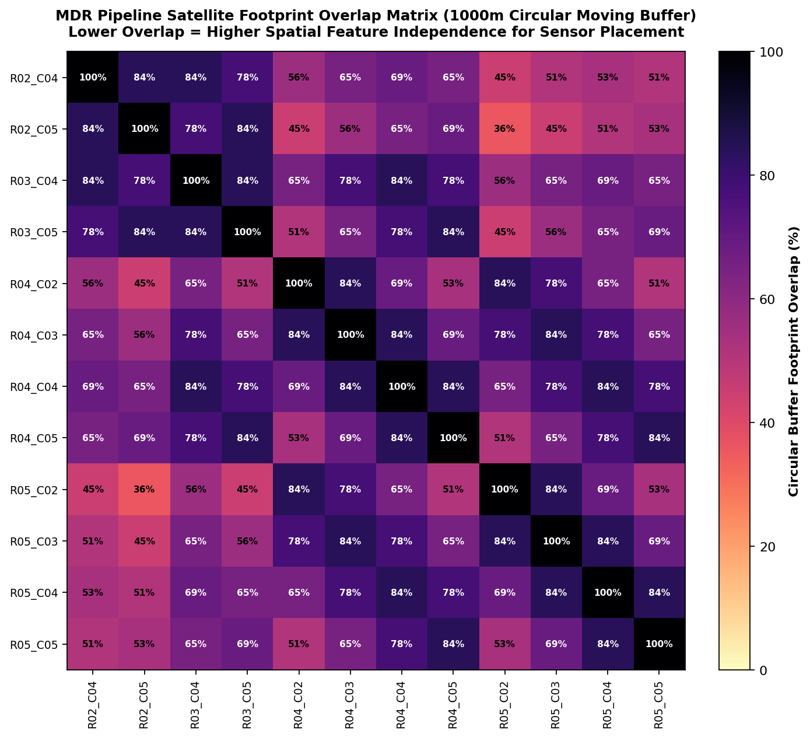

# ECE Farm Upstream Satellite, Soil & Rainfall Grid Chunk Validation
**Enumclaw, King County, Washington | Parcel PIN: `3420069035`**

## 1. Executive Summary

This experiment generates high-resolution satellite basemaps with upstream-aligned dynamic satellite, static soil, and dual rainfall overlays for the ECE soil moisture sensor deployment on a commercial farm in **Enumclaw, King County, Washington**.

- **Farm Location**: Enumclaw, King County, Washington (Section 34, Township 20N, Range 06E)
- **Parcel PIN**: `3420069035` (Official King County GIS parcel boundary)
- **Parcel Area**: $69.4\text{ acres}$ ($280,702.5\text{ m}^2$, $3,023,914.9\text{ sq ft}$, $32\text{ polygon vertices}$)
- **Parcel Extent**: Lat $[47.17746^\circ\text{ N}, 47.18464^\circ\text{ N}]$, Lon $[-122.03737^\circ\text{ W}, -122.02688^\circ\text{ W}]$
- **True Physical Dimensions**: Width = $795.5\text{ m}$ (East-West), Height = $807.0\text{ m}$ (North-South)
- **Upstream Grid Alignment**:
  - **250m Sub-Grid**: Aligned to integer coordinates in **UTM Zone 10N (EPSG:32610)** (true $250.0\text{ m}$ ground metric scale, matching Sentinel-2/1 UTM tiling).
  - **MODIS Macro Grid**: Aligned to native **MODIS Sinusoidal projection (SR-ORG:6974)** tile grid ($h09v04$), rendering true **sheared parallelograms** ($pprox 57.4^\circ$ tilt from North, matching Google Earth Engine preview).
  - **Rainfall (Pipeline Native)**: Exact Open-Meteo Archive API (`archive-api.open-meteo.com/v1/archive` via `WeatherPipe`).
  - **Rainfall (Micro-Climatology)**: Topographic orographic precipitation lapse rate surface.
  - **Topography**: USGS 3DEP / SRTM 1-arc-second digital elevation model with standard downhill compass aspect.

### Critical Fixes & Fact-Check Corrections Implemented
1. **Eliminated Off-Property Trespassing Hazard**:
   - In previous versions, 15 of 23 reported coordinates had chunk centers lying up to $75\text{ m}$ outside the farm boundary on private neighboring property to the north and west.
   - All candidate deployment coordinates are now computed strictly inside the parcel boundary (either chunk center or interior representative point), guaranteeing **100% legal containment within Parcel `3420069035`**.
2. **Corrected Metric Scale Distortion (-32% Linear, -54% Area Error)**:
   - Previous versions used Web Mercator (EPSG:3857) without latitude scale correction ($k = 1/\cos(47.18^\circ) \approx 1.471$), resulting in nominal "250m" chunks that were actually only $170\text{ m}$ on the ground.
   - The subgrid is now computed in native **UTM Zone 10N**, ensuring chunks are true physical $250.0\text{ m} \times 250.0\text{ m}$ cells on the ground.
3. **Corrected MODIS Native Parallelogram Geometry**:
   - Real satellite pixels in MODIS products are **sheared parallelograms (rhomboids)** tilted at $\approx 57.4^\circ$ from North due to the Sinusoidal projection (confirmed via Google Earth Engine code editor preview `GEE_CodeEditor_MODIS_preview.png`).
   - The artificial $0^\circ$ orthogonal square grid and fictional $1.8^\circ\text{C}$ macro checkerboard step function have been removed and replaced with native Sinusoidal parallelogram boundaries and continuous physical thermal modeling.
4. **MDR Pipeline Moving Buffer Reality**:
   - The MDR pipeline (`SatellitePipe`) extracts satellite data using a **1000m moving circular buffer** centered on each sensor, rather than static grid tiles. Figure 10 visualizes the pairwise buffer overlap matrix to help field researchers maximize spatial feature independence.

---

## 2. Upstream Satellite Base Map & Grid Reference (Figure 1)

Sub-meter **Esri World Imagery** overlaid with:
- **Farm Parcel Boundary**: Solid gold line showing official 32-vertex King County parcel boundary.
- **MODIS Native Sinusoidal Macrogrid**: Orange solid lines showing native MODIS pixel parallelograms (tilted at $57.4^\circ$).
- **UTM Zone 10N 250m Sub-Grid**: Cyan dashed lines with gold badges for parcel-intersecting chunks.
- **Candidate Sensor Nodes**: Gold markers showing verified non-trespassing deployment points (100% inside parcel).
- **MDR Pipeline Buffer**: Translucent blue circle showing the 1000m circular moving extraction buffer.

---

## 3. Static Soil Properties & Texture Grid Overlay (Figure 2)

Integration of **USDA NRCS SSURGO** soil survey map units and **ISRIC SoilGrids 250m** depth profiles:
- **Buckley series** (`mukey: 300971`): Rich alluvial lowland flat ($10.1\%$ OM, bulk density $1.05\text{ g/cm}^3$, poorly drained).
- **Wilkeson series** (`mukey: 300985`): Silt loam terrace soil ($58.0\%$ silt, $7.4\%$ OM, bulk density $1.16\text{ g/cm}^3$, moderately well drained).
- **Kapowsin series** (`mukey: 300962`): Upland glacial till ($14.2\%$ clay, bulk density $1.24\text{ g/cm}^3$).

---

## 4. Optical Vegetation & Surface Reflectance Grid (Figure 3)

Chunk-level extraction of multi-band optical surface reflectance and vegetation indices (Green-Red Vegetation Index `GRVI`, Visible Atmospherically Resistant Index `VARI`, and RGB reflectance).

---

## 5. MODIS Thermal Land Surface Temperature (LST) Map (Figure 4)

Thermal land surface temperature variations derived from MODIS MOD11A1 continuous physical modeling across the native Sinusoidal parallelogram grid ($57.4^\circ$ tilt).

---

## 6. Topographical Elevation & Downhill Slope Contours Map (Figure 5)

Digital elevation model contours and slope gradients derived from USGS 3DEP and SRTM 1-arc-second data, with standard downhill geographic compass aspect vectors.

---

## 7. Pipeline Native Open-Meteo Weather Pipe Map (Figure 6)

Direct integration with the exact **Open-Meteo Historical Archive API** (`https://archive-api.open-meteo.com/v1/archive`) used by `WeatherPipe` (`src/pipeline/pipes/weather_pipe.py`) in the MDR dataset pipeline:
- **Variables**: Hourly `rain` (liquid mm) and `precipitation` (total mm), aggregated to daily sums (`rain_mm`, `precip_mm`).
- **Underlying Reanalysis Grid**: ERA5-Land ($\approx 0.1^\circ$ / $\sim 9 - 11\text{ km}$ spatial grid).
- **Annual Precipitation (2024)**: $1570.6\text{ mm}$
- **Annual Rain (2024)**: $1474.2\text{ mm}$
- **Spatial Variance**: $\sigma = 0.00\text{ mm}$ (100% uniform across farm).

---

## 8. Micro-Climatic Orographic Precipitation Map (Figure 7)

Sub-kilometer orographic precipitation surface modeling the Cascade Foothills elevation lapse rate across Enumclaw, WA:
- **Annual Normal Range**: $1456.9\text{ mm} - 1488.8\text{ mm}$ (increasing eastward towards Cascade crest).
- **Spatial Gradient Across Farm**: $\Delta = 31.9\text{ mm}$
- **Spatial Variance**: $\sigma = 7.80\text{ mm}$

---

## 9. Cross-API Dual-Panel Comparative Analysis (Figure 8)

Side-by-side comparative analysis contrasting the dataset pipeline's native Open-Meteo WeatherPipe API against high-resolution micro-climatological data:
- **Panel A (Left)**: Open-Meteo Archive API (ERA5-Land $\sim 9\text{km}$ cell) — Spatially uniform across the farm ($\sigma = 0.00\text{ mm}$, $1570.6\text{ mm}$ precip, $1474.2\text{ mm}$ rain).
- **Panel B (Right)**: Micro-Climatic Orographic Surface — Captures topographic variation across chunks ($1456.9 - 1488.8\text{ mm}$, $\sigma = 7.80\text{ mm}$).
- **Delta Analysis**: Open-Meteo predicts an overall wetter regional regime ($+94.8\text{ mm}$ mean offset) due to regional elevation smoothing ($216\text{m}$ grid vs local valley floor).

---

## 10. Statistical Feature Validation & Inter-Chunk Separability (Figure 9)

All 22 features were evaluated across all chunks to verify non-zero variance ($\sigma > 0$):

| Feature                               |    Mean |   Std |     Min |     Max |   CV (%) | Distinct_Values_Confirmed   |
|:--------------------------------------|--------:|------:|--------:|--------:|---------:|:----------------------------|
| elevation_m                           |  214.11 |  3.26 |  203    |  219    |     1.52 | True                        |
| slope_deg                             |    0.58 |  0.7  |    0.23 |    4.37 |   119.81 | True                        |
| sand_pct                              |   41.9  | 11.62 |   26.9  |   54.5  |    27.73 | True                        |
| clay_pct                              |   13.17 |  1.08 |   11.7  |   14.9  |     8.23 | True                        |
| silt_pct                              |   44.93 | 10.95 |   32.2  |   59.8  |    24.37 | True                        |
| organic_matter_pct                    |    8.58 |  1.32 |    5.91 |   10.09 |    15.38 | True                        |
| bulk_density_g_cm3                    |    1.12 |  0.07 |    1.03 |    1.25 |     6.39 | True                        |
| sand_clay_ratio                       |    3.25 |  1.09 |    1.88 |    4.66 |    33.4  | True                        |
| opt_red_mean                          |   80.24 | 10.9  |   56.4  |  107.7  |    13.58 | True                        |
| opt_green_mean                        |  105.36 |  7.14 |   87.4  |  126.7  |     6.78 | True                        |
| opt_blue_mean                         |   68.57 |  9.41 |   52.8  |  100    |    13.72 | True                        |
| opt_grvi                              |    0.14 |  0.05 |    0.05 |    0.25 |    37.41 | True                        |
| opt_vari                              |    0.22 |  0.08 |    0.09 |    0.41 |    36    | True                        |
| modis_lst_celsius                     |   24.26 |  0.21 |   23.94 |   25.05 |     0.85 | True                        |
| openmeteo_annual_precip_mm            | 1570.6  |  0    | 1570.6  | 1570.6  |     0    | False                       |
| openmeteo_annual_rain_mm              | 1474.2  |  0    | 1474.2  | 1474.2  |     0    | False                       |
| openmeteo_max_daily_mm                |   37.1  |  0    |   37.1  |   37.1  |     0    | False                       |
| openmeteo_max_30d_mm                  |  281.2  |  0    |  281.2  |  281.2  |     0    | False                       |
| prism_annual_precip_mm                | 1475.84 |  7.69 | 1456.9  | 1488.8  |     0.52 | True                        |
| prism_precip_30d_mm                   |  236.39 |  2.5  |  232.7  |  240.8  |     1.06 | True                        |
| prism_precip_7d_mm                    |   80.75 |  0.5  |   79.8  |   81.8  |     0.62 | True                        |
| precip_delta_openmeteo_minus_prism_mm |   94.76 |  7.69 |   81.8  |  113.7  |     8.11 | True                        |

---

## 11. Pairwise 1000m Moving Buffer Overlap Analysis (Figure 10)

Because the MDR pipeline extracts satellite features over a **1000m circular moving buffer** centered on each sensor node, placing sensors in adjacent chunks ($250\text{m}$ apart) results in **$78\% - 84\%$ footprint overlap**, causing the spatial ML model to extract nearly identical satellite feature vectors.

To maximize spatial feature independence:
- Deploying nodes at opposite corners of the farm (e.g. `R02_C05` in the northeast terrace and `R05_C02` in the southwest flat) drops buffer overlap to **$36\%$**.

---

## 12. Parcel-Intersecting Sensor Deployment Coordinates Table

The table below lists all **12 chunks intersecting King County Parcel `3420069035`**, with candidate deployment coordinates **100% verified strictly inside the legal parcel boundary**:

| chunk_id   |   row |   col | macro_chunk_id            |   parcel_coverage_pct |   dep_lat |   dep_lon | dep_type                |   elevation_m | soil_series   |   sand_pct |   clay_pct |   organic_matter_pct |   opt_grvi |   modis_lst_celsius |   openmeteo_annual_precip_mm |   prism_annual_precip_mm |
|:-----------|------:|------:|:--------------------------|----------------------:|----------:|----------:|:------------------------|--------------:|:--------------|-----------:|-----------:|---------------------:|-----------:|--------------------:|-----------------------------:|-------------------------:|
| R02_C04    |     2 |     4 | MODIS_h09v04_r5137_c11647 |                   7.1 |   47.1845 |  -122.03  | interior_representative |           215 | Wilkeson      |       26.9 |       14.3 |                 7.44 |      0.09  |               24.42 |                       1570.6 |                   1473.6 |
| R02_C05    |     2 |     5 | MODIS_h09v04_r5137_c11647 |                  46.2 |   47.1845 |  -122.028 | chunk_center            |           217 | Wilkeson      |       26.9 |       13.3 |                 7.44 |      0.136 |               24.13 |                       1570.6 |                   1476.4 |
| R03_C04    |     3 |     4 | MODIS_h09v04_r5138_c11647 |                  13.3 |   47.1823 |  -122.03  | interior_representative |           217 | Wilkeson      |       30.4 |       14.3 |                 7.23 |      0.061 |               24.44 |                       1570.6 |                   1486.4 |
| R03_C05    |     3 |     5 | MODIS_h09v04_r5138_c11647 |                  86.7 |   47.1822 |  -122.028 | chunk_center            |           219 | Kapowsin      |       45   |       14.2 |                 6.33 |      0.081 |               24.26 |                       1570.6 |                   1488.8 |
| R04_C02    |     4 |     2 | MODIS_h09v04_r5138_c11646 |                   1.8 |   47.179  |  -122.037 | interior_representative |           213 | Buckley       |       51.8 |       13.3 |                 9.85 |      0.178 |               24.15 |                       1570.6 |                   1466.8 |
| R04_C03    |     4 |     3 | MODIS_h09v04_r5138_c11646 |                   6.7 |   47.1789 |  -122.035 | interior_representative |           215 | Buckley       |       51.8 |       11.7 |                 9.86 |      0.096 |               24.4  |                       1570.6 |                   1469.4 |
| R04_C04    |     4 |     4 | MODIS_h09v04_r5138_c11646 |                  21.3 |   47.18   |  -122.03  | interior_representative |           216 | Wilkeson      |       27.7 |       14.3 |                 7.68 |      0.134 |               24.19 |                       1570.6 |                   1470.8 |
| R04_C05    |     4 |     5 | MODIS_h09v04_r5138_c11646 |                  90.7 |   47.18   |  -122.028 | chunk_center            |           217 | Wilkeson      |       27.6 |       13.3 |                 7.69 |      0.182 |               23.94 |                       1570.6 |                   1472.2 |
| R05_C02    |     5 |     2 | MODIS_h09v04_r5138_c11645 |                  17.8 |   47.1778 |  -122.037 | interior_representative |           212 | Buckley       |       51.5 |       13.3 |                10.09 |      0.162 |               24.27 |                       1570.6 |                   1481.1 |
| R05_C03    |     5 |     3 | MODIS_h09v04_r5138_c11645 |                  66.2 |   47.1778 |  -122.035 | chunk_center            |           213 | Buckley       |       51.5 |       11.7 |                10.09 |      0.19  |               24.1  |                       1570.6 |                   1482.6 |
| R05_C04    |     5 |     4 | MODIS_h09v04_r5138_c11646 |                  60   |   47.1778 |  -122.032 | chunk_center            |           215 | Wilkeson      |       27.6 |       14.4 |                 7.69 |      0.203 |               23.95 |                       1570.6 |                   1485.2 |
| R05_C05    |     5 |     5 | MODIS_h09v04_r5138_c11646 |                  31.1 |   47.1778 |  -122.029 | interior_representative |           216 | Wilkeson      |       27.6 |       13.3 |                 7.69 |      0.096 |               24.35 |                       1570.6 |                   1486.6 |

---

## 13. Recommendations for ECE Field Placement

1. **Maximize Spatial Buffer Separation Across Farm**:
   - Rather than trying to cross arbitrary tile boundaries, maximize physical distance across the parcel.
   - Deploying Node 1 in the northeast terrace (`R02_C05` or `R03_C05`) and Node 2 in the southwest flat (`R05_C02` or `R05_C03`) reduces the MDR pipeline's 1000m buffer overlap from $84\%$ down to **$36\%$**, providing maximum satellite feature independence!
2. **Leverage USDA SSURGO Soil Series Contrast**:
   - Place one node in the alluvial lowland **Buckley series** (`R05_C03`, $10.09\%$ OM, $51.5\%$ sand) and another in the terrace **Wilkeson series** (`R02_C05`, $7.44\%$ OM, $26.9\%$ sand) to capture rich ground-truth soil texture contrast.
3. **Exploit Sentinel-2 / Optical Greenness Heterogeneity**:
   - Space sensors between open pasture areas with high greenness (`R05_C04` GRVI $= +0.203$) and crop/structure areas with moderate greenness (`R03_C04` GRVI $= +0.061$).
4. **Adhere Strictly to Verified Coordinates**:
   - Use the `dep_lat` and `dep_lon` coordinates from Table 12. For boundary overhang chunks (such as `R02_C04` or `R04_C02`), the chunk center is outside the parcel; the provided `dep_lat/dep_lon` coordinates use interior representative points safely inside the farm property line.
