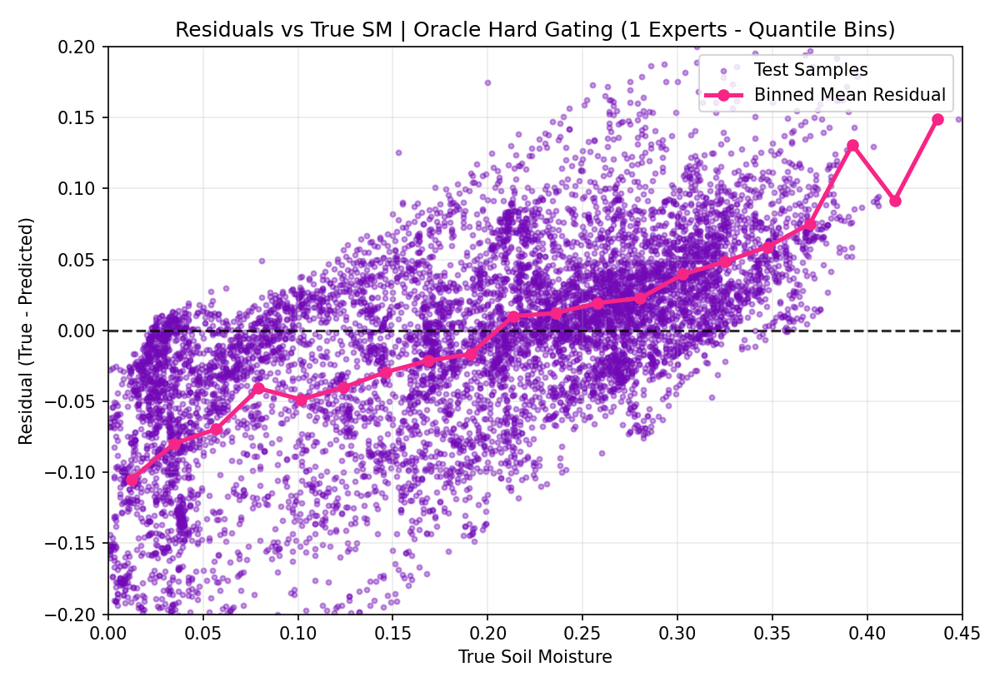
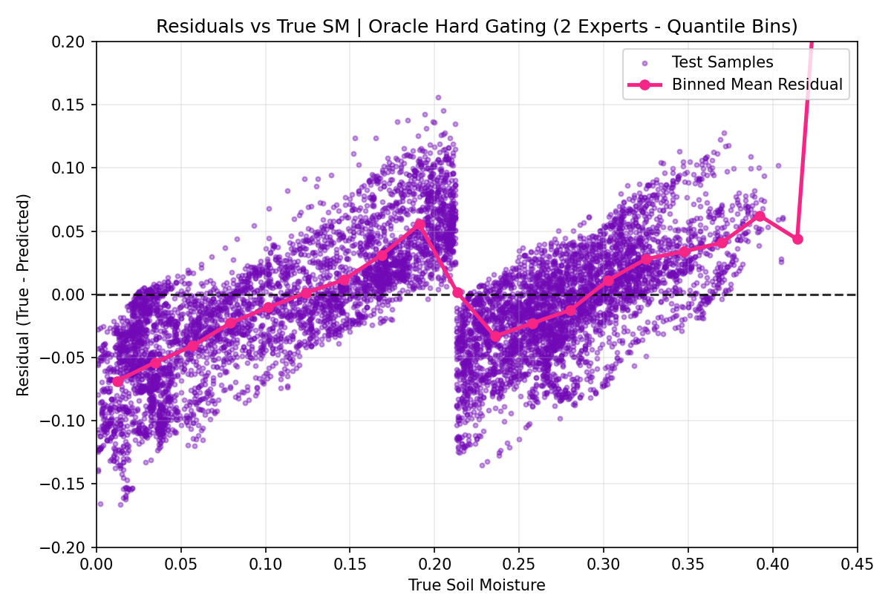
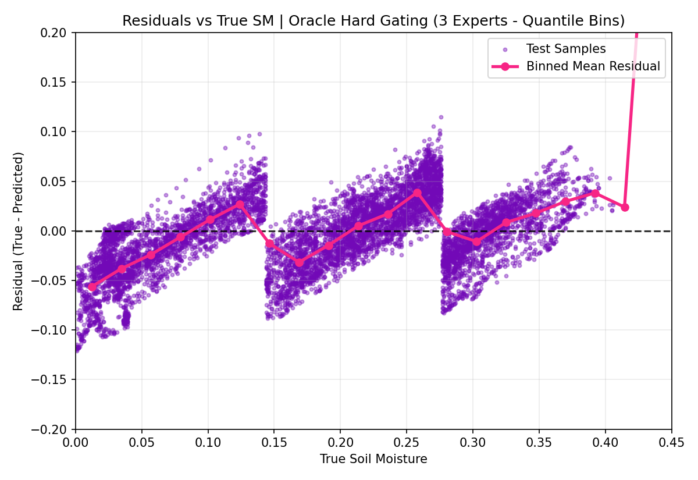
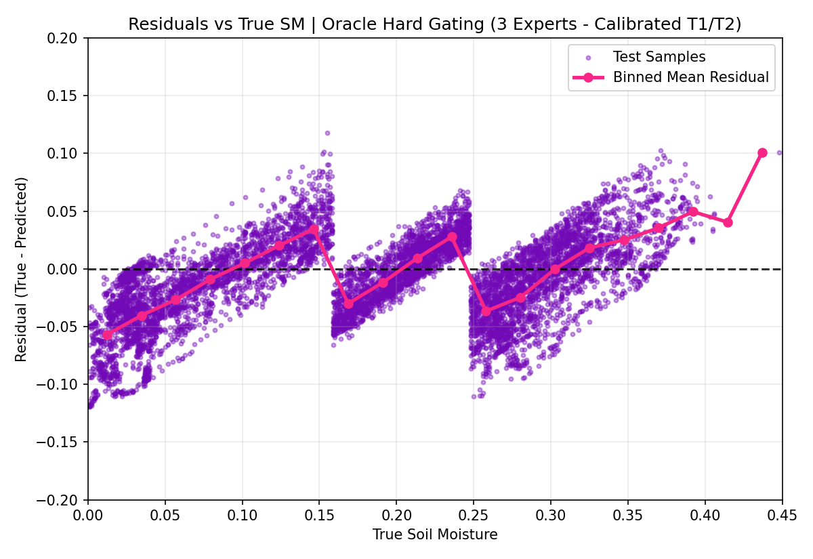
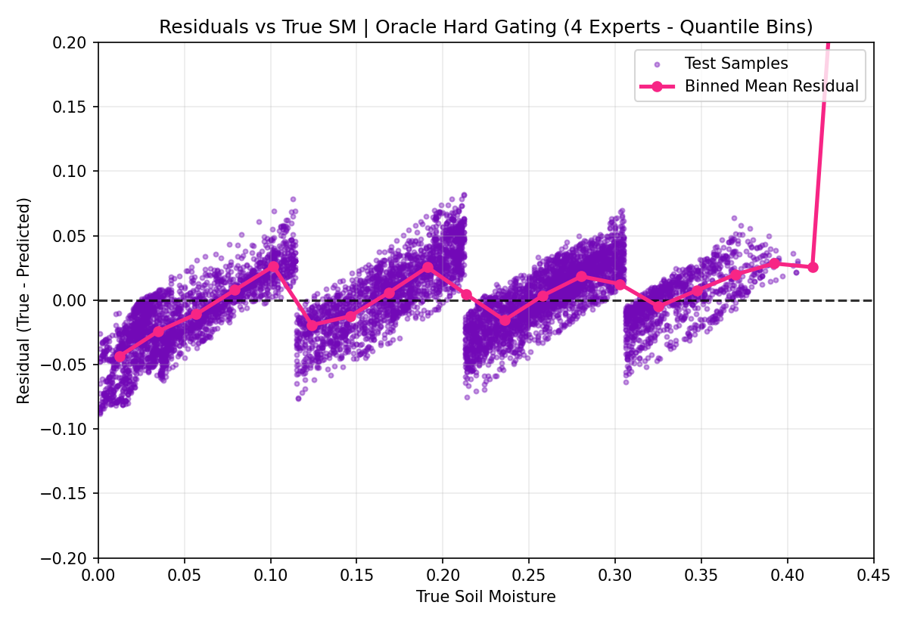
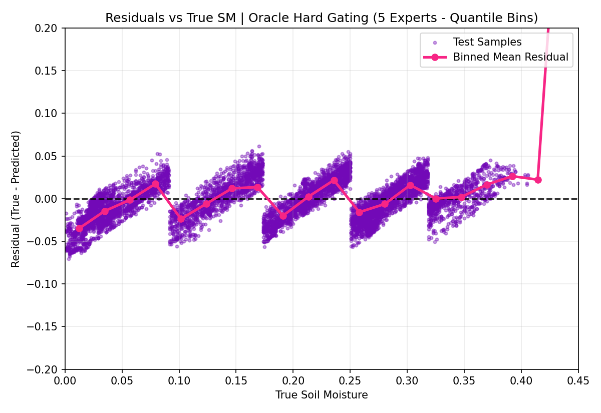
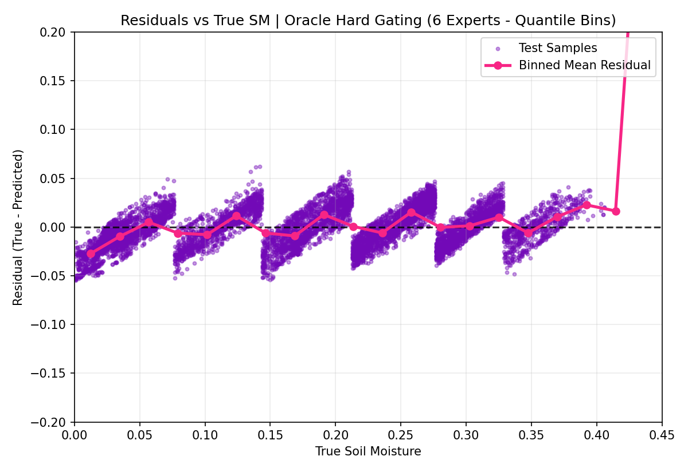
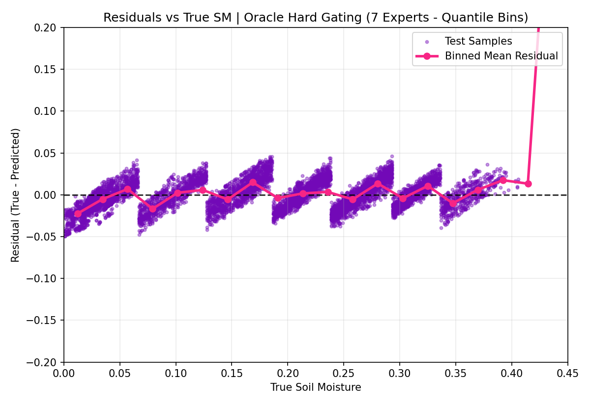
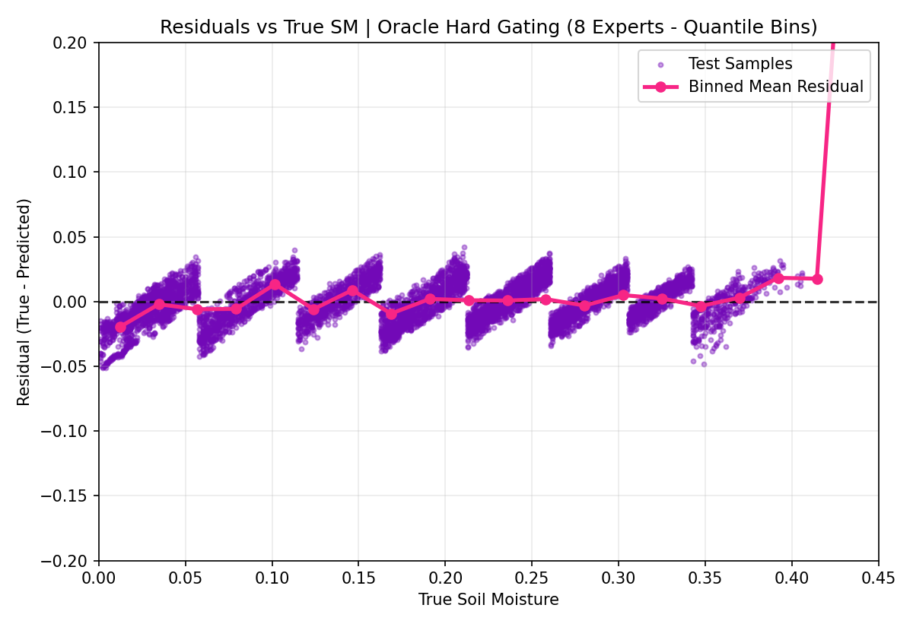
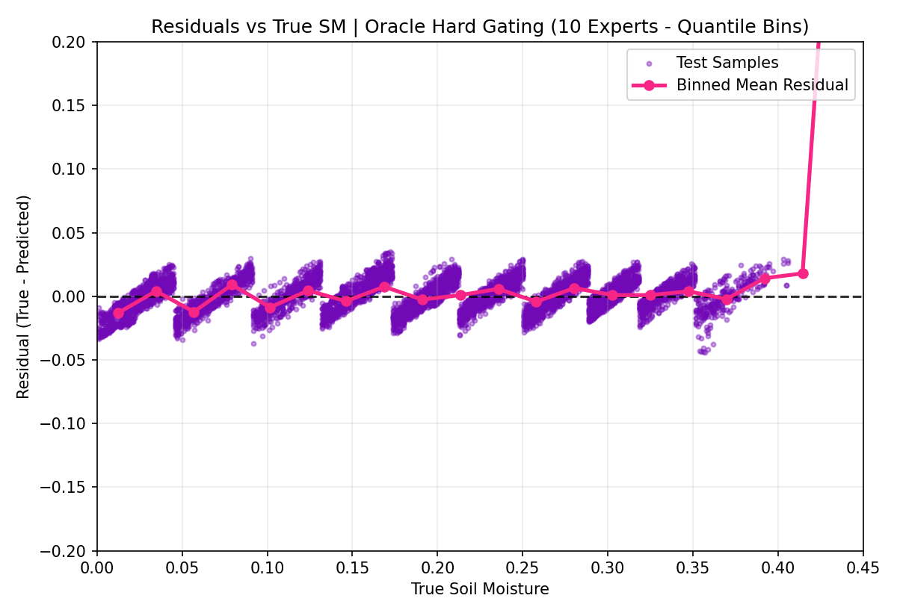

# Experiment: MoE Expert Scaling (`moe-spamming-1.0`)

Evaluating the scaling behavior of Mixture of Experts (Mixture of Specialists) under **Oracle Hard Gating** and **Temporal Recency Weighting (Drift, beta=0.4)**. This experiment sweeps the number of experts $k$ from 1 to 10 on the `derived_8.1_pos` test split.

## Rationale & Methodology
The 3-regime oracle hard-gating model showed strong performance in `derived_8.1_pos-eval-1.2`, but its residual plots still exhibited signs of regression to the mean (systematic bias). This experiment explores if increasing the number of experts (up to $k=10$) reduces this systematic bias.

- **Dataset**: `derived_8.1_pos` (SM > 0.0, 13 WA stations)
- **Features**: Controlled to use `OVERALL_SELECTED_FEATURES` for all experts.
- **Model Params**: Standardized to `XGB_PARAMS_GLOBAL` settings (depth 8, subsample 0.9, absolute error loss) to isolate capacity scaling as the sole variable.
- **Gating**: Oracle hard gating. Bins are defined using the training quantiles (percentiles) of `soil_moisture_5cm` on the `trainval` split.
- **Reference Model**: Calibrated 3-Regime model using thresholds $T_1 = 0.159, T_2 = 0.248$.

---

## Performance Summary Table

| Model Configuration | R² | RMSE | ubRMSE | Bias | MAE | Med\|Err\| | Pearson |
| :--- | :---: | :---: | :---: | :---: | :---: | :---: | :---: |
| **1 Expert (Global)** | 0.48581 | 0.07551 | 0.07455 | -0.01202 | 0.05536 | 0.03954 | 0.70845 |
| **2 Experts** | 0.77676 | 0.04975 | 0.04912 | -0.00788 | 0.03906 | 0.03181 | 0.88466 |
| **3 Experts (Quantile)** | 0.87625 | 0.03704 | 0.03676 | -0.00461 | 0.02937 | 0.02499 | 0.93866 |
| **3 Experts (Calibrated T1/T2)** | 0.87426 | 0.03734 | 0.03610 | -0.00953 | 0.02951 | 0.02481 | 0.93959 |
| **4 Experts** | 0.93080 | 0.02770 | 0.02767 | -0.00137 | 0.02183 | 0.01895 | 0.96593 |
| **5 Experts** | 0.95203 | 0.02306 | 0.02291 | -0.00263 | 0.01858 | 0.01648 | 0.97631 |
| **6 Experts** | 0.96432 | 0.01989 | 0.01987 | -0.00083 | 0.01596 | 0.01449 | 0.98239 |
| **7 Experts** | 0.97445 | 0.01683 | 0.01683 | -0.00018 | 0.01324 | 0.01177 | 0.98730 |
| **8 Experts** | 0.97828 | 0.01552 | 0.01547 | -0.00120 | 0.01210 | 0.01073 | 0.98920 |
| **9 Experts** | 0.98294 | 0.01375 | 0.01375 | -0.00000 | 0.01060 | 0.00929 | 0.99149 |
| **10 Experts** | 0.98522 | 0.01280 | 0.01280 | 0.00032 | 0.00982 | 0.00879 | 0.99262 |

---

## Critical Analysis & Insights

### 1. The Oracle Gating Scaling Artifact
The most striking result is that $R^2$ scales almost linearly at first, then asymptotes to **0.985** at $k=10$. However, it is vital to recognize that this is an **oracle gating artifact**. 
Under oracle gating:
1. The training target range is divided into $k$ slices. An expert is trained *only* on samples within its slice.
2. During testing, the sample is routed to the corresponding expert using the **true test soil moisture**.
3. Consequently, the expert only makes predictions for test samples that fall within its specific training range.

As $k$ increases, the width of each soil moisture slice shrinks. For $k=10$, each expert covers a range of only $\approx 0.04$ soil moisture units. Even if the expert models did nothing but predict the mean of their narrow slice, the maximum possible prediction error would be bounded by the width of the slice. As $k \to \infty$, the bin width goes to $0$, causing $R^2 \to 1.0$ and MAE/RMSE $\to 0$ **by construction**, regardless of whether the model has actually learned the physical dynamics.

#### Constant Mean Baseline Comparison
To verify this, we ran a baseline evaluation where each expert model was replaced by a dummy predictor that simply outputs the **constant training mean** of its target range. As shown below, for $k \ge 3$, the actual trained XGBoost expert models perform **identically to (or slightly worse than) a dummy baseline predicting a constant**:

| $k$ (Experts) | Dummy MoE (Predict Constant Mean) R² | Actual Trained XGBoost MoE R² |
| :---: | :---: | :---: |
| **1 (Global)** | -0.03705 | 0.48581 |
| **2** | 0.68525 | **0.77676** |
| **3** | 0.86085 | **0.87625** |
| **5** | **0.95301** | 0.95203 |
| **10** | **0.98623** | 0.98522 |

This proves that at higher values of $k$, **the specialists learn virtually nothing about features or dynamics**; they are simply predicting the range mean. If we have a reliable router, the complexity of individual expert models becomes completely irrelevant—a simple lookup table of range means achieves an $R^2$ of 0.98.

### 2. Specialist Fragility and Learned Routing Collapse
This experiment highlights why end-to-end (E2E) learned gating routers fail so severely in similar setups (e.g. `derived_8.1_pos-eval-2.0`):
- Because the specialists are trained on extremely narrow slices of the target distribution, they have **zero generalization capability** outside of their narrow target range.
- If the learned gating router makes even a minor mistake—e.g., routing a sample with true soil moisture of 0.3 to the expert trained on $[0.046, 0.092]$—the specialist will predict a value near its training mean ($\approx 0.07$), resulting in a massive prediction error of $\approx 0.23$.
- As the number of experts $k$ increases, the specialists become more "specialized" but also **incredibly fragile**, making the combined model exponentially sensitive to routing errors.

### 3. Quantile Bins vs. Calibrated Thresholds
At $k=3$, the quantile-based model ($R^2 = 0.87625$) perform virtually identically to the physically valley-calibrated model ($R^2 = 0.87426$). This suggests that when the routing is accurate, the exact choice of threshold boundaries does not matter as much, as long as the distribution of data across the specialists remains relatively balanced (the 33rd and 66th percentiles are close to the calibrated thresholds $T_1=0.159, T_2=0.248$).

### 4. Residual Analysis and Prediction Bias
Looking at the binned mean of the residuals (plotted in red over the scatter plots):
- **For $k=1$ (Global)**: The residuals have a clear negative slope, which is the classic signature of regression to the mean (the model over-predicts low soil moisture values and under-predicts high soil moisture values).
- **As $k$ increases**: The binned average residual line becomes progressively flatter and closer to zero. For $k=10$, the residuals are almost perfectly flat around zero.
- **Interpretation**: While this looks like the systematic bias is resolved, it is primarily due to the oracle routing constraint preventing the model from predicting outside its narrow true target slice. It confirms that dividing the target range into regimes allows local models to focus on local variances, but unless E2E routers can replicate this routing accuracy, the systematic bias remains a bottleneck.

---

## Residual Plots

Below are the residual plots generated for each model configuration. The red line represents the binned average residual across the soil moisture spectrum, highlighting prediction bias:

### 1 Expert (Global Model)

### 2 Experts

### 3 Experts (Quantile Bins)

### 3 Experts (Calibrated Baseline)

### 4 Experts

### 5 Experts

### 6 Experts

### 7 Experts

### 8 Experts

### 9 Experts

### 10 Experts

