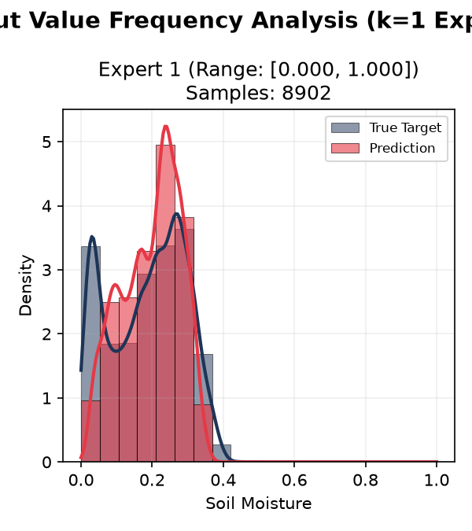
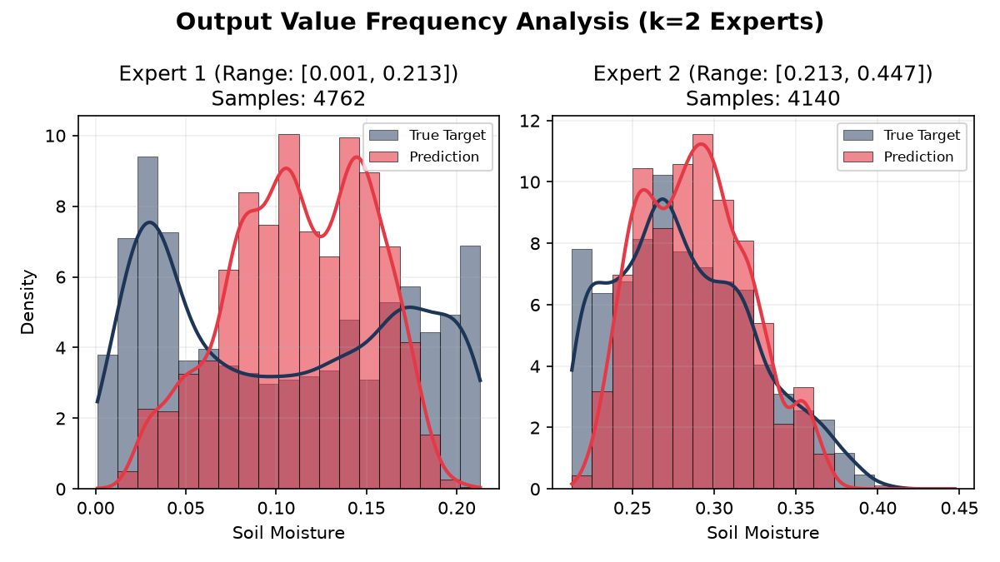
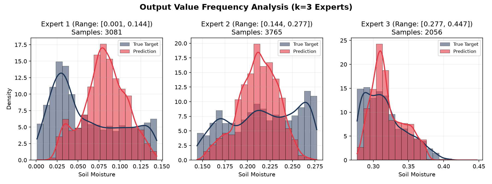
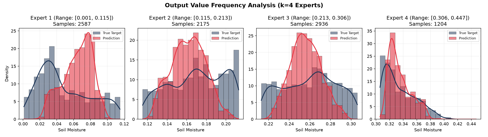
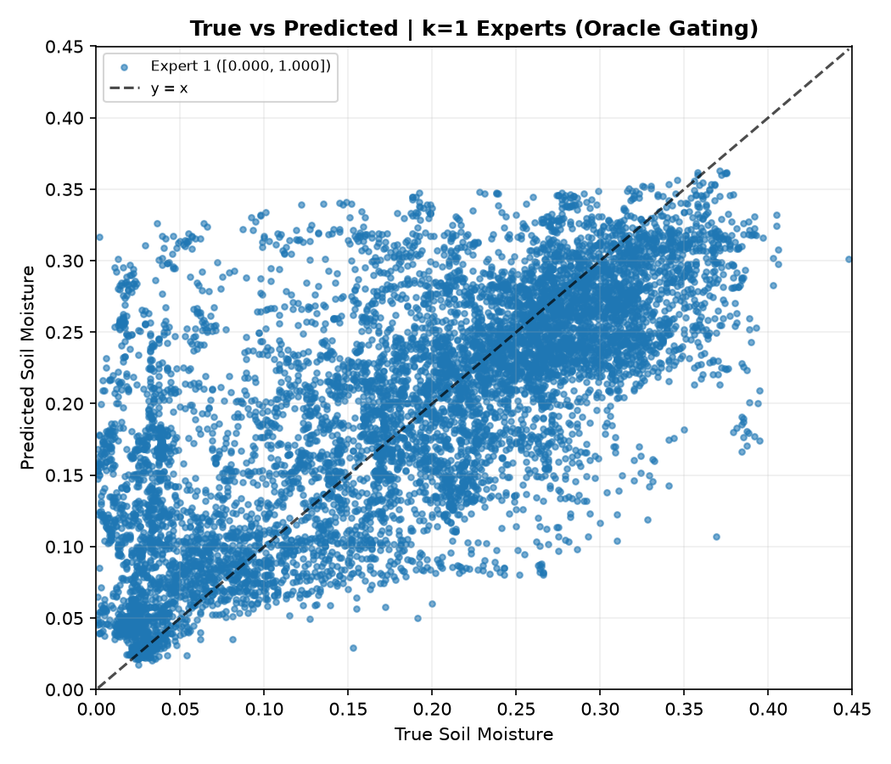
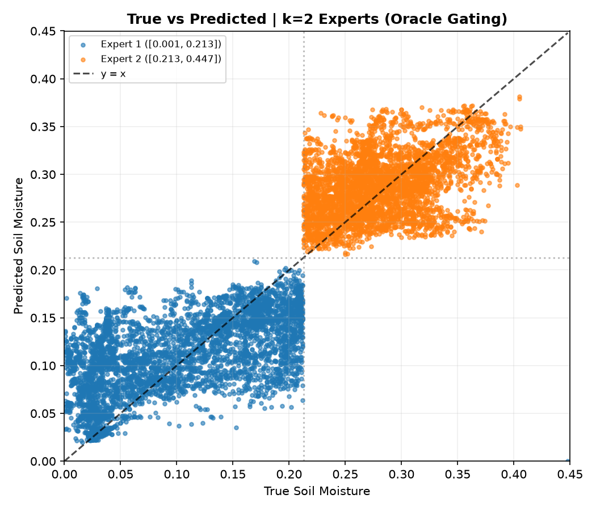
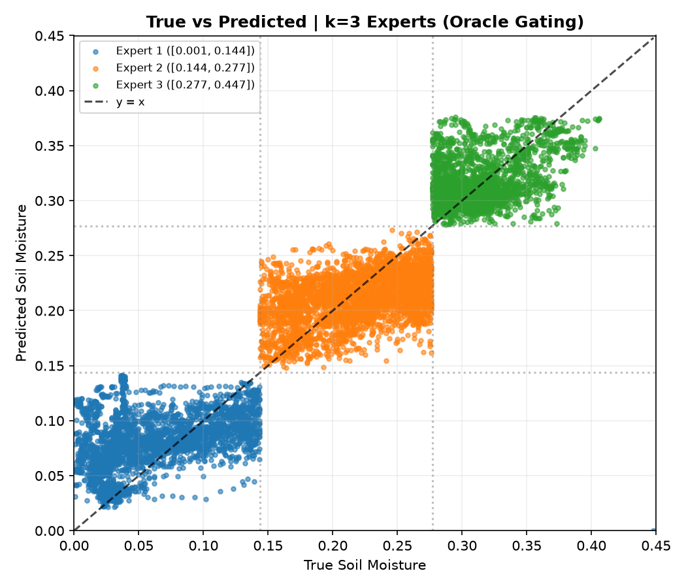
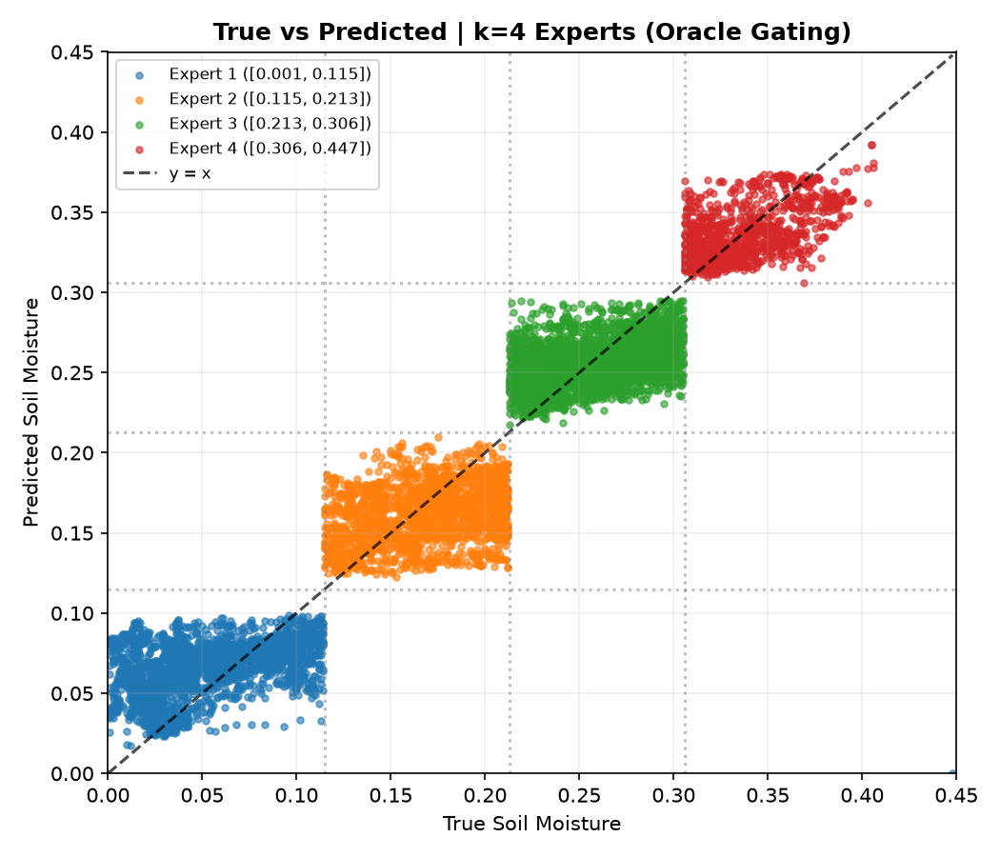

# Experiment: MoE Expert Frequency Validation (`moe-spamming-1.1`)

This experiment builds on `moe-spamming-1.0` to validate the hypothesis:
> **Hypothesis**: *Do individual experts under oracle hard gating simply output the mean of their routed target range?*

For simplicity, we sweep $k = 1$ to $k = 4$ using quantile-based thresholds and analyze the frequency distributions, variances, and predictive power of experts *within* their respective bins.

## Code Entrypoints

- [run_moe_spamming_1_1.py](../notebooks/experiment/moe-spamming-1.1/run_moe_spamming_1_1.py): Trains XGBoost MoE models under oracle gating, collects within-bin validation statistics, and generates plots.
- [diagnose_overfitting.py](../notebooks/experiment/moe-spamming-1.1/diagnose_overfitting.py): Performs train vs. test split comparisons to verify and evaluate generalization gap.

---

## Granular Expert Statistics

The table below shows the performance and distribution statistics of the trained XGBoost experts compared to a dummy baseline that predicts the constant training mean of each bin:

| $k$ (Experts) | Bin Index | Num Test | Train Mean | Test Target Std | Pred Std | Pred Spread Ratio ($\sigma_{pred}/\sigma_{true}$) | Within-Bin Correlation (Pearson $r$) | MAE Improvement over Dummy (%) | Local $R^2$ |
| :---: | :---: | :---: | :---: | :---: | :---: | :---: | :---: | :---: | :---: |
| **1 (Global)** | 1 | 8,902 | 0.2068 | 0.1053 | 0.0818 | 0.7767 | 0.7143 | 39.06% | 0.4949 |
| **2** | 1 | 4,761 | 0.1106 | 0.0669 | 0.0391 | 0.5850 | 0.5738 | 27.02% | 0.3093 |
| | 2 | 4,140 | 0.3028 | 0.0425 | 0.0329 | 0.7728 | 0.4112 | 16.05% | 0.0125 |
| **3** | 1 | 3,080 | 0.0754 | 0.0410 | 0.0255 | 0.6221 | 0.4208 | 12.59% | -0.0940 |
| | 2 | 3,765 | 0.2117 | 0.0381 | 0.0221 | 0.5802 | 0.4210 | 11.68% | 0.1289 |
| | 3 | 2,056 | 0.3323 | 0.0287 | 0.0227 | 0.7916 | 0.3644 | 18.70% | -0.0604 |
| **4** | 1 | 2,586 | 0.0577 | 0.0305 | 0.0175 | 0.5748 | 0.4181 | 6.73% | -0.1153 |
| | 2 | 2,175 | 0.1631 | 0.0279 | 0.0174 | 0.6233 | 0.2798 | 2.34% | -0.1157 |
| | 3 | 2,936 | 0.2595 | 0.0259 | 0.0149 | 0.5739 | 0.3934 | 9.20% | 0.1063 |
| | 4 | 1,204 | 0.3458 | 0.0230 | 0.0162 | 0.7026 | 0.5622 | 32.25% | 0.2962 |

---

## Critical Analysis & Hypothesis Validation

### 1. Behaviorally: The Hypothesis is **False**
- **Non-Zero Variance**: If the experts were simply outputting the range mean, the standard deviation of their predictions (`Pred Std`) would be close to zero. Instead, the predictions display substantial spread, with the **Prediction Spread Ratio** ($\sigma_{pred} / \sigma_{true}$) ranging between **0.57** and **0.79** across all configurations.
- **Positive Correlation**: The predictions are positively correlated with the true values within the bins. The **Pearson $r$** values within the narrow slices are consistently positive, ranging from **0.28** to **0.71**, showing that the models are actively learning to reconstruct the patterns of variability.

### 2. Practically/Performance-wise: The Hypothesis is **Almost True**
- **Local R² Collapse**: For $k \ge 3$, the local $R^2$ scores within individual bins become extremely low or even negative (e.g., $-0.0940$ for $k=3$ Bin 1, and $-0.1157$ for $k=4$ Bin 2). A negative local $R^2$ indicates that the XGBoost model's predictions are less accurate than a flat prediction of the *test* mean of that bin.
- **Diminishing MAE Improvement**: The relative MAE improvement of XGBoost over the constant training mean baseline drops dramatically as $k$ increases:
  - At $k=1$, XGBoost improves MAE by **39.1%**.
  - At $k=2$, the improvements are **27.0%** and **16.1%**.
  - At $k=3$, the improvements drop to **12.6%**, **11.7%**, and **18.7%**.
  - At $k=4$, the improvements drop to **6.7%**, **2.3%**, and **9.2%** for the lower three bins, with only the wettest bin (Bin 4) showing a higher improvement of **32.3%**.

### Conclusion
Individual experts **do not** literally output a constant mean value; they predict a distribution with substantial variance and positive correlation to the target. 

However, because the target ranges are sliced so thinly by the oracle gating, the local variance is extremely small. The practical predictive power of a complex XGBoost model inside these narrow bins is barely better than (and sometimes worse than) a dummy model predicting a constant mean. 

Thus, the performance gains of the overall MoE system at high $k$ are **almost entirely driven by the oracle router's bin classification** rather than the expert models learning refined sub-dynamics.

---

## Diagnostic Analysis: Overfitting & Target Shift

Two prominent features in the visualizations require explanation:
1. **Singular Peaks**: The predicted test distributions across all bins exhibit a singular, narrow peak, even when the true test distributions are relatively flat.
2. **Missing Dry Peak**: In Expert 1 (for $k=2, 3, 4$), the model completely fails to capture the true test peak around **0.025** (extreme dry), instead outputting a peak around **0.075**.

To diagnose this, we ran evaluations of the expert models on both the training (`trainval`) and testing splits. The table below highlights the performance gap:

| $k$ (Experts) | Bin Index | Train Target Std | Train Pred Std | Train MAE | Test Target Std | Test Pred Std | Test MAE |
| :---: | :---: | :---: | :---: | :---: | :---: | :---: | :---: |
| **1 (Global)** | 1 | 0.1114 | 0.1086 | 0.0068 | 0.1053 | 0.0818 | 0.0548 |
| **2** | 1 | 0.0612 | 0.0590 | 0.0040 | 0.0669 | 0.0391 | 0.0442 |
| | 2 | 0.0511 | 0.0484 | 0.0049 | 0.0425 | 0.0329 | 0.0337 |
| **3** | 1 | 0.0421 | 0.0406 | 0.0027 | 0.0410 | 0.0255 | 0.0338 |
| | 2 | 0.0376 | 0.0350 | 0.0043 | 0.0381 | 0.0221 | 0.0293 |
| | 3 | 0.0335 | 0.0314 | 0.0036 | 0.0287 | 0.0227 | 0.0232 |
| **4** | 1 | 0.0327 | 0.0314 | 0.0023 | 0.0305 | 0.0175 | 0.0262 |
| | 2 | 0.0293 | 0.0272 | 0.0033 | 0.0279 | 0.0174 | 0.0239 |
| | 3 | 0.0276 | 0.0254 | 0.0036 | 0.0259 | 0.0149 | 0.0200 |
| | 4 | 0.0269 | 0.0255 | 0.0027 | 0.0230 | 0.0162 | 0.0151 |

### Key Diagnostic Insights

#### 1. Massive Overfitting (Generalization Failure)
The **Train MAE is 8x to 12x smaller** than the Test MAE across all configurations. For example, in $k=3$ Bin 1, Train MAE is a minuscule **0.0027** while Test MAE is **0.0338**. 
* **Training Behavior**: During training, the models successfully capture the full spread of the targets (Train Pred Std is almost identical to Train Target Std, e.g. 0.0406 vs 0.0421). For train samples where the target is $\le 0.05$, the expert's mean prediction is **0.0272** (capturing the dry peak).
* **Testing Collapse**: When evaluated on unseen test data, the standard deviation of predictions collapses by **35% to 45%** (e.g. Test Pred Std drops to **0.0255** vs Test Target Std of **0.0410**). Because the models overfit heavily to training features (using 499 features on relatively small local sample sizes), they fail to generalize to the test set features, causing their predictions to default/revert towards the central training mean. This produces the narrow **singular peak** in the test predictions.

#### 2. Target Distribution Shift
A significant target shift exists between the training and testing sets in the dry regime (Bin 1):
* In the training set (`trainval`), only **33.15%** of Bin 1 samples are $\le 0.05$, with a median target of **0.0770**.
* In the testing set, **50.52%** of Bin 1 samples are $\le 0.05$, with a median target of **0.0490** (creating a heavy true peak around 0.025).

#### 3. Why Expert 1 Peaks at 0.075 Instead of 0.025
Because Expert 1 is heavily overfitted, its test predictions fail to track the true features and revert to the central tendency of its training experience (mean of ~0.075, median of ~0.077). 
When tested on a highly dried-out test split (where the true target peak is at 0.025), the overfitted model cannot generalize, so it outputs a singular peak around **0.075 - 0.082** (the training bin center). This mismatch highlights the fragility of specialists trained on narrow target ranges under covariate/target shift.

---

## Visualizations

### 1. Output Value Distributions
The distribution plots compare the histogram and KDE density of true soil moisture vs. predicted soil moisture *within* each bin:

#### 1 Expert (Global)

#### 2 Experts

#### 3 Experts

#### 4 Experts

### 2. Scatter Plots by Bin
These plots show the full set of test predictions against true values, color-coded by the bin boundary:

#### 1 Expert (Global)

#### 2 Experts

#### 3 Experts

#### 4 Experts

