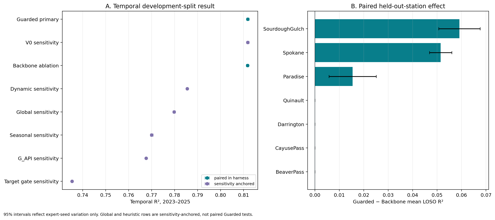
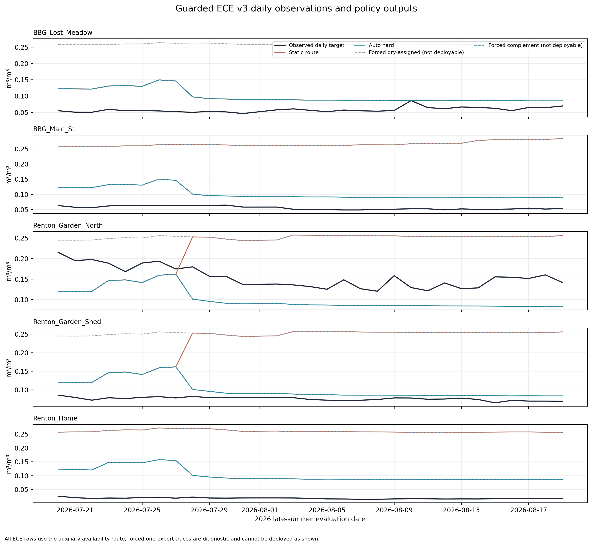

# Covariate-Defined Regional Experts for Soil-Moisture Estimation

## Technical report assembly 1.0 — PI handoff

> **Purpose.** This is a venue-neutral technical report for drafting the second paper. It records the methods, numerical results, interpretation, evidence boundaries, and source trail in one place. The active blueprint is [outline](../../writeup2/outline-v7.md). The assembled Markdown is the canonical text; `report.pdf` is its reading copy.
>
> **Evidence rule.** All current-study result numbers below are inserted from saved CSV/JSON artifacts by `scripts/report_data.py`. The 1.0 evidence bundle supplies the main Washington temporal and leave-one-station-out (LOSO) results. The completed 1.1 bundle supplies **all** ECE policy, mapping, calibration, and station results; its results supersede the earlier ECE account in 1.0. Historical experiments are labeled as sensitivity or context. The first paper is a different dataset and protocol.

### Reading key

- **Paired in harness:** the methods were trained and evaluated with the same seeds and protocol in the final-evidence 1.0 run. This applies to Guarded versus the unguarded shared-backbone router.
- **Sensitivity anchored:** a result is drawn from the earlier formal-evaluation harness. It provides a useful benchmark but is not a paired Guarded comparison, even when the split and settings appear similar.
- **Diagnostic:** a result helps explain behavior but is not an operational performance claim. This includes oracle expert forcing and the five-station ECE evaluation.
- R², RMSE, MAE, and bias refer to daily volumetric soil moisture at 5 cm; error metrics use m³/m³. Seed intervals measure expert random-state variation only. They do not measure uncertainty from station sampling, feature selection, router selection, or test-period reuse.

## 1. Executive synthesis and paper thesis

**Paper question.** With a fixed 54-feature prediction backbone and XGBoost expert type, which available routing signal makes regional specialization useful for Washington daily soil-moisture estimation? The testable contribution is a controlled comparison of target-derived, heuristic, and covariate-defined hard routers. It is not a new mixture-of-experts architecture or a claim that two experts are universally optimal.

**Primary finding.** The shared-backbone Guarded router has temporal R² **0.811843** (seed SD 0.001369; RMSE 0.044187) over 30 expert seeds on the 2023–2025 development test period. Its directly paired unguarded-backbone comparison is a small temporal difference of **+0.000119 R²** (0.811724 for the unguarded router). In LOSO it averages **0.637877 R²** versus **0.619877**, a paired difference of **+0.018000** across five seeds and seven held-out stations. The station table below locates the gain in 3 folds; 4 folds tie.

**Benchmark context.** The earlier formal-evaluation global single model has temporal R² **0.779794** and LOSO R² **0.579500**. The apparent Guarded gaps of **+0.0320** temporal and **+0.0584** LOSO are **sensitivity-anchored**, not a same-run paired Guarded-versus-global test. The tested target-derived gate has temporal R² **0.735359** in that earlier harness. The evidence supports a bounded design lesson: on this development split, inference-available covariate routing is promising, while this particular target-threshold gate performs poorly and lacks the contemporaneous in-situ target at inference. It does not show that supervised routers in general fail.

**ECE qualification.** On the five disjoint ECE collaboration stations, the 1.1 missing-input policy changes Guarded pooled RMSE from **0.167431** under its static `as_routed` policy to **0.057768** under `auto_hard`; the direct global reference is **0.058634**. All ECE rows trigger the availability gate. This is a short, one-season diagnostic of a Washington-calibrated G_API mapping, not broad deployment validation or evidence that a named physical dry/wet regime transferred.

**Most important constraint for the paper.** The shared 54-feature backbone and XGBoost settings were influenced by the same test era used here, and later router/model choices also saw that period. Every 2023–2025 result is development-split evidence rather than untouched confirmation. A future independent time period or external dataset is needed to estimate the true advantage without this selection bias.

**Suggested working title.** “Covariate-Defined Regional Experts for Soil-Moisture Estimation: A Controlled Study of Hard-Gated Routing.” The method should be called a hard-gated, cluster-wise XGBoost mixture of experts (MoE), with the station-consistency guard described as a deterministic routing rule.

## 2. Relationship to the first paper and literature

The submitted first paper, [*Enhancing Spatial and Temporal Coverage of Soil Moisture Estimation Using Satellite and Weather-Driven Machine Learning*](../../paper/Enhancing%20Spatial%20and%20Temporal%20Coverage%20of%20Soil%20Moisture%20Estimation%20Using%20Satellite%20and%20Weather-%20Driven%20Machine%20Learning.pdf), establishes the multi-source satellite/weather pipeline, imputation, feature-engineering approach, and a global XGBoost model. Its reported R² of 0.822 is from five public Washington stations under a different dataset and evaluation protocol; it must not be ranked against the seven-station `derived_8.4` results. The submitted PDF does **not** report the internal three-regime oracle and gate comparisons. Those internal analyses motivate this paper but should be cited as project history, not attributed to the submitted manuscript or treated as peer-reviewed results.

Soil-moisture MoE and regional specialization already exist. [Yang et al. (2025)](https://doi.org/10.1016/j.jhydrol.2025.133763) combine CNN–LSTM experts with adaptive weighting across Tibetan Plateau climate zones. [Zhang et al. (2026)](https://doi.org/10.3390/rs18183125) combine an antecedent-precipitation water-balance prior, a time-aware Mamba encoder, and a context-conditioned MoE for forecasting. [Singh et al. (2026)](https://doi.org/10.1029/2025JH001039) use wetness-specialized agents for surface-to-subsurface estimation; their target and protocol differ from this daily surface-estimation benchmark. [Wu et al. (2026)](https://doi.org/10.1016/j.jag.2026.105597) apply an RTE-guided MoE to passive-microwave retrieval. These are direct overlap in the use of specialized components, so architectural novelty is not the claim here.

Clustered soil-moisture models also precede this work: [Chakrabarti et al. (2016)](https://doi.org/10.1109/TGRS.2016.2547389) use soft cluster memberships and kernel regression for disaggregation; [Ding et al. (2024)](https://doi.org/10.1016/j.jag.2024.104003) use KMeans-defined subregions with specialized gap-filling models; and [Stahl and McColl (2022)](https://doi.org/10.1175/JCLI-D-21-0780.1) identify global seasonal-cycle regimes. In broader hydrology, [Moges et al. (2016)](https://doi.org/10.1002/2015WR018266) use indicator-driven hierarchical expert weighting, while [Rong et al. (2025)](https://doi.org/10.1016/j.jhydrol.2025.132737) compare alternative routers over heterogeneous streamflow experts. These studies motivate asking **which signal drives routing, when it exists at inference, and how it is evaluated**, rather than claiming that clustering or MoE is new. Full verified metadata is in `references.bib` and §12.

## 3. Data, target, and evaluation protocol

The project pipeline requests or loads station data, parses and cleans it, merges sources, adds satellite and site predictors, aggregates weather, fills predictor gaps, smooths configured series, and derives seasonal, temporal, and meteorological features. The canonical modeling split is `derived_8.4`, not the historical split listed in the root `AGENTS.md`. This report uses 9803 train rows (2017–2020), 4805 validation rows (2021–2022), and 6620 test rows (2023–2025). **Trainval** means training plus validation, 14608 rows. The target is `soil_moisture_5cm`. The split definition is [split](../../data/splits/derived_8.4/split_meta.json); the processing overview is in `src/pipeline/README.md` and the submitted first paper.

**Seven Washington study stations.** Coordinates, elevation, and cluster membership are descriptive site context; they do not establish causal climate groups. Cluster indices are local to this experiment.

| Station | Lat. | Lon. | Elevation m | Trainval local cluster | Trainval rows |
| --- | --- | --- | --- | --- | --- |
| BeaverPass_WA_990 | 48.88 | -121.26 | 1125 | 0 | 2185 |
| CayusePass_WA | 46.87 | -121.53 | 1588 | 0 | 2042 |
| Darrington | 48.54 | -121.45 | 166 | 0 | 2048 |
| Paradise_WA | 46.78 | -121.75 | 1564 | 0 | 2189 |
| Quinault | 47.51 | -123.81 | 88 | 0 | 2160 |
| SourdoughGulch_WA_985 | 46.23 | -117.40 | 1164 | 1 | 2191 |
| Spokane | 47.42 | -117.53 | 705 | 1 | 1793 |

The global model and every no-delta expert use the same **54** features. The Guarded router also clusters this same backbone, so its main method does not need a separate hand-picked router feature set. The features include SMAP soil-moisture proxies, Sentinel-derived indices, weather and antecedent precipitation, terrain, climate, land cover, and temporal transforms. Consequently, the primary router is **in-situ-target-label-free but satellite-soil-moisture-informed**. The exact feature list and its test-era selection goal are saved in [features](../../notebooks/experiment/derived_8.4-feature-selection-2.0/artifacts/selected_features.json) and reproduced in Appendix A. Sharing the backbone controls one dimension of the comparison; it does not undo the selection bias from choosing it using 2023–2025 evidence.

Temporal evaluation trains on trainval and evaluates the later test years at the seven known stations. LOSO refits the router and experts on six stations and tests the held-out seventh, with no held-out station in imputation means, scaling, centroids, majority labels, or thresholds. The final main run contains 30 temporal expert seeds and five LOSO expert seeds per fold. KMeans uses a fixed seed; expert random state is the changing seed. Earlier global/heuristic rows use the formal-evaluation harness and are explicitly marked sensitivity references.

For the paired and sensitivity analyses, R² measures explained variance, RMSE and MAE measure error size, bias is signed mean prediction error, and ubRMSE removes the mean bias component. Seed-level 95% t intervals, paired seed tests, and the older station-month block bootstrap answer different questions; they must not be interchanged. A seven-station LOSO win count is descriptive and has little inferential power.

## 4. Method and router provenance

One router assigns a row to an expert; one XGBoost regressor trained on each assigned trainval group returns the daily estimate. The no-delta result uses only the shared 54 features for every expert. The shared XGBoost settings are 2,500 histogram trees, learning rate 0.005, depth 9, minimum child weight 8, gamma 0, alpha 0.03, lambda 0.75, row subsampling 0.9, and column subsampling 0.8. These settings came from earlier test-era tuning and are part of the selection limitation. The exact configuration is in [main_config](../../notebooks/experiment/paper2-final-evidence-1.0/config.yaml).

| Router family | Tested configuration | In-situ target used to define the router? | SMAP-derived input | Report role |
| --- | --- | --- | --- | --- |
| Target-derived | `Trained_Gating_k2` with target threshold | Yes | Not required for gate | Non-deployable foil; target unavailable at inference |
| Heuristic | `Seasonal_Binary_k2` | No | No | Sensitivity reference |
| Heuristic | `Univariate_G_API_k2` | No | No | Sensitivity reference; antecedent precipitation index (API) |
| Dynamic covariate | `Clustering_Dynamic_k2` | No | Lagged SMAP proxy | Sensitivity reference |
| Full covariate | `Clustering_Backbone54_k2` | No | Current, lagged, and rolling SMAP proxies | Direct paired guard ablation |
| Full covariate | `Guarded_Backbone54_k2` | No | Same shared backbone | **Primary** router |
| Legacy full covariate | `Clustering_V0_Full_k2` | No | Partial | Sensitivity only; legacy 50-feature router |
| None | `Global_Single_54` | No router | SMAP in predictor backbone | Sensitivity reference |

**Guard rule.** Fit mean imputation, standard scaling, and KMeans with K=2 on the fit frame only. Canonicalize the two local indices by the fit-frame mean of `SMAP_sm_pm_interp_rollmean30` so local c1 has the lower value; this is an indexing convention, not proof of a physical dry regime. For a station present in the fit frame, assign its majority cluster label with a deterministic lower-index tie break. For unseen or missing station IDs, use the row-level KMeans prediction. The router also stores a fit-frame-calibrated margin and availability flag for a possible global fallback, but no evaluated Washington policy in this report activates that global fallback. Known-station voting uses `station_id` at inference and enforces station consistency; it is not an independent discovery of station regimes. The source implementation and fit-frame audit are in the 1.0 evidence bundle and the earlier routing-optimize report.

The guard design and promotion bars were fixed before its follow-up training run, but the shared test period had already shaped feature and model choices. The guard reproduces the historical trainval partition using the shared backbone, replacing the legacy 50-feature router only as an implementation simplification. It is not evidence that this rule transfers to other regions.

## 5. Primary temporal results

**Table 1. No-delta temporal test results, 2023–2025.** Seed SD and 95% CI are over expert random states; a row labeled sensitivity anchored is not paired with Guarded. RMSE, MAE, and bias are m³/m³. Source: [main_summary](../../notebooks/experiment/paper2-final-evidence-1.0/main_temporal_summary.csv) and the seed rows in [main_seed](../../notebooks/experiment/paper2-final-evidence-1.0/main_temporal_seed_comparison.csv).

| Router / expert | Comparison role | Seeds | R² | Seed SD | 95% seed CI | RMSE | MAE | Bias |
| --- | --- | --- | --- | --- | --- | --- | --- | --- |
| Legacy V0 (sensitivity) | sensitivity anchored | 30 | 0.8118 | 0.0014 | [0.8113, 0.8124] | 0.0442 | 0.0340 | 0.0060 |
| Guarded backbone (primary) | paired in harness | 30 | 0.8118 | 0.0014 | [0.8113, 0.8124] | 0.0442 | 0.0340 | 0.0060 |
| Unguarded backbone (paired ablation) | paired in harness | 30 | 0.8117 | 0.0014 | [0.8112, 0.8122] | 0.0442 | 0.0340 | 0.0060 |
| Dynamic covariate (sensitivity) | sensitivity anchored | 30 | 0.7855 | 0.0010 | [0.7851, 0.7858] | 0.0472 | 0.0363 | 0.0096 |
| Global single model (sensitivity) | sensitivity anchored | 30 | 0.7798 | 0.0013 | [0.7793, 0.7803] | 0.0478 | 0.0369 | 0.0100 |
| Seasonal (sensitivity) | sensitivity anchored | 30 | 0.7700 | 0.0016 | [0.7694, 0.7706] | 0.0489 | 0.0377 | 0.0107 |
| G_API (sensitivity) | sensitivity anchored | 30 | 0.7676 | 0.0009 | [0.7672, 0.7679] | 0.0491 | 0.0381 | 0.0106 |
| Target-derived gate (sensitivity) | sensitivity anchored | 30 | 0.7354 | 0.0011 | [0.7350, 0.7358] | 0.0524 | 0.0388 | 0.0145 |

**Analysis.** Guarded and unguarded Backbone are nearly tied temporally: their mean R² difference is +0.000119, smaller than the seed SD shown above, although the direction is consistent over the 30 paired seeds. The legacy V0 row reaches the same rounded temporal result but depends on the older 50-feature routing set and is an appendix sensitivity, not a co-ranked new method. The global and heuristic rows are lower in the saved comparison; because they come from another harness, the report treats their gaps as development-split context rather than a paired Guarded win. The tested target-derived gate's 0.735359 is a failure of that specific gate, not a conclusion about all learned routers.

The earlier formal-evaluation **V0 no-delta versus global** seed-paired R² difference is +0.0320 [0.0313, 0.0328], p=7.1e-37 ([formal_pair](../../notebooks/experiment/derived_8.4-formal-eval-1.0/temporal_pairwise_focused.csv)). This statement belongs to V0 in that earlier harness. It must not be rewritten as a p-value for Guarded. The older sample-level block-bootstrap result, +0.0352 [0.0190, 0.0549], p=0.0005, belongs to V0 with a **test-selected** expert feature addition (`c0=0, c1=10`) and is sensitivity only ([formal_bootstrap](../../notebooks/experiment/derived_8.4-formal-eval-1.0/temporal_bootstrap.csv)). It is excluded from the primary headline and abstract.

*Figure 1.* Main comparison generated by the report notebook from the frozen 1.0 tables. Color and labels distinguish direct paired rows from sensitivity-anchored rows. Error bars show expert-seed variation, not selection uncertainty.

## 6. In-state spatial generalization: LOSO

**Table 2. Station-mean LOSO metrics.** Each routed configuration uses five expert seeds across seven held-out Washington stations. The primary ablation is paired Guarded–Backbone; older rows are sensitivity references. Source: [loso_seed](../../notebooks/experiment/paper2-final-evidence-1.0/loso_seed_station.csv) and [formal_loso](../../notebooks/experiment/derived_8.4-formal-eval-1.0/loso_config_summary.csv).

| Configuration | Comparison role | Seeds × held-out sites | Station-mean R² | Station-mean RMSE |
| --- | --- | --- | --- | --- |
| Guarded backbone (primary) | paired in harness | 5 × 7 | 0.6379 | 0.0558 |
| Unguarded backbone (paired ablation) | paired in harness | 5 × 7 | 0.6199 | 0.0571 |
| Legacy V0 (sensitivity) | sensitivity anchored | 5 × 7 | 0.6372 | 0.0561 |
| Global 54 (sensitivity) | sensitivity anchored | 5 × 7 | 0.5795 | 0.0610 |
| Global 50 (sensitivity) | sensitivity anchored | 5 × 7 | 0.5907 | 0.0601 |

**Analysis.** Guarded's paired mean advantage over unguarded Backbone is +0.018000 R², with improvements on 3 held-out stations and ties on 4. This is the strongest spatial evidence for the guard. The sensitivity-anchored global gap can motivate the paper's question, but it does not supply direct Guarded-versus-global fold wins or a paired significance test. At seven stations, a fold count is a location-specific pattern, not a high-power population estimate.

**Table 3. Paired LOSO mechanism and fold outcomes.** The two ARI columns compare labels on each six-station *training* frame after router refitting. ARI is adjusted Rand index; low values show changed specialist-training composition. Source: [t8](../../notebooks/experiment/paper2-final-evidence-1.0/t8_loso_station_summary.csv) and [fold_agreement](../../notebooks/experiment/paper2-final-evidence-1.0/loso_fold_agreement.csv).

| Held-out station | Guarded R² | Backbone R² | Guarded − Backbone | Wins / ties (5 seeds) | Train ARI V0–Backbone | Train ARI Backbone–Guarded |
| --- | --- | --- | --- | --- | --- | --- |
| SourdoughGulch_WA_985 | 0.3699 | 0.3108 | +0.0591 | 5/0 | 0.132 | 0.349 |
| Spokane | 0.6083 | 0.5568 | +0.0514 | 5/0 | 0.192 | 0.330 |
| Paradise_WA | 0.7800 | 0.7645 | +0.0154 | 5/0 | 0.990 | 0.990 |
| BeaverPass_WA_990 | 0.7531 | 0.7531 | +0.0000 | 0/5 | 1.000 | 1.000 |
| CayusePass_WA | 0.6862 | 0.6862 | +0.0000 | 0/5 | 1.000 | 1.000 |
| Darrington | 0.6949 | 0.6949 | +0.0000 | 0/5 | 1.000 | 1.000 |
| Quinault | 0.5729 | 0.5729 | +0.0000 | 0/5 | 1.000 | 1.000 |

**Analysis.** The largest gains are associated with the SourdoughGulch and Spokane holdouts, where per-fold router refits change the specialist training partition substantially. The held-out predictions themselves follow the unseen-station row-level route; the guard's known-station vote protects the composition of each expert's *training* data rather than directly assigning a better label to an unseen station. Paradise has a smaller gain. The 4 exact fold ties are important evidence about where the guard has no observed effect. This mechanism is supported by the saved fold agreement and per-station differences; it should not be recast as a causal geophysical explanation.

## 7. Partition diagnostics and feature interpretation

**Table 4. Trainval-only K sweep.** Lower Davies–Bouldin and higher Calinski–Harabasz favor K=2 here; silhouette is slightly higher at K=3. Indices alone do not prove the physical meaning or future optimal K. Source: [k_sweep](../../notebooks/experiment/paper2-final-evidence-1.0/k_sweep_quality.csv).

| K | Silhouette | Calinski–Harabasz | Davies–Bouldin | Trainval station purity | Smallest cluster share |
| --- | --- | --- | --- | --- | --- |
| 2 | 0.219 | 3880.9 | 1.579 | 1.000 | 0.273 |
| 3 | 0.226 | 3589.4 | 1.815 | 0.833 | 0.264 |
| 4 | 0.188 | 2855.0 | 2.015 | 0.695 | 0.147 |

The K=2 trainval partition places Spokane and SourdoughGulch in local c1 and the other five Washington stations in c0 ([composition](../../notebooks/experiment/derived_8.4-gating-analysis-1.0/regime_station_composition_Clustering_Backbone54_k2.csv)). Guarded's known-station purity is 1.0 by construction. It should be described as enforced consistency, not independent evidence of two hydrologic regimes. Local indices may change with a new fit frame and are not universally dry/wet labels.

**Table 5. Leading descriptive covariate separations for the unguarded Backbone partition.** The separation index and cluster medians are drawn from the earlier gating-analysis artifact, which uses the same Washington split. These profile attributes need not be router inputs; the target is excluded from this table. Source: [profile](../../notebooks/experiment/derived_8.4-gating-analysis-1.0/regime_profile_summary_Clustering_Backbone54_k2.csv).

| Feature | Separation index | Median c0 | Median c1 |
| --- | --- | --- | --- |
| longitude | 1.000 | -121.534 | -117.400 |
| J_bio_bio13 | 1.000 | 391.000 | 70.000 |
| SMAP_sm_pm_interp | 0.932 | 0.414 | 0.192 |
| latitude | 0.642 | 47.510 | 46.233 |
| G_API | 0.551 | 47.459 | 14.936 |
| J_lc_code | 0.550 | 10.000 | 30.000 |
| G_rain_sum_7d | 0.424 | 30.100 | 9.500 |
| J_soil_texture_usda_b0 | 0.398 | 7.000 | 7.000 |
| LST_modis | 0.384 | 280.944 | 291.242 |
| F_NDVI | 0.326 | 0.532 | 0.330 |

**Analysis.** The partition coincides with site descriptors, satellite soil-moisture proxies, vegetation/temperature windows, and antecedent-weather features. These associations explain why the grouped experts may see different input distributions. Static features and `station_id`-adjacent information can make station purity easy to obtain, so the paper should emphasize unseen-station LOSO behavior and avoid saying the clusters *discover* physical climate regimes. The partition is Washington-specific; selecting K elsewhere requires local validation and balance/stability checks.

## 8. ECE collaboration stations: missing-input diagnostic

### 8.1 Design and what the evaluation can establish

`derived_8.4_ece_v3` contains 150 daily target rows from 5 ECE collaboration in-situ stations, from 2026-07-20 through 2026-08-19, with 30 observations per station. These stations do not overlap the seven Washington fit stations. Static routers and main experts use Washington trainval only. Auxiliary calibration experts use Washington train, and Washington validation selects availability-policy parameters and Guarded's G_API class-to-local-expert alignment under synthetic SMAP masking. ECE targets are used only for final scoring. Every ECE router-input SMAP block is fully missing and the availability gate activates on every evaluation row. The complete audit is [ece_audit](../../notebooks/experiment/paper2-final-evidence-1.1/ece_guarded/routing_audit.json) and the run record is [ece_manifest](../../notebooks/experiment/paper2-final-evidence-1.1/run_manifest.json).

`as_routed` uses the static family router. `auto_hard` uses the auxiliary SMAP-free G_API class when the availability gate fires; `auto_soft` uses that mapped class as the anchor of a Washington-calibrated blend. `c0_only` and `c1_only` force a family-local expert and are **non-deployable diagnostics**. Those policy names are historical aliases: the approved dry-assigned oracle is local c0 for V0/Backbone but local c1 for Guarded. G_API class labels are a separate auxiliary-router numbering system and have no inherent dry/wet meaning.

**Table 6. Mapping and oracle crosswalk.** The G_API alignment and the family-local oracle convention must be read separately. Source: [ece_crosswalk](../../notebooks/experiment/paper2-final-evidence-1.1/ece_guarded/policy_crosswalk.csv).

| Family | G_API class 0 → | G_API class 1 → | Dry-assigned oracle index | Complement index | Oracle deployable | Oracle index matches WA lower SMAP mean |
| --- | --- | --- | --- | --- | --- | --- |
| V0 | c0 | c1 | c0 | c1 | no | no |
| Backbone54 | c0 | c1 | c0 | c1 | no | no |
| Guarded | c0 | c1 | c1 | c0 | no | yes |

The Washington fit-frame mean of canonical `SMAP_sm_pm_interp_rollmean30` is 0.435981 at local c0 and 0.180078 at local c1; the corresponding target means are 0.221648 and 0.209373. Local c1 is lower on both measures in all three families. The V0/Backbone dry-assigned oracle remains local c0 by the approved salvage convention despite this disagreement; the indices are not physical class labels.

**Table 7. Guarded G_API mapping selection on synthetic-SMAP-masked Washington validation.** The lower RMSE choice was frozen before ECE scoring; an exact tie would select class 0 → local c0. Source: [ece_calibration](../../notebooks/experiment/paper2-final-evidence-1.1/ece_guarded/wa_calibration.csv).

| G_API class 0 → | G_API class 1 → | Masked WA validation RMSE | Selected for ECE |
| --- | --- | --- | --- |
| c0 | c1 | 0.073965 | yes |
| c1 | c0 | 0.117180 | no |

### 8.2 Pooled and station-level findings

**Table 8. ECE v3 pooled policy results over five expert seeds.** Error metrics are m³/m³. `c0_only` is the approved dry-assigned oracle alias even when its family-local index is c1; both one-expert rows are non-deployable. ECE R² is omitted because target variance is tiny over this short window. Source: [ece_policy](../../notebooks/experiment/paper2-final-evidence-1.1/ece_guarded/ece_policy_summary.csv) and [ece_seed](../../notebooks/experiment/paper2-final-evidence-1.1/ece_guarded/seed_metrics.csv).

| Family | Policy | Deployable | RMSE ± seed SD | MAE | Bias | ubRMSE |
| --- | --- | --- | --- | --- | --- | --- |
| V0 | as_routed | yes | 0.165908 ± 0.003051 | 0.139226 | +0.117727 | 0.116899 |
| V0 | auto_hard | yes | 0.057768 ± 0.000617 | 0.050167 | +0.028654 | 0.050158 |
| V0 | auto_soft | yes | 0.057768 ± 0.000617 | 0.050167 | +0.028655 | 0.050158 |
| V0 | c0_only | no | 0.057768 ± 0.000617 | 0.050167 | +0.028654 | 0.050158 |
| V0 | c1_only | no | 0.192536 ± 0.004021 | 0.185650 | +0.185650 | 0.051020 |
| Backbone54 | as_routed | yes | 0.167431 ± 0.003401 | 0.147346 | +0.141932 | 0.088816 |
| Backbone54 | auto_hard | yes | 0.057768 ± 0.000617 | 0.050167 | +0.028654 | 0.050158 |
| Backbone54 | auto_soft | yes | 0.057768 ± 0.000617 | 0.050167 | +0.028655 | 0.050158 |
| Backbone54 | c0_only | no | 0.057768 ± 0.000617 | 0.050167 | +0.028654 | 0.050158 |
| Backbone54 | c1_only | no | 0.192536 ± 0.004021 | 0.185650 | +0.185650 | 0.051020 |
| Guarded | as_routed | yes | 0.167431 ± 0.003401 | 0.147346 | +0.141932 | 0.088816 |
| Guarded | auto_hard | yes | 0.057768 ± 0.000617 | 0.050167 | +0.028654 | 0.050158 |
| Guarded | auto_soft | yes | 0.057768 ± 0.000617 | 0.050167 | +0.028655 | 0.050158 |
| Guarded | c0_only | no | 0.192536 ± 0.004021 | 0.185650 | +0.185650 | 0.051020 |
| Guarded | c1_only | no | 0.057768 ± 0.000617 | 0.050167 | +0.028654 | 0.050158 |
| Global54 | direct | yes | 0.058634 ± 0.000735 | 0.050623 | +0.015122 | 0.056635 |

**Analysis.** Guarded `auto_hard` reduces pooled RMSE relative to its static `as_routed` policy by 0.109663 m³/m³ on this ECE set. It is close to the direct global reference (auto minus global RMSE -0.000866), so this diagnostic should not be presented as a two-expert victory over global. All 150 rows take the auxiliary route, and all Guarded seed-row auxiliary predictions select G_API class 0. Because the Washington-selected mapping sends class 0 to Guarded local c0, `auto_hard` coincides here with the **complementary** forced-local-c0 diagnostic (RMSE 0.057768), while the approved dry-assigned forced expert is local c1 (RMSE 0.192536). The forced-expert curves remain non-deployable even when an automatic policy happens to coincide with one of them on this particular set.

**Table 9. ECE station-level Guarded and direct-global errors, plus descriptive site attributes.** Elevation and annual precipitation are static descriptors, not explanations of model error. The last column is the availability-gated policy's mean weight on the approved family-specific dry-assigned index. Source: [ece_station](../../notebooks/experiment/paper2-final-evidence-1.1/ece_guarded/ece_station_policy_summary.csv), [ece_sites](../../notebooks/experiment/paper2-final-evidence-1.1/ece_guarded/site_descriptors.csv), and [ece_shares](../../notebooks/experiment/paper2-final-evidence-1.1/ece_guarded/ece_routing_shares_by_station.csv).

| ECE station | Elev. m | Annual precip. descriptor mm | Guarded static RMSE | Guarded auto RMSE | Global RMSE | Auto bias | Auto dry-assigned share |
| --- | --- | --- | --- | --- | --- | --- | --- |
| ECE_BBG_Lost_Meadow | 52 | 1019 | 0.0480 | 0.0480 | 0.0619 | +0.0415 | 0.000 |
| ECE_BBG_Main_St | 51 | 1018 | 0.2105 | 0.0490 | 0.0414 | +0.0464 | 0.000 |
| ECE_Renton_Garden_North | 157 | 1227 | 0.1009 | 0.0569 | 0.0806 | -0.0537 | 0.000 |
| ECE_Renton_Garden_Shed | 157 | 1227 | 0.1566 | 0.0342 | 0.0232 | +0.0252 | 0.000 |
| ECE_Renton_Home | 136 | 1181 | 0.2425 | 0.0870 | 0.0678 | +0.0839 | 0.000 |

**Analysis.** Errors vary considerably among the five sites, making the pooled metric a poor description of every deployment. The policy's expert-index behavior is clear, but these station attributes and one short late-summer window cannot identify why one site is easier, infer a universal dry/wet mapping, or establish seasonal transfer. Guarded's class alignment is Washington-validation-selected and could be overfit to that calibration setting. The ECE targets did not choose the mapping.

*Figure 2.* ECE pooled and station-level RMSE from the 1.1 evidence. Forced one-expert policies are visibly marked non-deployable.

*Figure 3.* Daily observations and Guarded policies at the five ECE stations, generated from the saved 1.1 daily overlay table. The forced one-expert traces are diagnostic only.

The older published-router ECE comparison in formal-eval 2.1 was effectively a tie: station-mean ΔRMSE (V0 minus Global54) +0.000250, with 2 / 5 station wins and sign-test p=1.000 ([ece_legacy](../../notebooks/experiment/derived_8.4-formal-eval-2.1-ece-v3/spatial_focused_no_delta_pairwise.csv)). It was a different policy question and should not be blended with the 1.1 missingness-aware rerun. An hourly follow-up found median within-day sensor range 0.0349 versus median absolute day-to-day daily-target step 0.0025 on its focus windows ([hourly](../../notebooks/experiment/ece-input-diagnose-1.0/smoothing_summary.csv)). Daily averaging can hide event and diurnal behavior; the small daily ECE set remains useful for routing-availability diagnosis, not broad model ranking or a sensor-quality accusation.

## 9. Robustness, negative evidence, and limits

**Feature-addition sensitivity.** The primary model uses no regime-specific delta features. The earlier V0 test-selected addition slightly improved that earlier test score but was selected on the test period; validation-selected additions performed poorly. Those arms do not strengthen the Guarded claim.

| Feature addition source | Configuration | Temporal R² | LOSO R² |
| --- | --- | --- | --- |
| None | Clustering_V0_Full_k2_c0_0_c1_0 | 0.8118 ± 0.0014 | 0.6372 |
| Validation selected | Clustering_V0_Full_k2_val_winner | 0.7351 ± 0.0025 | 0.5060 |
| Test selected (sensitivity only) | Clustering_V0_Full_k2_c0_0_c1_10 | 0.8126 ± 0.0013 | 0.6430 |

**Out-of-state stress test.** These are earlier **pre-guard** no-delta models trained on Washington and evaluated on ten out-of-state stations. They are not Guarded results. Station-mean R² is negative across the tested configurations; two-expert variants do not provide reliable out-of-region transfer. Source: [oos](../../notebooks/experiment/derived_8.4-formal-eval-2.0/spatial_focused_no_delta_summary.csv).

| Pre-guard configuration | 10-station mean R² | 10-station mean RMSE | Pooled R² |
| --- | --- | --- | --- |
| Baseline Model (50 V0 feats) | -0.457 | 0.087 | 0.1799 ± 0.0053 |
| Clustering (54 backbone) | -0.527 | 0.088 | 0.1325 ± 0.0044 |
| Clustering (50 V0 features) | -0.599 | 0.090 | 0.1260 ± 0.0044 |
| Seasonal Binary (Summer/Winter) | -0.517 | 0.087 | 0.1613 ± 0.0059 |
| Univariate G_API split | -0.729 | 0.090 | 0.0899 ± 0.0087 |
| Global Single Model (54 feats) | -0.429 | 0.085 | 0.2060 ± 0.0047 |
| Clustering (Dynamic features) | -0.561 | 0.089 | 0.1380 ± 0.0063 |
| Trained Gating Classifier | -0.765 | 0.095 | 0.0485 ± 0.0060 |

**Interpretation.** The useful claim is regional: a covariate-defined partition can support within-Washington specialization under this development protocol. Both router and experts are exposed to distribution shift outside the region. The OOS table is a counterweight to any statement that the guard or K=2 transfers universally. Snowpack-dominated stations and missing snow-water-equivalent information also mark a feature-space boundary that a routing rule alone cannot fix.

**Selection and inference limitations.** The seven-station LOSO design is low power. The temporal 95% seed intervals reflect expert fitting stochasticity, not uncertainty due to feature/model choice or station sampling. The shared 54 features, XGBoost settings, and some router choices were informed by the 2023–2025 test period; both absolute metrics and apparent winner gaps can be optimistic. The guard's known-station majority vote uses `station_id`, so purity there is enforced. Unseen stations use row-level routing; the guard's measured LOSO benefit acts through expert-training composition. The ECE evaluation uses five disjoint stations for a short late-summer window and a Washington-calibrated missingness-aware auxiliary router; its family-local indices and site descriptors are not physical or causal regime labels. The proposed global fallback and direct paired Guarded-versus-global LOSO comparison have not been evaluated in the final main harness.

## 10. Paper contribution decisions and writing guidance

1. **Lead with router provenance.** The question is how to route without the contemporaneous in-situ target, while disclosing use of satellite soil-moisture proxies. Describe the tested target-threshold gate precisely, without generalizing its result to all supervised routers.
2. **Make the paired guard ablation the strongest new comparison.** Report the temporal near-tie and the three improving LOSO folds together. Cite global and heuristic rows as sensitivity anchors. Do not attach the V0 p-value or bootstrap interval to Guarded.
3. **Show the mechanism and its boundary.** Known-station voting stabilizes specialist training composition under eastern-station holdouts. It does not directly solve unseen-station routing, and known-station purity is by construction.
4. **Place ECE in Discussion and supplement.** Include the policy crosswalk, Washington-only calibration choice, pooled and site errors, and daily overlay. Call the five sites an input-availability diagnostic, not a SOTA or deployment-wide validation. Under a strict page limit, shorten this material without promoting a forced expert to a deployable row.
5. **State the development-split status in abstract, results, and limitations.** Independent confirmation requires new dates or sites and a selection protocol that keeps final evaluation untouched. Future work can test automatic K choice, meaningful global fallback, more station types and snowpack features, full-season ECE data, and a direct paired Guarded-versus-global LOSO run.

**Proposed paper spine.** Introduction: open routing question after the first paper. Related work: MoE and clustered regional models. Methods: split, shared backbone, expert protocol, router availability table, and guard. Results: temporal table, paired LOSO station table, partition mechanism. Discussion: ECE diagnostic, proxy dependence, scope, selection reuse, and OOS counterevidence. Conclusion: a bounded Washington router-design finding, not a universal K=2 law.

## 11. Reproducibility and evidence trail

`scripts/assemble_report.py` reads the frozen evidence and substitutes every result value in the report and `claims-ledger.md`. `provenance/source_manifest.json` records SHA-256 hashes and source precedence. `scripts/validate_assembly.py` checks source schemas, seed and station coverage, selected ECE mapping, ECE non-use for fitting, generated figures, links, and deterministic regeneration. The report-local notebook generates its three figures from the same saved tables and must be executed with `nb --uv` from `notebooks/`. The exact commands are in `README.md`. No model training, split regeneration, or modification of existing versioned notebooks is required for assembly.

The claims ledger distinguishes **confirmed within the saved protocol**, **sensitivity only**, **diagnostic**, and **unresolved**. A confirmed number does not imply independent test confirmation. Table rows link to source artifacts for audit, while this report supplies the data and interpretation needed for manuscript drafting.

## 12. References

1. Balkovec, J., et al. *Enhancing Spatial and Temporal Coverage of Soil Moisture Estimation Using Satellite and Weather-Driven Machine Learning.* Submitted IEEE manuscript; [repository PDF](../../paper/Enhancing%20Spatial%20and%20Temporal%20Coverage%20of%20Soil%20Moisture%20Estimation%20Using%20Satellite%20and%20Weather-%20Driven%20Machine%20Learning.pdf). Historical baseline and pipeline only.
2. Yang, J., Yang, Q., Hu, F., and Shao, J. (2025). “An Interpretable Framework of Soil Moisture Estimation Based on Mixture-of-Experts (ISMoE): A Case Study on the Tibetan Plateau.” *Journal of Hydrology* 661, 133763. [doi:10.1016/j.jhydrol.2025.133763](https://doi.org/10.1016/j.jhydrol.2025.133763).
3. Zhang, Z., Mao, K., Yuan, Z., and Bateni, S. M. (2026). “An Antecedent-Precipitation-Informed Soil Water Balance and Time-Aware Mamba–MoE Framework for Surface Soil Moisture Forecasting.” *Remote Sensing* 18(18), 3125. [doi:10.3390/rs18183125](https://doi.org/10.3390/rs18183125).
4. Singh, A., Singh, V., and Gaurav, K. (2026). “Weak Physics-Guided Multi-Agent Learning for Surface to Subsurface Moisture Estimation Across Diverse Climate and Soil Conditions.” *JGR: Machine Learning and Computation* 3, e2025JH001039. [doi:10.1029/2025JH001039](https://doi.org/10.1029/2025JH001039).
5. Wu, Y., Mao, K., Shi, J., Guo, Z., and Bateni, S. M. (2026). “An RTE-Guided Mixture-of-Experts Framework for AMSR2 Passive Microwave Soil Moisture Retrieval.” *International Journal of Applied Earth Observation and Geoinformation* 154, 105597. [doi:10.1016/j.jag.2026.105597](https://doi.org/10.1016/j.jag.2026.105597).
6. Chakrabarti, S., Judge, J., Bongiovanni, T., Rangarajan, A., and Ranka, S. (2016). “Disaggregation of Remotely Sensed Soil Moisture in Heterogeneous Landscapes Using Holistic Structure-Based Models.” *IEEE TGRS* 54(8), 4629–4641. [doi:10.1109/TGRS.2016.2547389](https://doi.org/10.1109/TGRS.2016.2547389).
7. Ding, T., Zhao, W., and Yang, Y. (2024). “Addressing Spatial Gaps in ESA CCI Soil Moisture Product: A Hierarchical Reconstruction Approach Using Deep Learning Model.” *International Journal of Applied Earth Observation and Geoinformation* 132, 104003. [doi:10.1016/j.jag.2024.104003](https://doi.org/10.1016/j.jag.2024.104003).
8. Stahl, M. O., and McColl, K. A. (2022). “The Seasonal Cycle of Surface Soil Moisture.” *Journal of Climate* 35, 4997–5012. [doi:10.1175/JCLI-D-21-0780.1](https://doi.org/10.1175/JCLI-D-21-0780.1).
9. Moges, E., Demissie, Y., and Li, H.-Y. (2016). “Hierarchical Mixture of Experts and Diagnostic Modeling Approach to Reduce Hydrologic Model Structural Uncertainty.” *Water Resources Research* 52, 2551–2570. [doi:10.1002/2015WR018266](https://doi.org/10.1002/2015WR018266).
10. Rong, Z., Sun, W., Xie, Y., Huang, Z., and Chen, X. (2025). “Mixture of Experts Leveraging Informer and LSTM Variants for Enhanced Daily Streamflow Forecasting.” *Journal of Hydrology*, 132737. [doi:10.1016/j.jhydrol.2025.132737](https://doi.org/10.1016/j.jhydrol.2025.132737).
11. Chen, T., and Guestrin, C. (2016). “XGBoost: A Scalable Tree Boosting System.” *Proceedings of KDD*. [doi:10.1145/2939672.2939785](https://doi.org/10.1145/2939672.2939785).

## Appendix A. Exact shared 54-feature backbone

The following list is inserted directly from the saved selected-feature JSON. It is the no-delta predictor backbone used by the global model and experts, and the input to the primary Guarded router. It is supplied here so the paper author can report or audit the precise feature provenance without searching the experiment files.

`precip_mm`, `s2_b4`, `s2_b8`, `SMAP_sm_pm_interp`, `D_sin_DOY`, `D_cos_DOY`, `E_SAR_ratio`, `G_API`, `G_DSLR`, `G_rain_sum_3d`, `G_rain_sum_7d`, `SMAP_sm_pm_interp_lag7`, `SMAP_sm_pm_interp_lag30`, `SMAP_sm_pm_interp_rollrange7`, `SMAP_sm_pm_interp_rollmean30`, `SMAP_sm_pm_interp_rollrange30`, `SMAP_sm_interp_rollrange7`, `SMAP_ampm_diff_interp`, `V_rollrng_G_API_kobs7`, `V_rollmax_F_NDMI_kobs30`, `A_d_E_SAR_ratio_kobs30`, `V_rollmax_E_SAR_ratio_kobs7`, `V_rollmin_E_SAR_ratio_kobs30`, `V_rollmax_E_SAR_ratio_kobs30`, `V_rollmin_LST_modis_kobs30`, `V_ema_LST_modis_kobs30`, `V_rollmax_F_NDVI_kobs14`, `V_rollmax_F_NDVI_kobs30`, `V_ema_F_NDVI_kobs30`, `C_lag_F_NDVI_kobs30`, `A_grad_E_SAR_diff_kobs30`, `V_rollmax_E_SAR_diff_kobs14`, `V_rollrng_E_SAR_diff_kobs30`, `V_rollmax_E_SAR_diff_kobs30`, `A_grad_s2_b11_kobs30`, `V_rollrng_s2_b11_kobs30`, `V_rollmin_s2_b11_kobs30`, `V_rollmin_s2_b12_kobs30`, `A_d_SMAP_sm_interp_kobs30`, `V_rollmin_SMAP_sm_interp_kobs14`, `V_rollmin_SMAP_sm_interp_kobs30`, `E_rough_s1_vh_kobs14`, `J_aspect_deg`, `J_bio_bio02`, `J_bio_bio13`, `J_lc_code`, `J_soil_texture_usda_b0`, `sin_year`, `cos_year`, `SMAP_x_year`, `D_z_F_NDMI`, `D_z_LST_modis`, `D_fft_dom_LST_modis_kobs30`, `D_fft_ent_LST_modis_kobs30`
