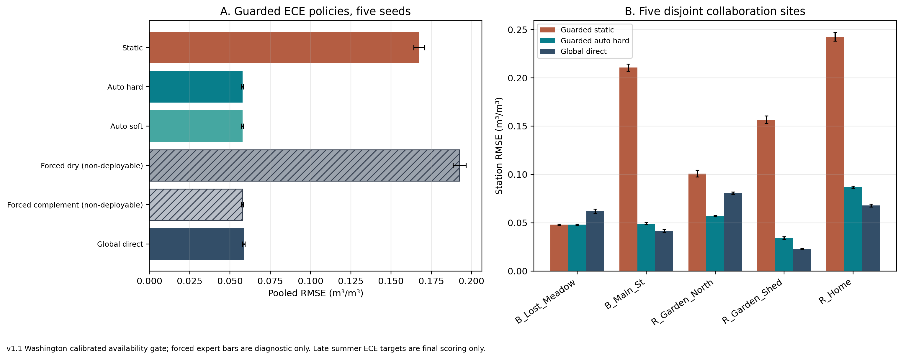

# Regional Models for Daily Soil-Moisture Estimation in Washington

## Technical report assembly 1.1 — Paper 2 handoff

> **Purpose.** This technical report supports drafting the second paper. It records the methods, results, interpretation, evidence boundaries, and source trail in one place. The assembled Markdown is the canonical text; `report.pdf` is its reading copy.
>
> **Evidence rule.** This report presents the Washington temporal and leave-one-station-out (LOSO) evaluation together with the ECE station evaluation as one final evidence batch. They use different station sets and evaluation protocols. Exact source paths, run identities, and hashes are recorded in the claims ledger and provenance manifest. All reported values are inserted from saved artifacts by `scripts/report_data.py`; no models are fitted during report assembly.

### Reading key

- **Paired comparison:** both methods use the same seeds and evaluation procedure. This applies to the primary regional model and the paired model without station consistency.
- **Historical reference:** an earlier model or evaluation provides context but is not a direct paired comparison with the primary model.
- **Evaluation-only comparison:** an analysis explains model behavior at the ECE sites and is not a deployment-wide performance claim.
- R², RMSE, MAE, and bias refer to daily volumetric soil moisture at 5 cm; error metrics use m³/m³. Seed intervals measure variation across predictor random states only. They do not measure uncertainty from station sampling, feature selection, model selection, or reuse of the test period during development.

## 1. Executive synthesis and paper thesis

**Study question.** Does grouping daily observations by their satellite, weather, and site features, then fitting a soil-moisture predictor for each group, improve estimates across Washington stations? The **primary regional model** follows this approach: it uses the shared environmental and satellite features to group observations, then fits a soil-moisture predictor for each group. We compare it with the existing global model, which fits one predictor across all observations, and with a paired regional model that uses the same features and predictors but does not keep known stations in their usual group. The study evaluates which grouping signals are useful on this dataset; it does not propose a new model architecture or a universal number of groups.

**Primary finding.** The primary regional model has temporal R² **0.811843** (seed SD 0.001369; RMSE 0.044187) over 30 predictor seeds on the 2023–2025 development test period. The paired regional model without station consistency has R² **0.811724**, a small difference of **+0.000119 R²**. In leave-one-station-out evaluation, the primary model averages **0.637877 R²** versus **0.619877** for the paired model, a difference of **+0.018000** across five seeds and seven held-out stations. The station table locates the gain in 3 folds; 4 folds tie.

**Comparison context.** The existing global model has temporal R² **0.779794** and LOSO R² **0.579500**. The apparent primary-model gaps of **+0.0320** temporal and **+0.0584** LOSO come from different saved comparison procedures, so they are context rather than paired tests. A grouping based on the in-situ target threshold has temporal R² **0.735359** in the earlier comparison; that target is unavailable when making predictions. These results describe the specific methods and data evaluated here.

**ECE result.** On five ECE collaboration stations, the primary regional model's usual fitted assignment has pooled RMSE **0.167431**. With the alternate assignment based on an antecedent-precipitation index, pooled RMSE is **0.057768**, close to the global model's **0.058634**. The next sections explain how the regional groups relate to the Washington sites and how the ECE comparison should be read.

**Most important constraint for the paper.** The shared 54-feature set and XGBoost settings were influenced by the same test period used here, as were later group-assignment and model choices. Every 2023–2025 result is development-split evidence rather than untouched confirmation. A future independent time period or external dataset is needed to estimate the true advantage without this selection bias.

**Suggested working title.** “Regional Models for Soil-Moisture Estimation in Washington.” In technical sections, the method can be described as two XGBoost predictors selected by feature-based groups. The primary model's known-station consistency rule is one defined part of that approach.

## 2. Relationship to the first paper and literature

The first paper, [*Enhancing Spatial and Temporal Coverage of Soil Moisture Estimation Using Satellite and Weather-Driven Machine Learning*](../../paper/Enhancing%20Spatial%20and%20Temporal%20Coverage%20of%20Soil%20Moisture%20Estimation%20Using%20Satellite%20and%20Weather-%20Driven%20Machine%20Learning.pdf), established the multi-source satellite/weather pipeline, imputation, feature-engineering approach, and a global XGBoost model. Its reported R² of 0.822 is from five public Washington stations under a different dataset and evaluation protocol; it should not be ranked against the seven-station results here. The paper does not report the project's later regional-group comparisons; those remain project history rather than findings of the first paper. The first paper's DOI is [10.1109/AIIoT68874.2026.11569136](https://doi.org/10.1109/AIIoT68874.2026.11569136).

Soil-moisture MoE and regional specialization already exist. [Yang et al. (2025)](https://doi.org/10.1016/j.jhydrol.2025.133763) combine CNN–LSTM experts with adaptive weighting across Tibetan Plateau climate zones. [Zhang et al. (2026)](https://doi.org/10.3390/rs18183125) combine an antecedent-precipitation water-balance prior, a time-aware Mamba encoder, and a context-conditioned MoE for forecasting. [Singh et al. (2026)](https://doi.org/10.1029/2025JH001039) use wetness-specialized agents for surface-to-subsurface estimation; their target and protocol differ from this daily surface-estimation benchmark. [Wu et al. (2026)](https://doi.org/10.1016/j.jag.2026.105597) apply an RTE-guided MoE to passive-microwave retrieval. These are direct overlap in the use of specialized components, so architectural novelty is not the claim here.

Clustered soil-moisture models also precede this work: [Chakrabarti et al. (2016)](https://doi.org/10.1109/TGRS.2016.2547389) use soft cluster memberships and kernel regression for disaggregation; [Ding et al. (2024)](https://doi.org/10.1016/j.jag.2024.104003) use K-means-defined subregions with specialized gap-filling models; and [Stahl and McColl (2022)](https://doi.org/10.1175/JCLI-D-21-0780.1) identify global seasonal-cycle regimes. In broader hydrology, [Moges et al. (2016)](https://doi.org/10.1002/2015WR018266) use indicator-driven hierarchical model weighting, while [Rong et al. (2025)](https://doi.org/10.1016/j.jhydrol.2025.132737) compare ways of assigning observations to specialists for streamflow prediction. These studies motivate asking **which inputs determine group assignment, whether they are available when a prediction is made, and how that assignment is evaluated**, rather than claiming that clustering or specialized predictors are new. Full verified metadata is in `references.bib` and §12.

## 3. Data, target, and evaluation protocol

The study combines in-situ soil-moisture observations with satellite, weather, and site information. It uses 9803 training rows (2017–2020), 4805 validation rows (2021–2022), and 6620 later-period test rows (2023–2025). **Trainval** means training plus validation, 14608 rows. The prediction target is daily soil moisture at 5 cm. Source and processing details are recorded in the claims ledger and provenance manifest.

**Seven Washington study stations.** The network column identifies the source of the in-situ observations. Coordinates, elevation, and group membership provide site context; group membership is not a causal climate classification. Group numbers are local to this study.

| Station | Data network | Lat. | Lon. | Elevation m | Trainval local group | Trainval rows |
| --- | --- | --- | --- | --- | --- | --- |
| Beaver Pass | SNOTEL | 48.88 | -121.26 | 1125 | 0 | 2185 |
| Cayuse Pass | SNOTEL | 46.87 | -121.53 | 1588 | 0 | 2042 |
| Darrington | NOAA USCRN | 48.54 | -121.45 | 166 | 0 | 2048 |
| Paradise | SNOTEL | 46.78 | -121.75 | 1564 | 0 | 2189 |
| Quinault | NOAA USCRN | 47.51 | -123.81 | 88 | 0 | 2160 |
| Sourdough Gulch | SNOTEL | 46.23 | -117.40 | 1164 | 1 | 2191 |
| Spokane | NOAA USCRN | 47.42 | -117.53 | 705 | 1 | 1793 |

The global model and each regional predictor use the same **54** features. The primary regional model uses those same features to form groups; it does not require a separate hand-picked grouping feature set. Inputs include SMAP soil-moisture proxies, Sentinel-derived indices, weather and antecedent precipitation, terrain, climate, land cover, and temporal summaries. The grouping does not use in-situ target labels, though it does use satellite soil-moisture information. The complete feature list appears in Appendix A. The shared feature set makes the model comparison easier to interpret, while its selection using the 2023–2025 test period remains a limitation.

Temporal evaluation trains on trainval and evaluates the later test years at the seven known stations. In leave-one-station-out (LOSO) evaluation, the model is refit using six stations and evaluated on the seventh; information from the held-out station is excluded from imputation, scaling, grouping, and thresholds. Temporal results average 30 predictor seeds; LOSO results use five seeds per held-out station. Earlier model comparisons are identified as historical references where appropriate.

For the paired and historical-reference analyses, R² measures explained variance, RMSE and MAE measure error size, bias is signed mean prediction error, and ubRMSE removes the mean bias component. Seed-level 95% t intervals and paired seed tests answer different questions and should not be interchanged. A seven-station LOSO win count is descriptive and has little inferential power.

## 4. How the regional models work

The primary regional model uses the shared 54 environmental and satellite features to assign each station-day observation to one of two groups. It predicts soil moisture with the XGBoost predictor fitted for that group. In technical terms, each observation uses one specialist predictor rather than a blend. The paired model uses the same features and predictor type but removes the rule that keeps a known station in its usual group. The existing global model uses one predictor for all observations.

The shared XGBoost predictors use 2,500 histogram trees, learning rate 0.005, depth 9, minimum child weight 8, gamma 0, alpha 0.03, lambda 0.75, row subsampling 0.9, and column subsampling 0.8. These settings were tuned during the same test era and contribute to the development-split limitation.

| Model | How observations are grouped | In-situ target used for grouping? | SMAP-derived input | Report role |
| --- | --- | --- | --- | --- |
| Target-threshold grouping | Groups defined using the in-situ target threshold | Yes | Not required for grouping | Historical comparison; target is unavailable at prediction time |
| Seasonal grouping | Groups defined by season | No | No | Historical reference |
| Precipitation-index grouping | Groups defined by antecedent precipitation | No | No | Historical reference |
| Dynamic-feature grouping | Groups defined by a small set of changing covariates | No | Lagged SMAP proxy | Historical reference |
| Primary regional model | Groups defined from the shared feature set, with known-station consistency | No | Current, lagged, and rolling SMAP proxies | **Primary model** |
| Paired regional model | Same shared feature set, without known-station consistency | No | Current, lagged, and rolling SMAP proxies | Paired comparison |
| Existing global model | No groups; one predictor for all observations | No | SMAP in predictor features | Historical reference |

**How the grouping is formed.** Using fit data only, the model imputes missing feature values, scales the features, and uses K-means to divide observations into two groups. Group numbers follow an indexing convention based on the mean of `SMAP_sm_pm_interp_rollmean30`; c1 has the lower fit-data mean. For a station present during fitting, the primary model uses that station's most common group. For a new station or a row without a station ID, it assigns the row from its features. Keeping known stations together shapes the training examples used by each group-specific predictor. The evaluation records when satellite inputs are unavailable so the ECE comparison can be described clearly.

The main comparison is between the primary regional model and its paired version without station consistency. The existing global model and earlier grouping methods provide context. Because the shared test period informed feature and model choices, all results here are development evidence rather than independent confirmation. An earlier V0 regional model is retained as historical context in Appendix B.

## 5. Primary temporal results

**Table 1. Temporal results on the 2023–2025 test period.** Seed SD and 95% CI show variation across predictor random states. Historical-reference rows use a different comparison procedure and are not paired with the primary regional model. RMSE, MAE, and bias are m³/m³. Evidence sources and hashes are recorded in the claims ledger.

| Model | Comparison role | Seeds | R² | Seed SD | 95% seed CI | RMSE | MAE | Bias |
| --- | --- | --- | --- | --- | --- | --- | --- | --- |
| Primary regional model | paired comparison | 30 | 0.8118 | 0.0014 | [0.8113, 0.8124] | 0.0442 | 0.0340 | 0.0060 |
| Regional model without station consistency | paired comparison | 30 | 0.8117 | 0.0014 | [0.8112, 0.8122] | 0.0442 | 0.0340 | 0.0060 |
| Changing-covariate grouping | historical reference | 30 | 0.7855 | 0.0010 | [0.7851, 0.7858] | 0.0472 | 0.0363 | 0.0096 |
| Existing global model | historical reference | 30 | 0.7798 | 0.0013 | [0.7793, 0.7803] | 0.0478 | 0.0369 | 0.0100 |
| Seasonal grouping | historical reference | 30 | 0.7700 | 0.0016 | [0.7694, 0.7706] | 0.0489 | 0.0377 | 0.0107 |
| Precipitation-index grouping | historical reference | 30 | 0.7676 | 0.0009 | [0.7672, 0.7679] | 0.0491 | 0.0381 | 0.0106 |
| Target-threshold grouping | historical reference | 30 | 0.7354 | 0.0011 | [0.7350, 0.7358] | 0.0524 | 0.0388 | 0.0145 |

**Analysis.** The primary regional model and the paired regional model are nearly tied temporally: their mean R² difference is +0.000119, smaller than the seed SD shown above, though its direction is consistent across the 30 paired seeds. The existing global and other grouping methods score lower in this saved comparison, but those are historical references rather than paired tests against the primary model. The earlier V0 regional model is retained as context; its detailed results and comparison limits are in Appendix B.

*Figure 1.* Model comparison from saved evaluation tables. The carried-forward figure uses shorthand labels: “Guarded primary” is the primary regional model, “Backbone ablation” is the paired regional model without station consistency, and “V0 sensitivity” is the earlier model described in Appendix B. Error bars show predictor-seed variation, not selection uncertainty.

## 6. In-state spatial generalization: LOSO

**Table 2. Station-mean leave-one-station-out results.** Each regional model uses five predictor seeds across seven held-out Washington stations. The primary comparison is paired; older rows are historical references. Evidence sources and hashes are recorded in the claims ledger.

| Model | Comparison role | Seeds × held-out sites | Station-mean R² | Station-mean RMSE |
| --- | --- | --- | --- | --- |
| Primary regional model | paired comparison | 5 × 7 | 0.6379 | 0.0558 |
| Regional model without station consistency | paired comparison | 5 × 7 | 0.6199 | 0.0571 |
| Existing global model | historical reference | 5 × 7 | 0.5795 | 0.0610 |
| Earlier global model | historical reference | 5 × 7 | 0.5907 | 0.0601 |

**Analysis.** The primary model's paired mean advantage over the regional model without station consistency is +0.018000 R², with improvements on 3 held-out stations and ties on 4. This is the clearest spatial result in the paired comparison. The global-model gap is context only; it does not supply a direct paired comparison or a test of fold-by-fold wins. With seven stations, the fold count describes this set of locations and is not a population estimate.

**Table 3. Paired LOSO results by held-out station.** The two adjusted Rand index (ARI) columns compare how the six-station training set is divided by the earlier and current regional grouping procedures. Lower agreement means the group assignments changed more after refitting. Evidence sources and hashes are recorded in the claims ledger.

| Held-out station | Primary model R² | Paired regional model R² | Difference | Wins / ties (5 seeds) | Earlier vs shared group ARI | Shared vs primary group ARI |
| --- | --- | --- | --- | --- | --- | --- |
| Sourdough Gulch | 0.3699 | 0.3108 | +0.0591 | 5/0 | 0.132 | 0.349 |
| Spokane | 0.6083 | 0.5568 | +0.0514 | 5/0 | 0.192 | 0.330 |
| Paradise | 0.7800 | 0.7645 | +0.0154 | 5/0 | 0.990 | 0.990 |
| Beaver Pass | 0.7531 | 0.7531 | +0.0000 | 0/5 | 1.000 | 1.000 |
| Cayuse Pass | 0.6862 | 0.6862 | +0.0000 | 0/5 | 1.000 | 1.000 |
| Darrington | 0.6949 | 0.6949 | +0.0000 | 0/5 | 1.000 | 1.000 |
| Quinault | 0.5729 | 0.5729 | +0.0000 | 0/5 | 1.000 | 1.000 |

**Analysis.** The largest gains occur for the Sourdough Gulch and Spokane holdouts, where refitting changes how the six training stations are divided. For a held-out station, predictions still use its row-level features. The consistency rule changes which training observations each group-specific predictor sees; it does not assign a fixed group to a station that was left out. Paradise has a smaller gain. The 4 tied folds show locations where the rule did not change the observed result. These comparisons describe model behavior and do not establish a geophysical cause.

## 7. Partition diagnostics and feature interpretation

**Table 4. Number-of-groups comparison using training and validation data.** Lower Davies–Bouldin and higher Calinski–Harabasz favor two groups here; silhouette is slightly higher at three. These summary measures do not establish physical meaning or the best choice for future data. Evidence sources and hashes are recorded in the claims ledger.

| Number of groups | Silhouette | Calinski–Harabasz | Davies–Bouldin | Trainval station agreement | Smallest group share |
| --- | --- | --- | --- | --- | --- |
| 2 | 0.219 | 3880.9 | 1.579 | 1.000 | 0.273 |
| 3 | 0.226 | 3589.4 | 1.815 | 0.833 | 0.264 |
| 4 | 0.188 | 2855.0 | 2.015 | 0.695 | 0.147 |

For the seven Washington stations, c0 contains Beaver Pass, Cayuse Pass, Darrington, Paradise, and Quinault; c1 contains Spokane and Sourdough Gulch. This is a sample-specific pattern across the Cascade side and eastern Washington. The c0 group includes both lower-elevation sites and mountain sites, so the groups are not a strict mountain-versus-lowland split. The primary model keeps known stations in one group by design; this consistency is a model rule rather than independent evidence of a physical classification. Group indices can change when the model is refit.

**Table 5. Features that differ most between the paired model's groups.** The separation index and group medians come from an earlier analysis of the same Washington split. These profile attributes need not be model inputs; the target is excluded. Evidence sources and hashes are recorded in the claims ledger.

| Feature | Separation index | Median c0 | Median c1 |
| --- | --- | --- | --- |
| longitude | 1.000 | -121.534 | -117.400 |
| J_bio_bio13 | 1.000 | 391.000 | 70.000 |
| SMAP_sm_pm_interp | 0.932 | 0.414 | 0.192 |
| latitude | 0.642 | 47.510 | 46.233 |
| G_API | 0.551 | 47.459 | 14.936 |
| J_lc_code | 0.550 | 10.000 | 30.000 |
| G_rain_sum_7d | 0.424 | 30.100 | 9.500 |
| J_soil_texture_usda_b0 | 0.398 | 7.000 | 7.000 |
| LST_modis | 0.384 | 280.944 | 291.242 |
| F_NDVI | 0.326 | 0.532 | 0.330 |

**Analysis.** The groups also differ in site descriptors, satellite soil-moisture summaries, vegetation and temperature features, and antecedent weather. These associations help explain why the regional predictors see different inputs. In this study, the useful interpretation is a broad western/Cascade-side versus eastern-Washington pattern that also reflects elevation and local conditions. It describes these stations and does not define universal physical regimes.

## 8. Regional model interpretation at ECE stations

The primary regional model uses environmental and satellite features to divide observations into two groups, then fits one soil-moisture predictor for each group. In this Washington sample, one group contains Beaver Pass, Cayuse Pass, Darrington, Paradise, and Quinault on the western/Cascade side; the other contains Spokane and Sourdough Gulch east of the Cascades. This is a sample-specific pattern that overlaps imperfectly with elevation: the western group includes both lower-elevation and mountain stations. The groups should not be read as a general mountain-versus-lowland classification.

The five ECE collaboration stations are outside the seven-station Washington training set, so the results show how the learned predictors behave at new sites. The ECE set contains 150 daily observations from 5 stations between 2026-07-20 and 2026-08-19, with 30 observations per site. It is a short evaluation window; the site-level results show how errors vary across those locations.

The ECE observations do not contain the SMAP features used in the usual Washington grouping. We report results for the usual fitted assignment and an alternate assignment based on the available antecedent-precipitation index (G_API). A blended assignment and predictions from each single regional predictor provide context for how the model outputs relate to the individual predictors. The single-predictor rows are reference comparisons. Washington validation data determined the alternate assignment and its mapping; ECE target values were used only to score predictions.

For the primary regional model, Washington fit data associates group c0 with the five western/Cascade-side stations and group c1 with Spokane and Sourdough Gulch. In the ECE tables, predictor indices 0 and 1 refer to the two fitted predictors within each model; those indices do not assign universal climate labels to ECE stations.

**Table 6. Mapping the precipitation-based assignment to each model's predictors.** Predictor indices are specific to each model fit; they are not climate labels. The table also shows fixed single-predictor comparisons.

| Model | Precipitation class 0 → predictor | Class 1 → predictor | Fixed comparator predictor | Other predictor | Comparator usable from inputs? | Index with lower WA SMAP mean? |
| --- | --- | --- | --- | --- | --- | --- |
| Regional model without station consistency | index 0 | index 1 | index 0 | index 1 | no | no |
| Primary regional model | index 0 | index 1 | index 1 | index 0 | no | yes |

In the Washington fit data, the mean of `SMAP_sm_pm_interp_rollmean30` is 0.435981 at c0 and 0.180078 at c1; corresponding target means are 0.221648 and 0.209373. These summaries describe the fitted groups; group numbers are model labels, not physical class labels.

**Table 7. Precipitation-group mapping chosen using Washington validation.** The lower-RMSE mapping was fixed before scoring ECE observations; an exact tie would select class 0 → predictor index 0.

| Precipitation class 0 → | Precipitation class 1 → | WA validation RMSE | Chosen for ECE |
| --- | --- | --- | --- |
| index 0 | index 1 | 0.073965 | yes |
| index 1 | index 0 | 0.117180 | no |

### ECE results across assignment options and sites

**Table 8. Pooled ECE results over five predictor seeds.** Error metrics are m³/m³. Single-predictor references are included for context. R² is omitted because target variance is very small over this short window.

| Model | Assignment or reference | Usable from observed inputs? | RMSE ± seed SD | MAE | Bias | ubRMSE |
| --- | --- | --- | --- | --- | --- | --- |
| Regional model without station consistency | Usual fitted assignment | yes | 0.167431 ± 0.003401 | 0.147346 | +0.141932 | 0.088816 |
| Regional model without station consistency | Precipitation-based assignment | yes | 0.057768 ± 0.000617 | 0.050167 | +0.028654 | 0.050158 |
| Regional model without station consistency | Precipitation-based blend | yes | 0.057768 ± 0.000617 | 0.050167 | +0.028655 | 0.050158 |
| Regional model without station consistency | Single regional predictor 0 (reference) | no | 0.057768 ± 0.000617 | 0.050167 | +0.028654 | 0.050158 |
| Regional model without station consistency | Single regional predictor 1 (reference) | no | 0.192536 ± 0.004021 | 0.185650 | +0.185650 | 0.051020 |
| Primary regional model | Usual fitted assignment | yes | 0.167431 ± 0.003401 | 0.147346 | +0.141932 | 0.088816 |
| Primary regional model | Precipitation-based assignment | yes | 0.057768 ± 0.000617 | 0.050167 | +0.028654 | 0.050158 |
| Primary regional model | Precipitation-based blend | yes | 0.057768 ± 0.000617 | 0.050167 | +0.028655 | 0.050158 |
| Primary regional model | Single regional predictor 1 (reference) | no | 0.192536 ± 0.004021 | 0.185650 | +0.185650 | 0.051020 |
| Primary regional model | Single regional predictor 0 (reference) | no | 0.057768 ± 0.000617 | 0.050167 | +0.028654 | 0.050158 |
| Existing global model | Single global predictor | yes | 0.058634 ± 0.000735 | 0.050623 | +0.015122 | 0.056635 |

**Analysis.** The precipitation-based assignment reduces pooled RMSE relative to the usual fitted assignment by 0.109663 m³/m³. Its RMSE is 0.057768, close to the global model's 0.058634 (difference -0.000866). All 150 rows use precipitation class 0. Under the mapping chosen with Washington validation, that class points to predictor index 0. Its result matches the index-0 single-predictor reference (RMSE 0.057768); the index-1 reference has RMSE 0.192536. These comparisons show the predictions from each regional predictor and the input-based assignment on this ECE set.

**Table 9. ECE station-level errors and site context.** Elevation and annual precipitation describe the sites; they do not explain model error by themselves. The final column summarizes the alternate assignment's weight on the fixed comparison predictor.

| ECE station | Elev. m | Annual precip. descriptor mm | Primary usual RMSE | Primary alternate RMSE | Global RMSE | Alternate bias | Weight on comparator predictor |
| --- | --- | --- | --- | --- | --- | --- | --- |
| BBG Lost Meadow | 52 | 1019 | 0.0480 | 0.0480 | 0.0619 | +0.0415 | 0.000 |
| BBG Main Street | 51 | 1018 | 0.2105 | 0.0490 | 0.0414 | +0.0464 | 0.000 |
| Renton Garden North | 157 | 1227 | 0.1009 | 0.0569 | 0.0806 | -0.0537 | 0.000 |
| Renton Garden Shed | 157 | 1227 | 0.1566 | 0.0342 | 0.0232 | +0.0252 | 0.000 |
| Renton Home | 136 | 1181 | 0.2425 | 0.0870 | 0.0678 | +0.0839 | 0.000 |

**Analysis.** Errors vary across the five sites, so the pooled result does not describe every location. This short evaluation helps interpret the regional predictors and their assignments at new stations. Its Washington-selected mapping and late-summer observations do not establish full-season performance or a universal regime definition. ECE targets did not determine the mapping.

*Figure 2.* ECE pooled and station-level RMSE. The carried-forward plot uses “Guarded” as shorthand for the primary regional model; its fixed single-predictor bars are model-specific references.

*Figure 3.* Daily observations and model predictions at the five ECE stations. “Guarded” in the carried-forward plot refers to the primary regional model; fixed single-predictor traces are model-specific references.

An earlier comparison of a regional model and the global model was effectively tied: station-mean ΔRMSE (regional model minus global) +0.000250, with 2 / 5 station wins and sign-test p=1.000. A separate hourly analysis found median within-day sensor range 0.0349 versus median absolute day-to-day daily-target step 0.0025 in its focus windows. These observations help describe the daily measurement setting; the ECE results here remain a short, site-specific view of the regional models.

## 9. Robustness, negative evidence, and limits

The primary regional model uses the shared feature set described in §4. Earlier feature-set comparisons are summarized in Appendix B.

**Out-of-state comparison.** These earlier regional and comparison models were trained on Washington and evaluated on ten out-of-state stations. They are not results for the primary regional model. Station-mean R² is negative across the listed configurations; the two-group variants do not show reliable transfer beyond the region. Evidence sources and hashes are recorded in the claims ledger.

| Earlier model or grouping | 10-station mean R² | 10-station mean RMSE | Pooled R² |
| --- | --- | --- | --- |
| Earlier global baseline (50 features) | -0.457 | 0.087 | 0.1799 ± 0.0053 |
| Regional model (54 shared features) | -0.527 | 0.088 | 0.1325 ± 0.0044 |
| Seasonal grouping | -0.517 | 0.087 | 0.1613 ± 0.0059 |
| Precipitation-index grouping | -0.729 | 0.090 | 0.0899 ± 0.0087 |
| Existing global model (54 features) | -0.429 | 0.085 | 0.2060 ± 0.0047 |
| Changing-covariate grouping | -0.561 | 0.089 | 0.1380 ± 0.0063 |
| Target-threshold grouping | -0.765 | 0.095 | 0.0485 ± 0.0060 |

**Interpretation.** The results support evaluating regional predictors for within-Washington differences under this development protocol. The out-of-state table shows that the current models do not establish transfer to other regions. Snowpack-dominated sites and missing snow-water-equivalent information are areas for future model development.

**Selection and inference limits.** Seven held-out stations provide a small spatial sample. Temporal seed intervals measure predictor fitting variation; they do not include uncertainty from station sampling or feature and model selection. The shared features, XGBoost settings, and some model choices were informed by the 2023–2025 test period, so the scores are development evidence. Known-station consistency is enforced by the model rule; for new stations, predictions use row-level grouping. The ECE evaluation covers five separate stations over a short late-summer window, with a model mapping selected using Washington validation. It helps interpret the model behavior at those sites but does not establish broader seasonal or geographic transfer.

## 10. Paper contribution decisions and writing guidance

1. **Introduce the models in plain language.** Explain the two regional predictors, the existing global comparison, and how known stations remain in their usual group before using implementation names.
2. **Lead with paired results.** Report the temporal near-tie and the LOSO differences together. Identify older model comparisons as historical references.
3. **Explain the Washington groups.** Describe the five west/Cascade-side stations and two eastern stations as a sample-specific pattern, with the mountain and lowland context stated accurately.
4. **Use the ECE section to interpret model behavior.** Explain the group mapping, assignment comparisons, Washington validation choice, pooled and site-level errors, and daily overlay. Keep the small sample and short window in view.
5. **State the development-split status in abstract, results, and limitations.** Independent confirmation requires new dates or sites and a selection protocol that keeps final evaluation untouched. Future work can test the number of groups, a global fallback, more station types and snowpack features, full-season ECE data, and a direct paired regional-versus-global station holdout comparison.

**Proposed paper spine.** Introduction: the estimation question after the first paper. Related work: regional soil-moisture models. Methods: data, shared predictors, regional model, and global comparison. Results: temporal performance, held-out station performance, and group interpretation. Discussion: behavior at ECE stations, reliance on satellite and weather inputs, selection limits, and scope. Conclusion: a bounded finding about regional models for Washington stations.

## 11. Reproducibility and evidence trail

`scripts/assemble_report.py` reads the saved evidence and inserts result values into the report and claims ledger. `provenance/source_manifest.json` records exact source paths, run identities, and SHA-256 hashes. `scripts/validate_assembly.py` checks source schemas, seed and station coverage, the station-network mapping, ECE mapping provenance, figures, links, and deterministic regeneration. The figures reuse the existing report notebook and saved tables. No model training, split regeneration, or edits to versioned notebooks are required.

The claims ledger distinguishes **confirmed within the saved protocol**, **historical reference**, **evaluation-only**, and **unresolved**. A confirmed number does not imply independent test confirmation. The ledger and manifest preserve the exact source artifacts for audit, while this report presents the results in one reader-facing account.

## 12. References

1. Balkovec, J., et al. *Enhancing Spatial and Temporal Coverage of Soil Moisture Estimation Using Satellite and Weather-Driven Machine Learning.* In *2026 IEEE World AI IoT Congress (AIIoT)*. [doi:10.1109/AIIoT68874.2026.11569136](https://doi.org/10.1109/AIIoT68874.2026.11569136); [repository PDF](../../paper/Enhancing%20Spatial%20and%20Temporal%20Coverage%20of%20Soil%20Moisture%20Estimation%20Using%20Satellite%20and%20Weather-%20Driven%20Machine%20Learning.pdf). Historical context for the pipeline and global model.
2. Yang, J., Yang, Q., Hu, F., and Shao, J. (2025). “An Interpretable Framework of Soil Moisture Estimation Based on Mixture-of-Experts (ISMoE): A Case Study on the Tibetan Plateau.” *Journal of Hydrology* 661, 133763. [doi:10.1016/j.jhydrol.2025.133763](https://doi.org/10.1016/j.jhydrol.2025.133763).
3. Zhang, Z., Mao, K., Yuan, Z., and Bateni, S. M. (2026). “An Antecedent-Precipitation-Informed Soil Water Balance and Time-Aware Mamba–MoE Framework for Surface Soil Moisture Forecasting.” *Remote Sensing* 18(18), 3125. [doi:10.3390/rs18183125](https://doi.org/10.3390/rs18183125).
4. Singh, A., Singh, V., and Gaurav, K. (2026). “Weak Physics-Guided Multi-Agent Learning for Surface to Subsurface Moisture Estimation Across Diverse Climate and Soil Conditions.” *JGR: Machine Learning and Computation* 3, e2025JH001039. [doi:10.1029/2025JH001039](https://doi.org/10.1029/2025JH001039).
5. Wu, Y., Mao, K., Shi, J., Guo, Z., and Bateni, S. M. (2026). “An RTE-Guided Mixture-of-Experts Framework for AMSR2 Passive Microwave Soil Moisture Retrieval.” *International Journal of Applied Earth Observation and Geoinformation* 154, 105597. [doi:10.1016/j.jag.2026.105597](https://doi.org/10.1016/j.jag.2026.105597).
6. Chakrabarti, S., Judge, J., Bongiovanni, T., Rangarajan, A., and Ranka, S. (2016). “Disaggregation of Remotely Sensed Soil Moisture in Heterogeneous Landscapes Using Holistic Structure-Based Models.” *IEEE TGRS* 54(8), 4629–4641. [doi:10.1109/TGRS.2016.2547389](https://doi.org/10.1109/TGRS.2016.2547389).
7. Ding, T., Zhao, W., and Yang, Y. (2024). “Addressing Spatial Gaps in ESA CCI Soil Moisture Product: A Hierarchical Reconstruction Approach Using Deep Learning Model.” *International Journal of Applied Earth Observation and Geoinformation* 132, 104003. [doi:10.1016/j.jag.2024.104003](https://doi.org/10.1016/j.jag.2024.104003).
8. Stahl, M. O., and McColl, K. A. (2022). “The Seasonal Cycle of Surface Soil Moisture.” *Journal of Climate* 35, 4997–5012. [doi:10.1175/JCLI-D-21-0780.1](https://doi.org/10.1175/JCLI-D-21-0780.1).
9. Moges, E., Demissie, Y., and Li, H.-Y. (2016). “Hierarchical Mixture of Experts and Diagnostic Modeling Approach to Reduce Hydrologic Model Structural Uncertainty.” *Water Resources Research* 52, 2551–2570. [doi:10.1002/2015WR018266](https://doi.org/10.1002/2015WR018266).
10. Rong, Z., Sun, W., Xie, Y., Huang, Z., and Chen, X. (2025). “Mixture of Experts Leveraging Informer and LSTM Variants for Enhanced Daily Streamflow Forecasting.” *Journal of Hydrology*, 132737. [doi:10.1016/j.jhydrol.2025.132737](https://doi.org/10.1016/j.jhydrol.2025.132737).
11. Chen, T., and Guestrin, C. (2016). “XGBoost: A Scalable Tree Boosting System.” *Proceedings of KDD*. [doi:10.1145/2939672.2939785](https://doi.org/10.1145/2939672.2939785).

## Appendix A. Exact shared 54-feature backbone

The following list is inserted directly from the saved feature record. It is the shared predictor input used by the global model and regional specialists. It is supplied here so the paper author can report or audit the precise feature provenance without searching experiment files.

`precip_mm`, `s2_b4`, `s2_b8`, `SMAP_sm_pm_interp`, `D_sin_DOY`, `D_cos_DOY`, `E_SAR_ratio`, `G_API`, `G_DSLR`, `G_rain_sum_3d`, `G_rain_sum_7d`, `SMAP_sm_pm_interp_lag7`, `SMAP_sm_pm_interp_lag30`, `SMAP_sm_pm_interp_rollrange7`, `SMAP_sm_pm_interp_rollmean30`, `SMAP_sm_pm_interp_rollrange30`, `SMAP_sm_interp_rollrange7`, `SMAP_ampm_diff_interp`, `V_rollrng_G_API_kobs7`, `V_rollmax_F_NDMI_kobs30`, `A_d_E_SAR_ratio_kobs30`, `V_rollmax_E_SAR_ratio_kobs7`, `V_rollmin_E_SAR_ratio_kobs30`, `V_rollmax_E_SAR_ratio_kobs30`, `V_rollmin_LST_modis_kobs30`, `V_ema_LST_modis_kobs30`, `V_rollmax_F_NDVI_kobs14`, `V_rollmax_F_NDVI_kobs30`, `V_ema_F_NDVI_kobs30`, `C_lag_F_NDVI_kobs30`, `A_grad_E_SAR_diff_kobs30`, `V_rollmax_E_SAR_diff_kobs14`, `V_rollrng_E_SAR_diff_kobs30`, `V_rollmax_E_SAR_diff_kobs30`, `A_grad_s2_b11_kobs30`, `V_rollrng_s2_b11_kobs30`, `V_rollmin_s2_b11_kobs30`, `V_rollmin_s2_b12_kobs30`, `A_d_SMAP_sm_interp_kobs30`, `V_rollmin_SMAP_sm_interp_kobs14`, `V_rollmin_SMAP_sm_interp_kobs30`, `E_rough_s1_vh_kobs14`, `J_aspect_deg`, `J_bio_bio02`, `J_bio_bio13`, `J_lc_code`, `J_soil_texture_usda_b0`, `sin_year`, `cos_year`, `SMAP_x_year`, `D_z_F_NDMI`, `D_z_LST_modis`, `D_fft_dom_LST_modis_kobs30`, `D_fft_ent_LST_modis_kobs30`

## Appendix B. Earlier V0 regional model

The V0 model is an earlier regional model retained to show how the current comparison developed. It used a 50-feature grouping input. The primary model uses the shared 54-feature input and keeps known stations in their most common group, as described in §4. In the main text, V0 appears only as a historical reference; the metrics and their comparison limits are collected here.

| Historical model | Temporal R² | LOSO R² | Role |
| --- | --- | --- | --- |
| V0 regional model | 0.8118 | 0.6372 | Historical reference |

**Earlier V0 feature-set comparison.** The table compares the shared V0 feature set with a version that added features selected using Washington validation. These results describe V0 only and are not a comparison of the primary model.

| Feature set | Temporal R² | LOSO R² |
| --- | --- | --- |
| Shared features only (V0) | 0.8118 ± 0.0014 | 0.6372 |
| Washington validation-selected additions (V0) | 0.7351 ± 0.0025 | 0.5060 |

**Earlier out-of-state results.** These V0 results are part of the historical record; they do not describe the current primary model.

| Earlier model or grouping | 10-station mean R² | 10-station mean RMSE | Pooled R² |
| --- | --- | --- | --- |
| Earlier V0 regional model (50 features) | -0.599 | 0.090 | 0.1260 ± 0.0044 |

The temporal and LOSO entries come from separate saved evaluations and are historical context; they are not paired comparisons with the primary model. In an earlier comparison without regime-specific feature additions, V0 exceeded the global model by +0.0320 [0.0313, 0.0328], p=7.1e-37 temporal R². This result belongs to V0 and its saved evaluation only; it does not establish a significance result for the primary model. The main temporal figure retains V0 as a visual reference, while the results tables in §§5–6 focus on the current primary and paired regional models.
