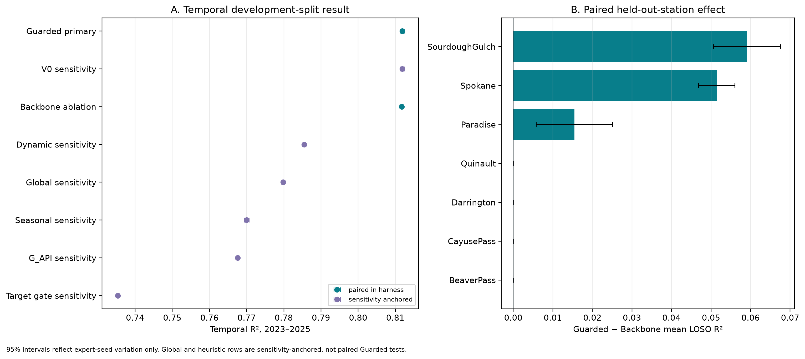
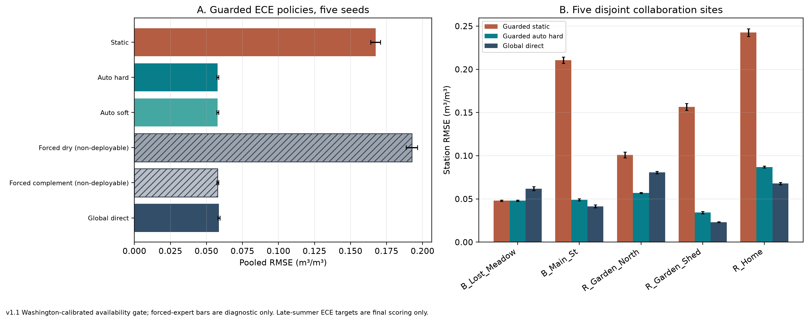
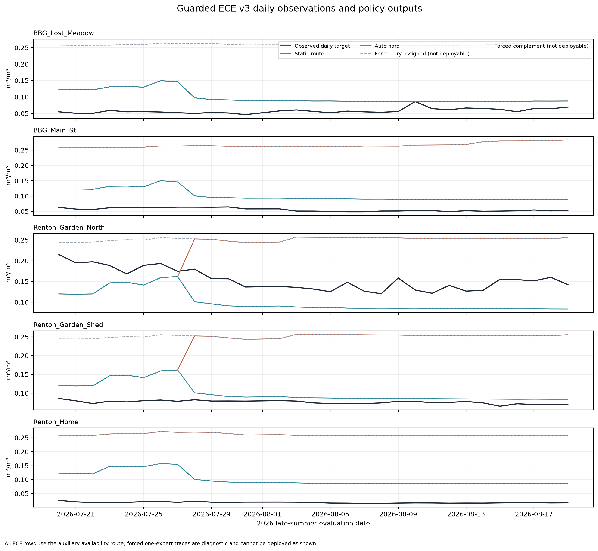

# Regional Models for Daily Soil-Moisture Estimation in Washington

## Technical report assembly 1.2 — Paper 2 handoff

> **Purpose.** This technical report supports drafting the second paper. It records the methods, results, interpretation, evidence boundaries, and source trail in one place. The assembled Markdown is the canonical text; `report.pdf` is its reading copy. It is written so an external reader can follow it without opening any other file in the repository.
>
> **Evidence rule.** This report presents the Washington temporal and leave-one-station-out (LOSO) evaluation together with the ECE station evaluation as one final evidence batch. They use different station sets and evaluation protocols. Exact source paths, run identities, and hashes are recorded in the claims ledger and provenance manifest. All reported values are inserted from saved artifacts by `scripts/report_data.py`; no models are fitted during report assembly.

### The three main models (read this first)

All models in this report predict the same thing — **daily volumetric soil moisture at 5 cm depth (m³/m³)** — from the same **shared set of 54 satellite, weather, and site features** (§3, full list in Appendix A), using the same XGBoost predictor settings (§4). They differ only in **how they group daily observations before fitting predictors**:

- **Two-regime regional model (the family under test).** A K-means router with k=2 divides each station-day observation into one of two groups, then a separate XGBoost predictor is fitted for each group. Each new observation is handled by exactly one of the two predictors (no blending). The router is fitted on fit data only (mean-impute → standardize → K-means with seed 42, `n_init=10`); cluster labels are canonicalized after each fit so the drier group — lower fit-data mean of the 30-day rolling SMAP feature `SMAP_sm_pm_interp_rollmean30` — has a consistent label.
- **Primary regional model.** The two-regime model **plus a station-majority rule**: a station already seen during fitting is always assigned to whichever group most of its fit-period days fell in (ties go to the smaller group id). Rows from a new station, rows without a station id, or rows failing the missing-data gate fall back to the per-day K-means assignment. We call this the **primary regional model** throughout and report its numbers as the headline result.
- **Unguarded two-regime model.** The identical two-regime model **without** the station-majority rule: every row is assigned from its own features by nearest K-means centroid. This is the only directly paired ablation of the primary model (same features, same predictors, same seeds).
- **Single-regime global model.** One XGBoost predictor fitted on all observations, no grouping. The global model reported here is re-run on the **same seven stations, same 54 features, and same test period** as the regional models, so it is a contemporary comparator. Do not confuse it with the first paper's R² of 0.822, which used five stations and a different protocol (§2) and must not be ranked against the numbers here.

### How to read the comparisons (replaces the old "comparison role" column)

- **Main paired result:** primary vs. unguarded two-regime model. Same seeds, same fitting/evaluation procedure. Only differences between these two rows can be read as a controlled effect of the station-majority rule.
- **Contemporary context:** seasonal, precipitation-index, dynamic-feature, target-threshold, and global single-regime rows in the same tables. These were all run on the current seven-station data with the same predictor settings, but they come from a different saved evaluation harness/run than the paired comparison, so treat gaps as background, not as formal paired tests.
- **Previous-paper anchor:** the first paper's R² 0.822 only (§2). Different stations, different data — never subtract it from numbers here.
- R², RMSE, MAE, and bias refer to daily volumetric soil moisture at 5 cm; error metrics use m³/m³. Seed intervals measure variation across XGBoost predictor random seeds only (the K-means router stays at seed 42). They do not measure uncertainty from station sampling, feature selection, model selection, or reuse of the test period during development.

## 1. Executive synthesis and paper thesis

**Study question.** Does grouping daily observations by their satellite, weather, and site features, then fitting one soil-moisture predictor per group, improve estimates across Washington stations? The **primary regional model** (two K-means groups + one XGBoost predictor per group + station-majority rule) is the method under test. We compare it against the unguarded version of the same two-regime model and against the single-regime global model and simpler grouping rules described in §4. The study evaluates which grouping signals are useful on this dataset; it does not propose a new model architecture or a universal number of groups.

**Primary finding.** The primary regional model has temporal R² **0.811843** (seed SD 0.001369; RMSE 0.044187) over 30 predictor seeds on the 2023–2025 development test period. The unguarded two-regime model has R² **0.811724**, a small difference of **+0.000119 R²**. In leave-one-station-out evaluation, the primary model averages **0.637877 R²** versus **0.619877** for the unguarded model, a difference of **+0.018000** across five seeds and seven held-out stations. The station table locates the gain in 3 folds; 4 folds tie.

**Comparison context.** The contemporary global model has temporal R² **0.779794** and LOSO R² **0.579500**. The apparent primary-model gaps of **+0.0320** temporal and **+0.0584** LOSO are background context from a different saved run, not paired tests — only the primary-vs-unguarded difference above is controlled. A grouping that learns its split from the in-situ target itself has temporal R² **0.735359**; that target is unavailable when making predictions, so it is shown only to illustrate the ceiling/cheating case. These results describe the specific methods and data evaluated here.

**ECE result.** On five ECE collaboration stations, the primary regional model's standard K-means assignment has pooled RMSE **0.167431** because the SMAP satellite inputs it expects are entirely missing there. With a fallback assignment based on the available antecedent-precipitation index, pooled RMSE is **0.057768**, close to the global model's **0.058634**. The next sections explain how the regional groups relate to the Washington sites and how the ECE comparison should be read.

**Most important constraint for the paper.** The shared 54-feature set and XGBoost settings were influenced by the same test period used here, as were later group-assignment and model choices. Every 2023–2025 result is development-split evidence rather than untouched confirmation. A future independent time period or external dataset is needed to estimate the true advantage without this selection bias.

**Suggested working title.** “Regional Models for Soil-Moisture Estimation in Washington.” In technical sections, the method can be described as two XGBoost predictors selected by feature-based groups. The primary model's station-majority rule is one defined part of that approach.

## 2. Relationship to the first paper and literature

The first paper, [*Enhancing Spatial and Temporal Coverage of Soil Moisture Estimation Using Satellite and Weather-Driven Machine Learning*](../../paper/Enhancing%20Spatial%20and%20Temporal%20Coverage%20of%20Soil%20Moisture%20Estimation%20Using%20Satellite%20and%20Weather-%20Driven%20Machine%20Learning.pdf), established the multi-source satellite/weather pipeline, imputation, feature-engineering approach, and a global XGBoost model. Its reported R² of 0.822 is from five public Washington stations under a different dataset and evaluation protocol; it should not be ranked against the seven-station results here. The paper does not report the project's later regional-group comparisons; those remain project history rather than findings of the first paper. The first paper's DOI is [10.1109/AIIoT68874.2026.11569136](https://doi.org/10.1109/AIIoT68874.2026.11569136).

Soil-moisture MoE and regional specialization already exist. [Yang et al. (2025)](https://doi.org/10.1016/j.jhydrol.2025.133763) combine CNN–LSTM experts with adaptive weighting across Tibetan Plateau climate zones. [Zhang et al. (2026)](https://doi.org/10.3390/rs18183125) combine an antecedent-precipitation water-balance prior, a time-aware Mamba encoder, and a context-conditioned MoE for forecasting. [Singh et al. (2026)](https://doi.org/10.1029/2025JH001039) use wetness-specialized agents for surface-to-subsurface estimation; their target and protocol differ from this daily surface-estimation benchmark. [Wu et al. (2026)](https://doi.org/10.1016/j.jag.2026.105597) apply an RTE-guided MoE to passive-microwave retrieval. These are direct overlap in the use of specialized components, so architectural novelty is not the claim here.

Clustered soil-moisture models also precede this work: [Chakrabarti et al. (2016)](https://doi.org/10.1109/TGRS.2016.2547389) use soft cluster memberships and kernel regression for disaggregation; [Ding et al. (2024)](https://doi.org/10.1016/j.jag.2024.104003) use K-means-defined subregions with specialized gap-filling models; and [Stahl and McColl (2022)](https://doi.org/10.1175/JCLI-D-21-0780.1) identify global seasonal-cycle regimes. In broader hydrology, [Moges et al. (2016)](https://doi.org/10.1002/2015WR018266) use indicator-driven hierarchical model weighting, while [Rong et al. (2025)](https://doi.org/10.1016/j.jhydrol.2025.132737) compare ways of assigning observations to specialists for streamflow prediction. These studies motivate asking **which inputs determine group assignment, whether they are available when a prediction is made, and how that assignment is evaluated**, rather than claiming that clustering or specialized predictors are new. Full verified metadata is in `references.bib` and §12.

## 3. Data, target, and evaluation protocol

The study combines in-situ soil-moisture observations with satellite, weather, and site information. It uses 9803 training rows (2017–2020), 4805 validation rows (2021–2022), and 6620 later-period test rows (2023–2025). Training plus validation is 14608 rows fitted together (called "trainval" in file names). The prediction target is daily soil moisture at 5 cm. Source and processing details are recorded in the claims ledger and provenance manifest.

**Seven Washington study stations.** The network column identifies the source of the in-situ observations. Coordinates, elevation, and group membership provide site context; group membership is not a causal climate classification. Group numbers are local to this study.

| Station | Data network | Lat. | Lon. | Elevation m | Trainval local group | Trainval rows |
| --- | --- | --- | --- | --- | --- | --- |
| Beaver Pass | SNOTEL | 48.88 | -121.26 | 1125 | 0 | 2185 |
| Cayuse Pass | SNOTEL | 46.87 | -121.53 | 1588 | 0 | 2042 |
| Darrington | NOAA USCRN | 48.54 | -121.45 | 166 | 0 | 2048 |
| Paradise | SNOTEL | 46.78 | -121.75 | 1564 | 0 | 2189 |
| Quinault | NOAA USCRN | 47.51 | -123.81 | 88 | 0 | 2160 |
| Sourdough Gulch | SNOTEL | 46.23 | -117.40 | 1164 | 1 | 2191 |
| Spokane | NOAA USCRN | 47.42 | -117.53 | 705 | 1 | 1793 |

The global model and each regional predictor use the same **54** features. The primary regional model uses those same features to form groups; it does not require a separate hand-picked grouping feature set. Inputs include SMAP soil-moisture proxies, Sentinel-derived indices, weather and antecedent precipitation, terrain, climate, land cover, and temporal summaries. The grouping does not use in-situ target labels, though it does use satellite soil-moisture information. The complete feature list appears in Appendix A. The shared feature set makes the model comparison easier to interpret, while its selection using the 2023–2025 test period remains a limitation.

Temporal evaluation trains on training plus validation and evaluates the later test years at the seven known stations. In leave-one-station-out (LOSO) evaluation, the model is refit using six stations and evaluated on the seventh (seven held-out folds total); information from the held-out station is excluded from imputation, scaling, grouping, and thresholds. Temporal results average 30 XGBoost seeds; LOSO results use five seeds per held-out station. The K-means router itself is fixed at seed 42 throughout, because per-group feature additions are tied to one clustering.

For all analyses, R² measures explained variance, RMSE and MAE measure error size, bias is signed mean prediction error, and ubRMSE removes the mean bias component. Seed-level 95% t intervals and paired seed tests answer different questions and should not be interchanged. A seven-station LOSO win count is descriptive and has little inferential power.

## 4. How the regional models work

The primary regional model assigns each station-day observation to one of two groups with K-means on the shared 54 environmental and satellite features, then predicts soil moisture with the XGBoost predictor fitted for that group. Each observation uses one predictor rather than a blend. The unguarded model uses the same features and predictor type but assigns every row from its own features, without the station-majority rule. The global model uses one predictor for all observations.

The shared XGBoost predictors use 2,500 histogram trees, learning rate 0.005, depth 9, minimum child weight 8, gamma 0, alpha 0.03, lambda 0.75, row subsampling 0.9, and column subsampling 0.8. These settings were tuned during the same test era and contribute to the development-split limitation. Only the XGBoost `random_state` varies across seeds; the routers are fixed at seed 42.

| Model | Exact grouping rule (inputs → groups) | In-situ target used for grouping? | SMAP input to the grouping step | How to read it |
| --- | --- | --- | --- | --- |
| Target-threshold grouping | XGB classifier (same XGBoost settings) on the earlier 50-feature set, trained to predict whether that day's in-situ soil moisture is below 0.16 m³/m³; at predict time it uses only features, but its labels came from the target | Yes (to train the gate) | Not needed for the gate itself | Contemporary context; undeployable because the target is unavailable at prediction time |
| Seasonal grouping | Calendar month only: May–Oct → group 0 (dry season), Nov–Apr → group 1 (wet season); no fitting | No | None | Contemporary context |
| Precipitation-index grouping | Single feature `G_API` (antecedent precipitation index): split at the fit-data median, low → group 0, high → group 1; the median is refit on each fit frame | No | None | Contemporary context; the only SMAP-free rule, reused as the ECE fallback (§8) |
| Dynamic-feature grouping | K-means (k=2, standardized, mean-imputed, seed 42, `n_init=10`) on exactly 3 time-varying features: `SMAP_sm_pm_interp_lag1`, `G_API`, `LST_modis` | No | One lagged SMAP proxy (`SMAP_sm_pm_interp_lag1`) | Contemporary context |
| Primary regional model | K-means (k=2, same recipe) on all 54 shared features, **plus station-majority rule**: a fitted station gets its most common fit-frame group; new/missing/gated rows use the per-day K-means label | No | Current, lagged, and rolling SMAP proxies (part of the 54) | **Headline model** |
| Unguarded two-regime model | Same 54-feature K-means as the primary model, per-day assignment for every row (no station-majority rule) | No | Same as primary | **Paired ablation**: the only controlled comparison against the primary model |
| Single-regime global model | No groups; one XGBoost on all 54 features | No | SMAP only inside the predictor, not a grouping step | Contemporary context (re-run on current data, not the first paper's number) |

**How the K-means grouping is formed.** Using fit data only, the model fills missing feature values with the fit-frame column means, standardizes the features, and fits K-means with k=2 (seed 42, `n_init=10`). Cluster labels are canonicalized after each fit so the drier group (lower fit-data mean of `SMAP_sm_pm_interp_rollmean30`) carries a consistent label. For a station present during fitting, the primary model uses that station's most common group (deterministic tie-break: smaller group id). For a new station or a row without a station id, it assigns the row from its features by nearest centroid. Keeping known stations together changes which training examples each group-specific predictor sees. Rows whose SMAP block is entirely missing, or whose overall missing-data rate exceeds the fitted gate, are flagged by an input-only availability check so the ECE shortfall (§8) can be described honestly.

The main comparison is between the primary regional model and its unguarded twin. The global model and the simpler grouping rules above provide context. Because the shared test period informed feature and model choices, all results here are development evidence rather than independent confirmation. An earlier 50-feature regional variant (V0) is retained as background in Appendix B only.

## 5. Primary temporal results

**Table 1. Temporal results on the 2023–2025 test period.** Seed SD and 95% CI show variation across the 30 XGBoost random seeds (router fixed). Only the primary-vs-unguarded gap is a paired test; every other gap in this table is contemporary context from a different saved run — do not read them as formal wins. RMSE, MAE, and bias are m³/m³.

| Model | Seeds | R² | Seed SD | 95% seed CI | RMSE | MAE | Bias |
| --- | --- | --- | --- | --- | --- | --- | --- |
| Primary regional model | 30 | 0.8118 | 0.0014 | [0.8113, 0.8124] | 0.0442 | 0.0340 | 0.0060 |
| Regional model without station consistency | 30 | 0.8117 | 0.0014 | [0.8112, 0.8122] | 0.0442 | 0.0340 | 0.0060 |
| Changing-covariate grouping | 30 | 0.7855 | 0.0010 | [0.7851, 0.7858] | 0.0472 | 0.0363 | 0.0096 |
| Existing global model | 30 | 0.7798 | 0.0013 | [0.7793, 0.7803] | 0.0478 | 0.0369 | 0.0100 |
| Seasonal grouping | 30 | 0.7700 | 0.0016 | [0.7694, 0.7706] | 0.0489 | 0.0377 | 0.0107 |
| Precipitation-index grouping | 30 | 0.7676 | 0.0009 | [0.7672, 0.7679] | 0.0491 | 0.0381 | 0.0106 |
| Target-threshold grouping | 30 | 0.7354 | 0.0011 | [0.7350, 0.7358] | 0.0524 | 0.0388 | 0.0145 |

**Analysis.** The primary regional model and the unguarded two-regime model are nearly tied temporally: their mean R² difference is +0.000119, smaller than the seed SD shown above, though its direction is consistent across the 30 paired seeds. The global and simpler-grouping rows score lower in this saved comparison, but those are context rows rather than paired tests against the primary model. The earlier 50-feature variant is kept out of this table; see Appendix B.

*Figure 1.* Model comparison from saved evaluation tables. In the carried-forward figure, "Guarded primary" is the primary regional model defined above, "Backbone ablation" is the unguarded two-regime model, and "V0 sensitivity" is the earlier 50-feature model detailed in Appendix B. Error bars show predictor-seed variation, not selection uncertainty.

## 6. In-state spatial generalization: LOSO

**Table 2. Station-mean leave-one-station-out results.** Each model uses five XGBoost seeds across seven held-out Washington stations. Only the first two rows are paired; the global rows are contemporary context from a different saved run.

| Model | Seeds × held-out sites | Station-mean R² | Station-mean RMSE |
| --- | --- | --- | --- |
| Primary regional model | 5 × 7 | 0.6379 | 0.0558 |
| Regional model without station consistency | 5 × 7 | 0.6199 | 0.0571 |
| Existing global model | 5 × 7 | 0.5795 | 0.0610 |
| Earlier global model | 5 × 7 | 0.5907 | 0.0601 |

**Analysis.** The primary model's paired mean advantage over the unguarded two-regime model is +0.018000 R², with improvements on 3 held-out stations and ties on 4. This is the clearest spatial result in the paired comparison. The global-model gap is context only; it does not supply a direct paired comparison or a test of fold-by-fold wins. With seven stations, the fold count describes this set of locations and is not a population estimate.

**Table 3. Paired LOSO results by held-out station.** The two agreement columns are adjusted Rand index (ARI) scores between alternative training-set partitions: higher means the two procedures divided the six training stations more similarly. Lower agreement means the group assignments changed more after refitting.

| Held-out station | Primary model R² | Unguarded two-regime R² | Difference | Wins / ties (5 seeds) | Train-group agreement: older 50-feat. vs 54-feat. | Train-group agreement: unguarded vs primary |
| --- | --- | --- | --- | --- | --- | --- |
| Sourdough Gulch | 0.3699 | 0.3108 | +0.0591 | 5/0 | 0.132 | 0.349 |
| Spokane | 0.6083 | 0.5568 | +0.0514 | 5/0 | 0.192 | 0.330 |
| Paradise | 0.7800 | 0.7645 | +0.0154 | 5/0 | 0.990 | 0.990 |
| Beaver Pass | 0.7531 | 0.7531 | +0.0000 | 0/5 | 1.000 | 1.000 |
| Cayuse Pass | 0.6862 | 0.6862 | +0.0000 | 0/5 | 1.000 | 1.000 |
| Darrington | 0.6949 | 0.6949 | +0.0000 | 0/5 | 1.000 | 1.000 |
| Quinault | 0.5729 | 0.5729 | +0.0000 | 0/5 | 1.000 | 1.000 |

**Analysis.** The largest gains occur for the Sourdough Gulch and Spokane holdouts, where refitting changes how the six training stations are divided. For a held-out station, predictions still use its row-level features. The station-majority rule changes which training observations each group-specific predictor sees; it does not assign a fixed group to a station that was left out. Paradise has a smaller gain. The 4 tied folds show locations where the rule did not change the observed result. These comparisons describe model behavior and do not establish a geophysical cause.

## 7. Partition diagnostics and feature interpretation

**Table 4. Number-of-groups comparison using training and validation data.** Lower Davies–Bouldin and higher Calinski–Harabasz favor two groups here; silhouette is slightly higher at three. These summary measures do not establish physical meaning or the best choice for future data.

| Number of groups | Silhouette | Calinski–Harabasz | Davies–Bouldin | Trainval station agreement | Smallest group share |
| --- | --- | --- | --- | --- | --- |
| 2 | 0.219 | 3880.9 | 1.579 | 1.000 | 0.273 |
| 3 | 0.226 | 3589.4 | 1.815 | 0.833 | 0.264 |
| 4 | 0.188 | 2855.0 | 2.015 | 0.695 | 0.147 |

For the seven Washington stations, the drier-labeled group contains Spokane and Sourdough Gulch; the other group contains Beaver Pass, Cayuse Pass, Darrington, Paradise, and Quinault. This is a sample-specific pattern across the Cascade side and eastern Washington. The five-station group includes both lower-elevation sites and mountain sites, so the groups are not a strict mountain-versus-lowland split. The primary model keeps known stations in one group by design; this consistency is a model rule rather than independent evidence of a physical classification. Group labels can change when the model is refit (they are re-canonicalized each time).

**Table 5. Features that differ most between the two groups.** Separation index is a saved 0–1 group-difference score from the earlier gating analysis of the same Washington split (1 = groups do not overlap on that feature); the target itself is excluded from the ranking. Profile attributes need not be router inputs — this table profiles what the groups look like, not what the K-means saw.

| Feature | Separation index | Median c0 | Median c1 |
| --- | --- | --- | --- |
| longitude | 1.000 | -121.534 | -117.400 |
| J_bio_bio13 | 1.000 | 391.000 | 70.000 |
| SMAP_sm_pm_interp | 0.932 | 0.414 | 0.192 |
| latitude | 0.642 | 47.510 | 46.233 |
| G_API | 0.551 | 47.459 | 14.936 |
| J_lc_code | 0.550 | 10.000 | 30.000 |
| G_rain_sum_7d | 0.424 | 30.100 | 9.500 |
| J_soil_texture_usda_b0 | 0.398 | 7.000 | 7.000 |
| LST_modis | 0.384 | 280.944 | 291.242 |
| F_NDVI | 0.326 | 0.532 | 0.330 |

**Analysis.** The groups also differ in site descriptors (longitude, precipitation climatology, land cover), satellite soil-moisture summaries, vegetation and temperature features, and antecedent weather. These associations help explain why the regional predictors see different inputs. In this study, the useful interpretation is a broad western/Cascade-side versus eastern-Washington pattern that also reflects elevation and local conditions. It describes these stations and does not define universal physical regimes.

## 8. Regional model interpretation at ECE stations

The primary regional model divides Washington observations into two groups — one holding Beaver Pass, Cayuse Pass, Darrington, Paradise, and Quinault on the western/Cascade side, the other holding Spokane and Sourdough Gulch east of the Cascades — and fits one soil-moisture predictor per group. This is a sample-specific pattern that overlaps imperfectly with elevation: the western group includes both lower-elevation and mountain stations. The groups should not be read as a general mountain-versus-lowland classification.

The five ECE collaboration stations are outside the seven-station Washington training set, so the results show how the learned predictors behave at new sites. The ECE set contains 150 daily observations from 5 stations between 2026-07-20 and 2026-08-19, with 30 observations per site. It is a short evaluation window; the site-level results show how errors vary across those locations.

The ECE observations contain none of the SMAP features used in the standard Washington grouping (100% SMAP missing rate on the 150 rows). We therefore report the standard K-means assignment alongside a fallback assignment based on the available antecedent-precipitation index (`G_API`): split at the Washington-fit median, low → the Washington-drier predictor, high → the other predictor. Which fallback direction to use was fixed on SMAP-masked Washington validation data before scoring any ECE target; ECE targets were used only to score predictions. Single-predictor rows (run one Washington predictor on every ECE row) are non-deployable references that show what each predictor does on its own.

For the primary regional model, Washington fit data associates the western/Cascade-side stations with one predictor and Spokane plus Sourdough Gulch with the other. In the ECE tables, predictor indices 0 and 1 refer to the two fitted predictors within each model; those indices do not assign universal climate labels to ECE stations.

**Table 6. Mapping the precipitation-based fallback to each model's predictors.** Predictor indices are specific to each model fit; they are not climate labels. The fixed single-predictor rows are non-deployable references.

| Model | Precipitation class 0 → predictor | Class 1 → predictor | Fixed comparator predictor | Other predictor | Comparator usable from inputs? | Index with lower WA SMAP mean? |
| --- | --- | --- | --- | --- | --- | --- |
| Regional model without station consistency | index 0 | index 1 | index 0 | index 1 | no | no |
| Primary regional model | index 0 | index 1 | index 1 | index 0 | no | yes |

In the Washington fit data, the mean of `SMAP_sm_pm_interp_rollmean30` is 0.435981 in one group and 0.180078 in the other; corresponding target means are 0.221648 and 0.209373. These summaries describe the fitted groups; group numbers are model labels, not physical class labels.

**Table 7. Fallback mapping chosen using Washington validation.** The lower-RMSE mapping was fixed before scoring ECE observations; an exact tie would select class 0 → predictor index 0.

| Precipitation class 0 → | Precipitation class 1 → | WA validation RMSE | Chosen for ECE |
| --- | --- | --- | --- |
| index 0 | index 1 | 0.073965 | yes |
| index 1 | index 0 | 0.117180 | no |

**Table 8. Pooled ECE results over five predictor seeds (primary model + references).** Error metrics are m³/m³. R² is omitted because target variance is very small over this short window. The unguarded two-regime model's deployable rows are bit-identical to the primary model's on this ECE set (standard RMSE 0.167431, fallback RMSE 0.057768), so they are stated here rather than repeated as extra rows; the soft-blend fallback matches the hard fallback at reported precision and is omitted. "Usable from observed inputs?" marks deployable assignments versus single-predictor diagnostic references.

| Model | Assignment or reference | Usable from observed inputs? | RMSE ± seed SD | MAE | Bias | ubRMSE |
| --- | --- | --- | --- | --- | --- | --- |
| Primary regional model | Usual fitted assignment | yes | 0.167431 ± 0.003401 | 0.147346 | +0.141932 | 0.088816 |
| Primary regional model | Precipitation-based assignment | yes | 0.057768 ± 0.000617 | 0.050167 | +0.028654 | 0.050158 |
| Primary regional model | Single regional predictor 1 (reference) | no | 0.192536 ± 0.004021 | 0.185650 | +0.185650 | 0.051020 |
| Primary regional model | Single regional predictor 0 (reference) | no | 0.057768 ± 0.000617 | 0.050167 | +0.028654 | 0.050158 |
| Existing global model | Single global predictor | yes | 0.058634 ± 0.000735 | 0.050623 | +0.015122 | 0.056635 |

**Analysis.** The precipitation-based fallback reduces pooled RMSE relative to the standard K-means assignment by 0.109663 m³/m³. Its RMSE is 0.057768, close to the global model's 0.058634 (difference -0.000866). All 150 rows fall in precipitation class 0. Under the mapping chosen with Washington validation, that class points to the Washington-wetter predictor. Its result matches that predictor run alone (RMSE 0.057768); the other predictor run alone has RMSE 0.192536. In other words, on this short late-summer ECE window the fallback test exercises only one of the two regional predictors — it checks whether that predictor transfers, not whether the two-predictor system beats the global model.

**Table 9. ECE station-level errors and site context.** Elevation and annual precipitation describe the sites; they do not explain model error by themselves. The final column summarizes the fallback assignment's weight on the fixed comparison predictor (0.000 at every site: every ECE row took the same branch).

| ECE station | Elev. m | Annual precip. descriptor mm | Primary usual RMSE | Primary alternate RMSE | Global RMSE | Alternate bias | Weight on comparator predictor |
| --- | --- | --- | --- | --- | --- | --- | --- |
| BBG Lost Meadow | 52 | 1019 | 0.0480 | 0.0480 | 0.0619 | +0.0415 | 0.000 |
| BBG Main Street | 51 | 1018 | 0.2105 | 0.0490 | 0.0414 | +0.0464 | 0.000 |
| Renton Garden North | 157 | 1227 | 0.1009 | 0.0569 | 0.0806 | -0.0537 | 0.000 |
| Renton Garden Shed | 157 | 1227 | 0.1566 | 0.0342 | 0.0232 | +0.0252 | 0.000 |
| Renton Home | 136 | 1181 | 0.2425 | 0.0870 | 0.0678 | +0.0839 | 0.000 |

**Analysis.** Errors vary across the five sites, so the pooled result does not describe every location. This short evaluation helps interpret the regional predictors and their assignments at new stations. Its Washington-selected mapping and late-summer observations do not establish full-season performance or a universal regime definition. ECE targets did not determine the mapping.

*Figure 2.* ECE pooled and station-level RMSE. In the carried-forward plot, "Guarded" means the primary regional model; its fixed single-predictor bars are model-specific diagnostic references, not deployable assignments.

*Figure 3.* Daily observations and model predictions at the five ECE stations. "Guarded" in the carried-forward plot refers to the primary regional model; fixed single-predictor traces are model-specific diagnostic references.

An earlier comparison of a regional model and the global model was effectively tied: station-mean ΔRMSE (regional model minus global) +0.000250, with 2 / 5 station wins and sign-test p=1.000. A separate hourly analysis found median within-day sensor range 0.0349 versus median absolute day-to-day daily-target step 0.0025 in its focus windows. These observations help describe the daily measurement setting; the ECE results here remain a short, site-specific view of the regional models.

## 9. Robustness, negative evidence, and limits

The primary regional model uses the shared feature set described in §4. Earlier feature-set comparisons are kept in Appendix B.

**Out-of-state comparison (one paragraph, details in ledger).** Earlier Washington-trained regional and comparator configurations evaluated on ten out-of-state stations all have negative station-mean R² (table in the claims ledger source below); the two-group variants show no reliable transfer beyond the region. These are not results for the primary regional model, so they appear here as a scope boundary, not a result table.

| Earlier model or grouping | 10-station mean R² | 10-station mean RMSE | Pooled R² |
| --- | --- | --- | --- |
| Earlier global baseline (50 features) | -0.457 | 0.087 | 0.1799 ± 0.0053 |
| Regional model (54 shared features) | -0.527 | 0.088 | 0.1325 ± 0.0044 |
| Seasonal grouping | -0.517 | 0.087 | 0.1613 ± 0.0059 |
| Precipitation-index grouping | -0.729 | 0.090 | 0.0899 ± 0.0087 |
| Existing global model (54 features) | -0.429 | 0.085 | 0.2060 ± 0.0047 |
| Changing-covariate grouping | -0.561 | 0.089 | 0.1380 ± 0.0063 |
| Target-threshold grouping | -0.765 | 0.095 | 0.0485 ± 0.0060 |

**Interpretation.** The results support evaluating regional predictors for within-Washington differences under this development protocol. The out-of-state table shows that the current models do not establish transfer to other regions. Snowpack-dominated sites and missing snow-water-equivalent information are areas for future model development.

**Selection and inference limits.** Seven held-out stations provide a small spatial sample. Temporal seed intervals measure XGBoost fitting variation; they do not include uncertainty from station sampling or feature and model selection. The shared features, XGBoost settings, and some model choices were informed by the 2023–2025 test period, so the scores are development evidence. The station-majority rule applies to known stations; for new stations, predictions use row-level grouping. The ECE evaluation covers five separate stations over a short late-summer window, with a fallback mapping selected using Washington validation. It helps interpret the model behavior at those sites but does not establish broader seasonal or geographic transfer.

## 10. Paper contribution decisions and writing guidance

1. **Introduce the models in plain language.** Explain the two-regime idea, the two XGBoost predictors, the single-regime global comparator, and the station-majority rule before using any implementation names.
2. **Lead with the one paired result.** Report the temporal near-tie and the LOSO differences for primary vs. unguarded together. Present every other model gap as contemporary context, not as a test.
3. **Explain the Washington groups.** Describe the five west/Cascade-side stations and two eastern stations as a sample-specific pattern, with the mountain and lowland context stated accurately.
4. **Use the ECE section to interpret model behavior.** Explain the SMAP shortfall, the Washington-selected precipitation fallback, pooled and site-level errors, and the daily overlay — including the fact that all 150 ECE rows took the same fallback branch. Keep the small sample and short window in view.
5. **State the development-split status in abstract, results, and limitations.** Independent confirmation requires new dates or sites and a selection protocol that keeps final evaluation untouched. Future work can test the number of groups, a global fallback, more station types and snowpack features, full-season ECE data, and a direct paired regional-versus-global station holdout comparison.

**Proposed paper spine.** Introduction: the estimation question after the first paper. Related work: regional soil-moisture models. Methods: data, shared predictors, regional model, and global comparison. Results: temporal performance, held-out station performance, and group interpretation. Discussion: behavior at ECE stations, reliance on satellite and weather inputs, selection limits, and scope. Conclusion: a bounded finding about regional models for Washington stations.

## 11. Reproducibility and evidence trail

`scripts/assemble_report.py` reads the saved evidence and inserts result values into the report and claims ledger. `provenance/source_manifest.json` records exact source paths, run identities, and SHA-256 hashes. `scripts/validate_assembly.py` checks source schemas, seed and station coverage, the station-network mapping, ECE mapping provenance, figures, links, and deterministic regeneration. The figures reuse the existing report notebook and saved tables. No model training, split regeneration, or edits to versioned notebooks are required.

The claims ledger distinguishes **confirmed within the saved protocol**, **contemporary context**, **evaluation-only**, and **unresolved**. A confirmed number does not imply independent test confirmation. The ledger and manifest preserve the exact source artifacts for audit, while this report presents the results in one reader-facing account.

## 12. References

1. Balkovec, J., et al. *Enhancing Spatial and Temporal Coverage of Soil Moisture Estimation Using Satellite and Weather-Driven Machine Learning.* In *2026 IEEE World AI IoT Congress (AIIoT)*. [doi:10.1109/AIIoT68874.2026.11569136](https://doi.org/10.1109/AIIoT68874.2026.11569136); [repository PDF](../../paper/Enhancing%20Spatial%20and%20Temporal%20Coverage%20of%20Soil%20Moisture%20Estimation%20Using%20Satellite%20and%20Weather-%20Driven%20Machine%20Learning.pdf). Historical context for the pipeline and global model.
2. Yang, J., Yang, Q., Hu, F., and Shao, J. (2025). “An Interpretable Framework of Soil Moisture Estimation Based on Mixture-of-Experts (ISMoE): A Case Study on the Tibetan Plateau.” *Journal of Hydrology* 661, 133763. [doi:10.1016/j.jhydrol.2025.133763](https://doi.org/10.1016/j.jhydrol.2025.133763).
3. Zhang, Z., Mao, K., Yuan, Z., and Bateni, S. M. (2026). “An Antecedent-Precipitation-Informed Soil Water Balance and Time-Aware Mamba–MoE Framework for Surface Soil Moisture Forecasting.” *Remote Sensing* 18(18), 3125. [doi:10.3390/rs18183125](https://doi.org/10.3390/rs18183125).
4. Singh, A., Singh, V., and Gaurav, K. (2026). “Weak Physics-Guided Multi-Agent Learning for Surface to Subsurface Moisture Estimation Across Diverse Climate and Soil Conditions.” *JGR: Machine Learning and Computation* 3, e2025JH001039. [doi:10.1029/2025JH001039](https://doi.org/10.1029/2025JH001039).
5. Wu, Y., Mao, K., Shi, J., Guo, Z., and Bateni, S. M. (2026). “An RTE-Guided Mixture-of-Experts Framework for AMSR2 Passive Microwave Soil Moisture Retrieval.” *International Journal of Applied Earth Observation and Geoinformation* 154, 105597. [doi:10.1016/j.jag.2026.105597](https://doi.org/10.1016/j.jag.2026.105597).
6. Chakrabarti, S., Judge, J., Bongiovanni, T., Rangarajan, A., and Ranka, S. (2016). “Disaggregation of Remotely Sensed Soil Moisture in Heterogeneous Landscapes Using Holistic Structure-Based Models.” *IEEE TGRS* 54(8), 4629–4641. [doi:10.1109/TGRS.2016.2547389](https://doi.org/10.1109/TGRS.2016.2547389).
7. Ding, T., Zhao, W., and Yang, Y. (2024). “Addressing Spatial Gaps in ESA CCI Soil Moisture Product: A Hierarchical Reconstruction Approach Using Deep Learning Model.” *International Journal of Applied Earth Observation and Geoinformation* 132, 104003. [doi:10.1016/j.jag.2024.104003](https://doi.org/10.1016/j.jag.2024.104003).
8. Stahl, M. O., and McColl, K. A. (2022). “The Seasonal Cycle of Surface Soil Moisture.” *Journal of Climate* 35, 4997–5012. [doi:10.1175/JCLI-D-21-0780.1](https://doi.org/10.1175/JCLI-D-21-0780.1).
9. Moges, E., Demissie, Y., and Li, H.-Y. (2016). “Hierarchical Mixture of Experts and Diagnostic Modeling Approach to Reduce Hydrologic Model Structural Uncertainty.” *Water Resources Research* 52, 2551–2570. [doi:10.1002/2015WR018266](https://doi.org/10.1002/2015WR018266).
10. Rong, Z., Sun, W., Xie, Y., Huang, Z., and Chen, X. (2025). “Mixture of Experts Leveraging Informer and LSTM Variants for Enhanced Daily Streamflow Forecasting.” *Journal of Hydrology*, 132737. [doi:10.1016/j.jhydrol.2025.132737](https://doi.org/10.1016/j.jhydrol.2025.132737).
11. Chen, T., and Guestrin, C. (2016). “XGBoost: A Scalable Tree Boosting System.” *Proceedings of KDD*. [doi:10.1145/2939672.2939785](https://doi.org/10.1145/2939672.2939785).

## Appendix A. Exact shared 54-feature backbone

The following list is inserted directly from the saved feature record. It is the shared predictor input used by the global model and regional specialists. It is supplied here so the paper author can report or audit the precise feature provenance without searching experiment files.

`precip_mm`, `s2_b4`, `s2_b8`, `SMAP_sm_pm_interp`, `D_sin_DOY`, `D_cos_DOY`, `E_SAR_ratio`, `G_API`, `G_DSLR`, `G_rain_sum_3d`, `G_rain_sum_7d`, `SMAP_sm_pm_interp_lag7`, `SMAP_sm_pm_interp_lag30`, `SMAP_sm_pm_interp_rollrange7`, `SMAP_sm_pm_interp_rollmean30`, `SMAP_sm_pm_interp_rollrange30`, `SMAP_sm_interp_rollrange7`, `SMAP_ampm_diff_interp`, `V_rollrng_G_API_kobs7`, `V_rollmax_F_NDMI_kobs30`, `A_d_E_SAR_ratio_kobs30`, `V_rollmax_E_SAR_ratio_kobs7`, `V_rollmin_E_SAR_ratio_kobs30`, `V_rollmax_E_SAR_ratio_kobs30`, `V_rollmin_LST_modis_kobs30`, `V_ema_LST_modis_kobs30`, `V_rollmax_F_NDVI_kobs14`, `V_rollmax_F_NDVI_kobs30`, `V_ema_F_NDVI_kobs30`, `C_lag_F_NDVI_kobs30`, `A_grad_E_SAR_diff_kobs30`, `V_rollmax_E_SAR_diff_kobs14`, `V_rollrng_E_SAR_diff_kobs30`, `V_rollmax_E_SAR_diff_kobs30`, `A_grad_s2_b11_kobs30`, `V_rollrng_s2_b11_kobs30`, `V_rollmin_s2_b11_kobs30`, `V_rollmin_s2_b12_kobs30`, `A_d_SMAP_sm_interp_kobs30`, `V_rollmin_SMAP_sm_interp_kobs14`, `V_rollmin_SMAP_sm_interp_kobs30`, `E_rough_s1_vh_kobs14`, `J_aspect_deg`, `J_bio_bio02`, `J_bio_bio13`, `J_lc_code`, `J_soil_texture_usda_b0`, `sin_year`, `cos_year`, `SMAP_x_year`, `D_z_F_NDMI`, `D_z_LST_modis`, `D_fft_dom_LST_modis_kobs30`, `D_fft_ent_LST_modis_kobs30`

## Appendix B. Earlier V0 regional model

The V0 model is an earlier 50-feature K-means regional variant retained to show how the current comparison developed. It is not part of the main claim. The primary model uses the shared 54-feature input and the station-majority rule described in §4. In the main text, V0 appears only here; the metrics and their comparison limits are collected below.

| Historical model | Temporal R² | LOSO R² | Role |
| --- | --- | --- | --- |
| V0 regional model | 0.8118 | 0.6372 | Historical reference |

**Earlier V0 feature-set comparison.** The table compares the shared V0 feature set with a version that added features selected using Washington validation. These results describe V0 only and are not a comparison of the primary model.

| Feature set | Temporal R² (mean ± seed SD) | LOSO R² |
| --- | --- | --- |
| Shared features only (V0) | 0.8118 ± 0.0014 | 0.6372 |
| Washington validation-selected additions (V0) | 0.7351 ± 0.0025 | 0.5060 |

**Earlier out-of-state results.** These V0 results are part of the background record; they do not describe the current primary model.

| Earlier model or grouping | 10-station mean R² | 10-station mean RMSE | Pooled R² |
| --- | --- | --- | --- |
| Earlier V0 regional model (50 features) | -0.599 | 0.090 | 0.1260 ± 0.0044 |

The temporal and LOSO entries come from separate saved evaluations and are background context; they are not paired comparisons with the primary model. In an earlier comparison without regime-specific feature additions, V0 exceeded the global model by +0.0320 [0.0313, 0.0328], p=7.1e-37 temporal R². This result belongs to V0 and its saved evaluation only; it does not establish a significance result for the primary model. The main temporal figure retains V0 as a visual reference, while the results tables in §§5–6 focus on the current primary and unguarded two-regime models.
