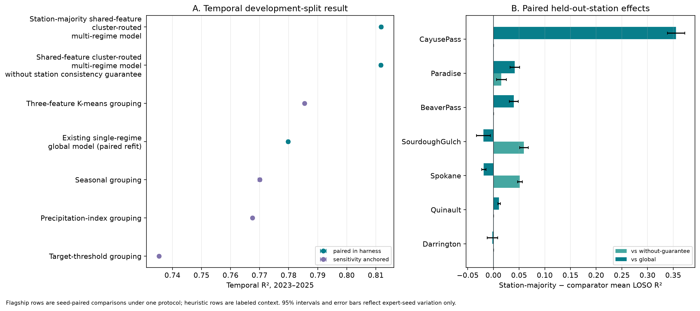
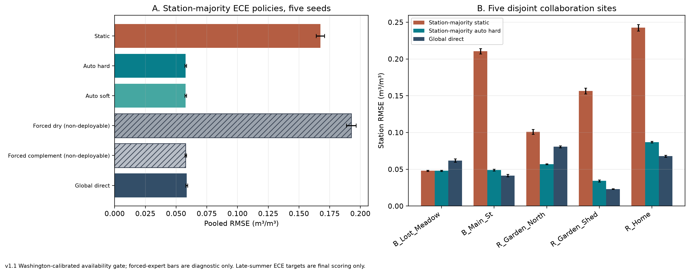
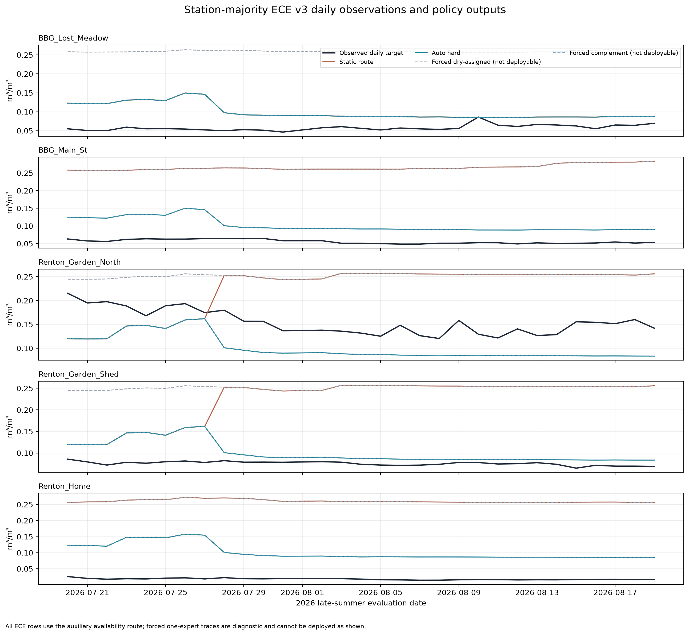

# Regional Models for Daily Soil-Moisture Estimation in Washington

## Technical report assembly 1.4 — Paper 2 handoff

> **Purpose.** This technical report supports drafting the second paper. It records the methods, results, interpretation, evidence boundaries, and source trail in one place. The assembled Markdown is the canonical text; `report.pdf` is its reading copy. It is written so an external reader can follow it without opening any other file in the repository.
>
> **Evidence rule.** This report presents the Washington temporal and leave-one-station-out (LOSO) evaluation together with the ECE station evaluation. The main comparison uses the same protocol and the same random seeds throughout, so every main gap below compares matched runs. The four simpler grouping rules are shown for context. Full details of the data sources behind each result are recorded in the claims ledger.

## 1. Executive synthesis and paper thesis

**Study question.** Does grouping daily observations by their satellite, weather, and site features, then fitting one soil-moisture predictor per group, improve estimates across Washington stations? All multi-regime models in this report share one shape — a router with k=2 sends each station-day observation to exactly one of two XGBoost predictors, with no blending — and the global comparator fits one XGBoost predictor for all observations (§4). The method under test is the **station-majority shared-feature cluster-routed multi-regime model**. It is tested twice: against the same model without the station consistency guarantee (isolating the station-majority rule), and against the existing single-regime global model (isolating grouping itself). The study evaluates which grouping signals are useful on this dataset; it does not propose a new model architecture or a universal number of groups.

**Primary finding.** The station-majority shared-feature cluster-routed multi-regime model has temporal R² **0.811843** (seed SD 0.001369; RMSE 0.044187) over 30 predictor seeds on the 2023–2025 development test period. Against the single-regime global model at R² **0.779794** (seed SD 0.001279), the difference is **+0.032049 R²**, with the station-majority model higher on all 30 seeds (30/0/0 wins/ties/losses). Against the same model without the station consistency guarantee at R² **0.811724**, the difference is **+0.000119 R²**, a near-tie. In leave-one-station-out evaluation, the station-majority model averages **0.637877 R²** versus **0.579737** for the global model, a difference of **+0.058140** across five seeds and seven held-out stations, with gains on 4 folds and losses on 3; versus **0.619877** for the model without the guarantee, the difference is **+0.018000**, with gains on 3 folds and ties on 4.

**Comparison context.** The four simpler grouping rules in Table 1 score lower in this comparison, shown for context. A grouping that learns its split from the in-situ target itself has temporal R² **0.735359**; that target is unavailable when making predictions, so it is shown only to illustrate the ceiling/cheating case. These results describe the specific methods and data evaluated here.

**ECE result.** On five ECE collaboration stations — new in-situ soil-moisture sensor sites deployed by the collaborating ECE team, disjoint from the seven Washington training stations (§8) — the station-majority shared-feature cluster-routed multi-regime model's standard K-means assignment has pooled RMSE **0.167431** because the SMAP satellite inputs it expects are entirely missing there. With a fallback assignment based on the available antecedent-precipitation index, pooled RMSE is **0.057768**, close to the global model's **0.058634**. The next sections explain how the regional groups relate to the Washington sites and how the ECE comparison should be read.

**Most important constraint for the paper.** The shared 54-feature set and XGBoost settings were influenced by the same test period used here, as were later group-assignment and model choices. Every 2023–2025 result is development-split evidence rather than untouched confirmation. A future independent time period or external dataset is needed to estimate the true advantage without this selection bias.

**Suggested working title.** “Regional Models for Soil-Moisture Estimation in Washington.” In technical sections, the method can be described as two XGBoost predictors selected by feature-based groups. The station-majority rule is one defined part of that approach.

## 2. Relationship to the first paper and literature

The first paper, [*Enhancing Spatial and Temporal Coverage of Soil Moisture Estimation Using Satellite and Weather-Driven Machine Learning*](../../paper/Enhancing%20Spatial%20and%20Temporal%20Coverage%20of%20Soil%20Moisture%20Estimation%20Using%20Satellite%20and%20Weather-%20Driven%20Machine%20Learning.pdf), established the multi-source satellite/weather pipeline, imputation, feature-engineering approach, and a global XGBoost model. Its reported R² of 0.822 is from five public Washington stations under a different dataset and evaluation protocol; it should not be ranked against the seven-station results here. The paper does not report the project's later regional-group comparisons; those remain project history rather than findings of the first paper. The first paper's DOI is [10.1109/AIIoT68874.2026.11569136](https://doi.org/10.1109/AIIoT68874.2026.11569136).

Soil-moisture MoE and regional specialization already exist. [Yang et al. (2025)](https://doi.org/10.1016/j.jhydrol.2025.133763) combine CNN–LSTM experts with adaptive weighting across Tibetan Plateau climate zones. [Zhang et al. (2026)](https://doi.org/10.3390/rs18183125) combine an antecedent-precipitation water-balance prior, a time-aware Mamba encoder, and a context-conditioned MoE for forecasting. [Singh et al. (2026)](https://doi.org/10.1029/2025JH001039) use wetness-specialized agents for surface-to-subsurface estimation; their target and protocol differ from this daily surface-estimation benchmark. [Wu et al. (2026)](https://doi.org/10.1016/j.jag.2026.105597) apply an RTE-guided MoE to passive-microwave retrieval. These are direct overlap in the use of specialized components, so architectural novelty is not the claim here.

Clustered soil-moisture models also precede this work: [Chakrabarti et al. (2016)](https://doi.org/10.1109/TGRS.2016.2547389) use soft cluster memberships and kernel regression for disaggregation; [Ding et al. (2024)](https://doi.org/10.1016/j.jag.2024.104003) use K-means-defined subregions with specialized gap-filling models; and [Stahl and McColl (2022)](https://doi.org/10.1175/JCLI-D-21-0780.1) identify global seasonal-cycle regimes. In broader hydrology, [Moges et al. (2016)](https://doi.org/10.1002/2015WR018266) use indicator-driven hierarchical model weighting, while [Rong et al. (2025)](https://doi.org/10.1016/j.jhydrol.2025.132737) compare ways of assigning observations to specialists for streamflow prediction. These studies motivate asking **which inputs determine group assignment, whether they are available when a prediction is made, and how that assignment is evaluated**, rather than claiming that clustering or specialized predictors are new. Full verified metadata is in `references.bib` and §12.

## 3. Data, target, and evaluation protocol

The study combines in-situ soil-moisture observations with satellite, weather, and site information. It uses 9803 training rows (2017–2020), 4805 validation rows (2021–2022), and 6620 later-period test rows (2023–2025). Training plus validation is 14608 rows fitted together. The prediction target is daily soil moisture at 5 cm. Source and processing details are recorded in the claims ledger and provenance manifest.

**Seven Washington study stations.** The network column identifies the source of the in-situ observations. Coordinates, elevation, and training-plus-validation row counts provide site context. No station is hand-assigned to a group anywhere in this report; grouping always comes from the fitted routers described in §4.

| Station | Data network | Lat. | Lon. | Elevation m | Trainval rows |
| --- | --- | --- | --- | --- | --- |
| Beaver Pass | SNOTEL | 48.88 | -121.26 | 1125 | 2185 |
| Cayuse Pass | SNOTEL | 46.87 | -121.53 | 1588 | 2042 |
| Darrington | NOAA USCRN | 48.54 | -121.45 | 166 | 2048 |
| Paradise | SNOTEL | 46.78 | -121.75 | 1564 | 2189 |
| Quinault | NOAA USCRN | 47.51 | -123.81 | 88 | 2160 |
| Sourdough Gulch | SNOTEL | 46.23 | -117.40 | 1164 | 2191 |
| Spokane | NOAA USCRN | 47.42 | -117.53 | 705 | 1793 |

Every model compared in this report predicts the same target — daily volumetric soil moisture at 5 cm depth (m³/m³) — from the same **54** satellite, weather, and site features (full list in Appendix A) and with the same XGBoost predictor settings (§4); the multi-regime models differ from the global model only in that daily observations are grouped before predictors are fitted, and from each other only in the assignment rule. The station-majority shared-feature cluster-routed multi-regime model uses those same features to form its groups; it does not require a separate hand-picked grouping feature set. Inputs include SMAP soil-moisture proxies, Sentinel-derived indices, weather and antecedent precipitation, terrain, climate, land cover, and temporal summaries. The grouping does not use in-situ target labels, though it does use satellite soil-moisture information. The complete feature list appears in Appendix A. The shared feature set makes the model comparison easier to interpret, while its selection using the 2023–2025 test period remains a limitation.

Temporal evaluation trains on training plus validation and evaluates the later test years at the seven known stations. In leave-one-station-out (LOSO) evaluation, the model is refit using six stations and evaluated on the seventh (seven held-out folds total); information from the held-out station is excluded from imputation, scaling, grouping, and thresholds. The global comparator used the same protocol and the same random seeds, so temporal gaps compare matched seeds and LOSO gaps compare matched seed-and-station combinations. Temporal results average 30 XGBoost seeds; LOSO results use five seeds per held-out station. The K-means router itself is fixed at seed 42 throughout.

For all analyses, R², RMSE, MAE, and bias refer to daily volumetric soil moisture at 5 cm; error metrics use m³/m³. R² measures explained variance, RMSE and MAE measure error size, bias is signed mean prediction error, and ubRMSE removes the mean bias component. Seed intervals measure variation across XGBoost predictor random seeds only (the K-means router stays at seed 42). They do not measure uncertainty from station sampling, feature selection, model selection, or reuse of the test period during development. Seed-level 95% t intervals and matched-seed differences answer different questions and should not be interchanged. Seven-station LOSO win counts are descriptive and have little inferential power.

## 4. How the regional models work

The question this paper tests is multi-regime versus single-regime: whether fitting one predictor per group beats fitting one predictor for all observations. The family under test is therefore the **shared-feature cluster-routed multi-regime model**: a K-means group router over the shared feature set with k=2 paired with one XGBoost predictor per group, so each station-day observation is handled by exactly one predictor and there is no blending across predictors. The comparator is the **existing single-regime global model**, which fits one XGBoost predictor with the same settings on all observations and performs no grouping. Two differences carry the headline numbers: station-majority versus the same model without the station consistency guarantee (isolating the rule), and station-majority versus the global model (isolating grouping itself). Hard assignment is a deployability choice rather than an accuracy claim: a soft-blend fallback policy run on the ECE set matches the hard fallback at reported precision (Table 9), so the simpler deployable rule is kept; that comparison covers only the short ECE window (§8). This contrasts with the soft-membership and adaptive-weighting designs in the literature (§2), which this study does not test.

The group count k=2 is a Washington setting, not a finding: two groups performed best on these seven stations, and the training-and-validation number-of-groups comparison behind that choice is reported in Table 5 (§7). Deployments to other regions should re-run that comparison on local data rather than assume two groups.

Fitting and prediction follow one chain. On the fit data — mean-impute, then standardize, then K-means with seed 42 and `n_init=10` — each station-day row receives a per-day group label; labels are canonicalized after each fit so the drier group, defined by the lower training-data mean of the 30-day rolling SMAP feature `SMAP_sm_pm_interp_rollmean30`, carries a consistent label (canonical group 1 here). One XGBoost predictor is then fitted per group on that group's rows. At predict time, the frozen impute-scale recipe is applied, the nearest centroid gives the per-day label, and the predictor for the row's final group produces the estimate. On the Washington fit data the two groups hold 10624 and 3984 training rows; the drier-labeled group contains Spokane and Sourdough Gulch and the other group contains Beaver Pass, Cayuse Pass, Darrington, Paradise, and Quinault. Every station sits entirely inside one group on this fit (minimum station purity 1.000), so the station-majority rule described next changes no training assignment here; it acts on refits where the partition shifts and on rows whose per-day label disagrees with their station's majority. The Washington training-data means of that SMAP feature are 0.435981 for canonical group 0 and 0.180078 for group 1, with corresponding target means 0.221648 and 0.209373; group numbers are model labels, not physical class labels. Table 6 (§7) profiles which features differ most between the groups.

Per-day K-means assignment can split one station's rows across groups, so each group-specific predictor would train on a shifting slice of that station. The station-majority rule exists to prevent that: it keeps all observations of the same station within a single regime, assigning every fitted station to its most common training-data group with ties broken toward the smaller group id, and keeping known stations together changes which training examples each predictor sees. A model fitted with that rule is the **station-majority shared-feature cluster-routed multi-regime model**; the identical model without it — every row assigned from its own features by nearest K-means centroid — is reported as the shared-feature cluster-routed multi-regime model without station consistency guarantee. The rule is the only difference between the two, so the gaps in §§5–6 (+0.000119 temporal R², +0.018000 LOSO R²) measure exactly its effect, while the gaps against the global model (+0.032049 temporal R², +0.058140 LOSO R²) measure grouping itself. For a new station or a row without a station id, assignment falls back to the per-day nearest-centroid label. Rows whose SMAP block is entirely missing, or whose overall missing-data rate exceeds the fitted gate, are flagged by an input-only availability check so the ECE shortfall (§8) can be described honestly.

The shared XGBoost predictors use 2,500 histogram trees, learning rate 0.005, depth 9, minimum child weight 8, gamma 0, alpha 0.03, lambda 0.75, row subsampling 0.9, and column subsampling 0.8. These settings were tuned during the same test era and contribute to the development-split limitation. Only the XGBoost `random_state` varies across seeds; the routers are fixed at seed 42.

| Model | Grouping inputs | Assignment rule |
| --- | --- | --- |
| station-majority shared-feature cluster-routed multi-regime model | All 54 shared features, including current, lagged, and rolling SMAP proxies | 54-feature K-means (mean-impute, standardize, seed 42, `n_init=10`) **plus station-majority rule**: a fitted station gets its most common training-data group; new/missing/gated rows use the per-day label |
| shared-feature cluster-routed multi-regime model without station consistency guarantee | Same 54 features | Same 54-feature K-means, per-day assignment for every row (no station-majority rule) |
| Existing single-regime global model | No grouping (SMAP only inside the predictor, not a grouping step) | One XGBoost on all 54 features |
| Three-feature K-means grouping | 3 time-varying features: `SMAP_sm_pm_interp_lag1`, `G_API`, `LST_modis` | K-means (k=2, standardized, mean-imputed, seed 42, `n_init=10`) |
| Seasonal grouping | Calendar month | May–Oct → group 0 (dry season), Nov–Apr → group 1 (wet season); no fitting |
| Precipitation-index grouping | Single feature `G_API` (antecedent precipitation index) | Split at the training-data median, low → group 0, high → group 1 |
| Target-threshold grouping | In-situ labels to train the gate (undeployable: labels unavailable at predict time) | XGB classifier predicts whether that day's in-situ soil moisture is below 0.16 m³/m³; at predict time it uses only features |

The first three rows use the same protocol and the same random seeds, so the main gaps in §§5–6 compare matched runs. The four simpler grouping rules are shown for context. The global model's single-regime form must not be ranked against the first paper's R² of 0.822, which used five stations and a different protocol (§2). Because the shared test period informed feature and model choices, all results here are development evidence rather than independent confirmation.

## 5. Primary temporal results

**Table 1. Temporal results on the 2023–2025 test period.** Seed SD and 95% CI show variation across the 30 XGBoost random seeds (router fixed). The first three rows use the same protocol; the four simpler-grouping rows are shown for context. RMSE, MAE, and bias are m³/m³.

| Model | Seeds | R² | Seed SD | 95% seed CI | RMSE | MAE | Bias |
| --- | --- | --- | --- | --- | --- | --- | --- |
| station-majority shared-feature cluster-routed multi-regime model | 30 | 0.8118 | 0.0014 | [0.8113, 0.8124] | 0.0442 | 0.0340 | 0.0060 |
| shared-feature cluster-routed multi-regime model without station consistency guarantee | 30 | 0.8117 | 0.0014 | [0.8112, 0.8122] | 0.0442 | 0.0340 | 0.0060 |
| Three-feature K-means grouping | 30 | 0.7855 | 0.0010 | [0.7851, 0.7858] | 0.0472 | 0.0363 | 0.0096 |
| Existing single-regime global model | 30 | 0.7798 | 0.0013 | [0.7793, 0.7803] | 0.0478 | 0.0369 | 0.0100 |
| Seasonal grouping | 30 | 0.7700 | 0.0016 | [0.7694, 0.7706] | 0.0489 | 0.0377 | 0.0107 |
| Precipitation-index grouping | 30 | 0.7676 | 0.0009 | [0.7672, 0.7679] | 0.0491 | 0.0381 | 0.0106 |
| Target-threshold grouping | 30 | 0.7354 | 0.0011 | [0.7350, 0.7358] | 0.0524 | 0.0388 | 0.0145 |

**Analysis.** The station-majority shared-feature cluster-routed multi-regime model beats the single-regime global model by +0.032049 mean R², higher on all 30 seeds (30/0/0 wins/ties/losses) — a gap roughly twenty-five times the seed SD shown above, so it is not seed noise under this development protocol. The same model without the station consistency guarantee is nearly tied with the station-majority model temporally: their mean R² difference is +0.000119, smaller than the seed SD shown above, though its direction is consistent across the 30 seeds. On the full training-plus-validation fit this is expected: every station sits entirely in one group, so the station-majority rule has almost nothing to reassign (§4). The simpler-grouping rows score lower in this comparison, shown for context.

*Figure 1.* Model comparison: the first three rows use the same protocol and seeds; simpler-grouping rows are shown for context. Error bars show predictor-seed variation, not selection uncertainty.

## 6. In-state spatial generalization: LOSO

**Table 2. Station-mean leave-one-station-out results.** Each of the first three models uses five XGBoost seeds across seven held-out Washington stations. The first three rows use the same protocol; the four simpler-grouping rows are shown for context.

| Model | Seeds × held-out sites | Station-mean R² | Station-mean RMSE |
| --- | --- | --- | --- |
| station-majority shared-feature cluster-routed multi-regime model | 5 × 7 | 0.6379 | 0.0558 |
| shared-feature cluster-routed multi-regime model without station consistency guarantee | 5 × 7 | 0.6199 | 0.0571 |
| Existing single-regime global model | 5 × 7 | 0.5797 | 0.0610 |
| Three-feature K-means grouping | 5 × 7 | 0.5627 | 0.0624 |
| Seasonal grouping | 5 × 7 | 0.5744 | 0.0619 |
| Precipitation-index grouping | 5 × 7 | 0.5490 | 0.0634 |
| Target-threshold grouping | 5 × 7 | 0.4906 | 0.0667 |

**Analysis.** The station-majority shared-feature cluster-routed multi-regime model's mean advantage over the global model is +0.058140 R², with gains on 4 held-out stations and losses on 3 (24/0/11 wins/ties/losses across the 35 seed-fold combinations). Its mean advantage over the same model without the station consistency guarantee is +0.018000 R², with improvements on 3 held-out stations and ties on 4. The simpler-grouping rows score lower on station-mean R² in this comparison, shown for context. With seven stations, fold counts describe this set of locations and are not population estimates.

**Table 3. LOSO results by held-out station, station-majority versus global.** Each row compares the two models on the same five seeds at one held-out station; wins/ties/losses count seeds where the station-majority model scored higher, equal, or lower.

| Held-out station | Station-majority shared-feature cluster-routed multi-regime model R² | Existing single-regime global model R² | Difference (5-seed mean) | Wins / ties / losses (5 seeds) |
| --- | --- | --- | --- | --- |
| Cayuse Pass | 0.6862 | 0.3309 | +0.3553 | 5/0/0 |
| Paradise | 0.7800 | 0.7384 | +0.0415 | 5/0/0 |
| Beaver Pass | 0.7531 | 0.7135 | +0.0396 | 5/0/0 |
| Quinault | 0.5729 | 0.5619 | +0.0110 | 5/0/0 |
| Darrington | 0.6949 | 0.6970 | -0.0021 | 3/0/2 |
| Spokane | 0.6083 | 0.6271 | -0.0189 | 0/0/5 |
| Sourdough Gulch | 0.3699 | 0.3894 | -0.0195 | 1/0/4 |

**Analysis.** The largest gain is the Cayuse Pass holdout (+0.3553, 5/0/0), where the global predictor transfers poorly and the regional predictor holds; Beaver Pass, Paradise, and Quinault also favor the station-majority model on all five seeds. Three holdouts favor the global model: Spokane (0/0/5) and Sourdough Gulch (1/0/4), the two eastern-Washington stations whose group loses its training representatives when either is held out, and Darrington narrowly (3/0/2). The station-majority rule changes which training observations each group-specific predictor sees; it does not assign a fixed group to a station that was left out. These comparisons describe model behavior and do not establish a geophysical cause.

**Table 4. LOSO results by held-out station, station-majority versus without-guarantee.** The two agreement columns are adjusted Rand index (ARI) scores between alternative training-set partitions: higher means the two procedures divided the six training stations more similarly. Lower agreement means the group assignments changed more after refitting.

| Held-out station | Station-majority shared-feature cluster-routed multi-regime model R² | shared-feature cluster-routed multi-regime model without station consistency guarantee R² | Difference | Wins / ties (5 seeds) | Train-group agreement: older 50-feat. vs 54-feat. | Train-group agreement: with vs without station consistency guarantee |
| --- | --- | --- | --- | --- | --- | --- |
| Sourdough Gulch | 0.3699 | 0.3108 | +0.0591 | 5/0 | 0.132 | 0.349 |
| Spokane | 0.6083 | 0.5568 | +0.0514 | 5/0 | 0.192 | 0.330 |
| Paradise | 0.7800 | 0.7645 | +0.0154 | 5/0 | 0.990 | 0.990 |
| Beaver Pass | 0.7531 | 0.7531 | +0.0000 | 0/5 | 1.000 | 1.000 |
| Cayuse Pass | 0.6862 | 0.6862 | +0.0000 | 0/5 | 1.000 | 1.000 |
| Darrington | 0.6949 | 0.6949 | +0.0000 | 0/5 | 1.000 | 1.000 |
| Quinault | 0.5729 | 0.5729 | +0.0000 | 0/5 | 1.000 | 1.000 |

**Analysis.** The largest gains occur for the Sourdough Gulch and Spokane holdouts, where refitting changes how the six training stations are divided. For a held-out station, predictions still use its row-level features. Paradise has a smaller gain. The 4 tied folds show locations where the rule did not change the observed result. These comparisons describe model behavior and do not establish a geophysical cause.

## 7. Partition diagnostics and feature interpretation

**Table 5. Number-of-groups comparison using training and validation data.** Lower Davies–Bouldin and higher Calinski–Harabasz favor two groups here; silhouette is slightly higher at three. The Calinski–Harabasz index compares between-group spread to within-group spread (higher means more compact, better-separated groups); the Davies–Bouldin index averages each group's similarity to its most similar group (lower means better separated). These summary measures do not establish physical meaning or the best choice for future data. Deployments to other regions should re-run this comparison on local data rather than assume two groups.

| Number of groups | Silhouette | Calinski–Harabasz | Davies–Bouldin | Trainval station agreement | Smallest group share |
| --- | --- | --- | --- | --- | --- |
| 2 | 0.219 | 3880.9 | 1.579 | 1.000 | 0.273 |
| 3 | 0.226 | 3589.4 | 1.815 | 0.833 | 0.264 |
| 4 | 0.188 | 2855.0 | 2.015 | 0.695 | 0.147 |

For the seven Washington stations (membership stated in §4), this is a sample-specific pattern across the Cascade side and eastern Washington. The five-station group includes both lower-elevation sites and mountain sites, so the groups are not a strict mountain-versus-lowland split. The station-majority shared-feature cluster-routed multi-regime model keeps known stations in one group by design; this consistency is a model rule rather than independent evidence of a physical classification.

**Table 6. Features that differ most between the two groups.** Separation index is a 0–1 group-difference score (1 = groups do not overlap on that feature); the target itself is excluded from the ranking. Profile attributes need not be router inputs — this table profiles what the groups look like, not what the K-means saw.

| Feature | Separation index | Median c0 | Median c1 |
| --- | --- | --- | --- |
| longitude | 1.000 | -121.534 | -117.400 |
| J_bio_bio13 | 1.000 | 391.000 | 70.000 |
| SMAP_sm_pm_interp | 0.932 | 0.414 | 0.192 |
| latitude | 0.642 | 47.510 | 46.233 |
| G_API | 0.551 | 47.459 | 14.936 |
| J_lc_code | 0.550 | 10.000 | 30.000 |
| G_rain_sum_7d | 0.424 | 30.100 | 9.500 |
| J_soil_texture_usda_b0 | 0.398 | 7.000 | 7.000 |
| LST_modis | 0.384 | 280.944 | 291.242 |
| F_NDVI | 0.326 | 0.532 | 0.330 |

**Analysis.** The groups also differ in site descriptors (longitude, precipitation climatology, land cover), satellite soil-moisture summaries, vegetation and temperature features, and antecedent weather. These associations help explain why the regional predictors see different inputs. In this study, the useful interpretation is a broad western/Cascade-side versus eastern-Washington pattern that also reflects elevation and local conditions. It describes these stations and does not define universal physical regimes.

## 8. Regional model interpretation at ECE stations

The station-majority shared-feature cluster-routed multi-regime model (§4) fits one soil-moisture predictor per Washington group. This is a sample-specific pattern that overlaps imperfectly with elevation: the five-station group includes both lower-elevation and mountain stations. The groups should not be read as a general mountain-versus-lowland classification.

The five ECE collaboration stations are new in-situ sensor sites deployed by the collaborating ECE team, disjoint from and outside the seven-station Washington training set, so the results show how the learned predictors behave at new sites. The ECE set contains 150 daily observations from 5 stations between 2026-07-20 and 2026-08-19, with 30 observations per site. It is a short late-summer evaluation window; the site-level results show how errors vary across those locations.

The ECE observations contain none of the SMAP features used in the standard Washington grouping (100% SMAP missing rate on the 150 rows). We therefore report the standard K-means assignment alongside a fallback assignment based on the available antecedent-precipitation index (`G_API`): split at the Washington-fit median, low → the Washington-drier predictor, high → the other predictor. Which fallback direction to use was fixed on SMAP-masked Washington validation data before scoring any ECE target; ECE targets were used only to score predictions. Single-predictor rows (run one Washington predictor on every ECE row) are non-deployable references that show what each predictor does on its own.

For the station-majority shared-feature cluster-routed multi-regime model, Washington fit data associates the western/Cascade-side stations with one predictor and Spokane plus Sourdough Gulch with the other. In the ECE tables, predictor indices 0 and 1 refer to the two fitted predictors within each model; those indices do not assign universal climate labels to ECE stations.

**Table 7. Mapping the precipitation-based fallback to each model's predictors.** Predictor indices are specific to each model fit; they are not climate labels. The fixed single-predictor rows are non-deployable references.

| Model | Precipitation class 0 → predictor | Class 1 → predictor | Fixed comparator predictor | Other predictor | Comparator usable from inputs? | Index with lower WA SMAP mean? |
| --- | --- | --- | --- | --- | --- | --- |
| shared-feature cluster-routed multi-regime model without station consistency guarantee | index 0 | index 1 | index 0 | index 1 | no | no |
| station-majority shared-feature cluster-routed multi-regime model | index 0 | index 1 | index 1 | index 0 | no | yes |

In the Washington fit data, the mean of `SMAP_sm_pm_interp_rollmean30` is 0.435981 in one group and 0.180078 in the other; corresponding target means are 0.221648 and 0.209373. These summaries describe the fitted groups; group numbers are model labels, not physical class labels.

**Table 8. Fallback mapping chosen using Washington validation.** The lower-RMSE mapping was fixed before scoring ECE observations; an exact tie would select class 0 → predictor index 0.

| Precipitation class 0 → | Precipitation class 1 → | WA validation RMSE | Chosen for ECE |
| --- | --- | --- | --- |
| index 0 | index 1 | 0.073965 | yes |
| index 1 | index 0 | 0.117180 | no |

**Table 9. Pooled ECE results over five predictor seeds (station-majority shared-feature cluster-routed multi-regime model + references).** Error metrics are m³/m³. R² is omitted because target variance is very small over this short window. The deployable rows of the same model without the station consistency guarantee are bit-identical to the station-majority shared-feature cluster-routed multi-regime model's on this ECE set (standard RMSE 0.167431, fallback RMSE 0.057768), so they are stated here rather than repeated as extra rows; the soft-blend fallback matches the hard fallback at reported precision and is omitted. "Usable from observed inputs?" marks deployable assignments versus single-predictor diagnostic references.

| Model | Assignment or reference | Usable from observed inputs? | RMSE ± seed SD | MAE | Bias | ubRMSE |
| --- | --- | --- | --- | --- | --- | --- |
| station-majority shared-feature cluster-routed multi-regime model | Usual fitted assignment | yes | 0.167431 ± 0.003401 | 0.147346 | +0.141932 | 0.088816 |
| station-majority shared-feature cluster-routed multi-regime model | Precipitation-based assignment | yes | 0.057768 ± 0.000617 | 0.050167 | +0.028654 | 0.050158 |
| station-majority shared-feature cluster-routed multi-regime model | Single regime predictor 1 (reference) | no | 0.192536 ± 0.004021 | 0.185650 | +0.185650 | 0.051020 |
| station-majority shared-feature cluster-routed multi-regime model | Single regime predictor 0 (reference) | no | 0.057768 ± 0.000617 | 0.050167 | +0.028654 | 0.050158 |
| Existing single-regime global model | Single global predictor | yes | 0.058634 ± 0.000735 | 0.050623 | +0.015122 | 0.056635 |

**Analysis.** The precipitation-based fallback reduces pooled RMSE relative to the standard K-means assignment by 0.109663 m³/m³. Its RMSE is 0.057768, close to the global model's 0.058634 (difference -0.000866). All 150 rows fall in precipitation class 0. Under the mapping chosen with Washington validation, that class points to the Washington-wetter predictor. Its result matches that predictor run alone (RMSE 0.057768); the other predictor run alone has RMSE 0.192536. In other words, on this short late-summer ECE window the fallback test exercises only one of the two regime predictors — it checks whether that predictor transfers, not whether the two-predictor system beats the global model.

**Table 10. ECE station-level errors and site context.** Elevation and annual precipitation describe the sites; they do not explain model error by themselves. The final column summarizes the fallback assignment's weight on the fixed comparison predictor (0.000 at every site: every ECE row took the same branch).

| ECE station | Elev. m | Annual precip. descriptor mm | Usual-assignment RMSE | Precipitation-assignment RMSE | Single-regime global RMSE | Precipitation-assignment bias | Weight on comparator predictor |
| --- | --- | --- | --- | --- | --- | --- | --- |
| Bellevue Botanical Garden Lost Meadow | 52 | 1019 | 0.0480 | 0.0480 | 0.0619 | +0.0415 | 0.000 |
| Bellevue Botanical Garden Main Street | 51 | 1018 | 0.2105 | 0.0490 | 0.0414 | +0.0464 | 0.000 |
| Renton Garden North | 157 | 1227 | 0.1009 | 0.0569 | 0.0806 | -0.0537 | 0.000 |
| Renton Garden Shed | 157 | 1227 | 0.1566 | 0.0342 | 0.0232 | +0.0252 | 0.000 |
| Renton Home | 136 | 1181 | 0.2425 | 0.0870 | 0.0678 | +0.0839 | 0.000 |

**Analysis.** Errors vary across the five sites, so the pooled result does not describe every location. This short evaluation helps interpret the regional predictors and their assignments at new stations. Its Washington-selected mapping and late-summer observations do not establish full-season performance or a universal regime definition. ECE targets did not determine the mapping.

*Figure 2.* ECE pooled and station-level RMSE, labeled with the model names stated in the text. Its fixed single-predictor bars are model-specific diagnostic references, not deployable assignments.

*Figure 3.* Daily observations and model predictions at the five ECE stations, labeled with the model names stated in the text. Fixed single-predictor traces are model-specific diagnostic references.

An earlier comparison of a 50-feature multi-regime variant and the existing single-regime global model was effectively tied: station-mean ΔRMSE (variant minus global) +0.000250, with 2 / 5 station wins and sign-test p=1.000. A separate hourly analysis found median within-day sensor range 0.0349 versus median absolute day-to-day daily-target step 0.0025 in its focus windows. These observations help describe the daily measurement setting; the ECE results here remain a short, site-specific view of the Washington models.

## 9. Robustness, negative evidence, and limits

The station-majority shared-feature cluster-routed multi-regime model uses the shared feature set described in §4.

**Out-of-state comparison (one paragraph, details in ledger).** Earlier Washington-trained 54-feature multi-regime and comparator configurations evaluated on ten out-of-state stations all have negative station-mean R² (table in the claims ledger source below); the two-group variants show no reliable transfer beyond the region. These are not results for the station-majority shared-feature cluster-routed multi-regime model, so they appear here as a scope boundary, not a result table.

| Earlier model or grouping | 10-station mean R² | 10-station mean RMSE | Pooled R² |
| --- | --- | --- | --- |
| Earlier global baseline (50 features) | -0.457 | 0.087 | 0.1799 ± 0.0053 |
| shared-feature cluster-routed multi-regime model without station consistency guarantee (54 features) | -0.527 | 0.088 | 0.1325 ± 0.0044 |
| Seasonal grouping | -0.517 | 0.087 | 0.1613 ± 0.0059 |
| Precipitation-index grouping | -0.729 | 0.090 | 0.0899 ± 0.0087 |
| Existing single-regime global model (54 features) | -0.429 | 0.085 | 0.2060 ± 0.0047 |
| Three-feature K-means grouping | -0.561 | 0.089 | 0.1380 ± 0.0063 |
| Target-threshold grouping | -0.765 | 0.095 | 0.0485 ± 0.0060 |

**Interpretation.** The results support evaluating regional predictors for within-Washington differences under this development protocol. The out-of-state table shows that the current models do not establish transfer to other regions. Snowpack-dominated sites and missing snow-water-equivalent information are areas for future model development.

**Selection and inference limits.** Seven held-out stations provide a small spatial sample. Temporal seed intervals measure XGBoost fitting variation; they do not include uncertainty from station sampling or feature and model selection. The shared features, XGBoost settings, and some model choices were informed by the 2023–2025 test period, so the scores are development evidence. The station-majority rule applies to known stations; for new stations, predictions use row-level grouping. The ECE evaluation covers five separate stations over a short late-summer window, with a fallback mapping selected using Washington validation. It helps interpret the model behavior at those sites but does not establish broader seasonal or geographic transfer. An older summary file reports the LOSO global mean as 0.5795, but the mean of that file's own seed rows is 0.579737, reproduced exactly by the paired refit; this report uses 0.579737 throughout.

## 10. Paper contribution decisions and writing guidance

1. **Introduce the models in plain language.** Explain the multi-regime idea, the two XGBoost predictors, the single-regime global comparator, and the station-majority rule before using any implementation names.
2. **Lead with the two main results.** Report the temporal and LOSO differences for the station-majority shared-feature cluster-routed multi-regime model versus the global model together with the comparison against the same model without the station-consistency rule: grouping itself gains +0.032049 temporal R² (30/0 seeds) and +0.058140 LOSO R²; the station-majority rule adds +0.000119 temporal and +0.018000 LOSO over the same model without it. Present the simpler grouping rows as additional context. Report fold-level wins and losses honestly — three LOSO folds favor the global model.
3. **Explain the Washington groups.** Describe the five west/Cascade-side stations and two eastern stations as a sample-specific pattern, with the mountain and lowland context stated accurately.
4. **Use the ECE section to interpret model behavior.** Explain the SMAP shortfall, the Washington-selected precipitation fallback, pooled and site-level errors, and the daily overlay — including the fact that all 150 ECE rows took the same fallback branch. Keep the small sample and short window in view.
5. **State the development-split status in abstract, results, and limitations.** Independent confirmation requires new dates or sites and a selection protocol that keeps final evaluation untouched. Future work can test the number of groups, an evaluated global fallback for ECE routing, more station types and snowpack features, full-season ECE data, and broader geographic transfer.

**Proposed paper spine.** Introduction: the estimation question after the first paper. Related work: regional soil-moisture models. Methods: data, shared predictors, the multi-regime model, and the global comparison. Results: temporal performance, held-out station performance, and group interpretation. Discussion: behavior at ECE stations, reliance on satellite and weather inputs, selection limits, and scope. Conclusion: a bounded finding about regional models for Washington stations.

## 11. Reproducibility and evidence trail

`scripts/assemble_report.py` reads the saved evidence and inserts result values into the report and claims ledger. `provenance/source_manifest.json` records exact source paths, run identities, and SHA-256 hashes. `scripts/validate_assembly.py` checks source schemas, paired seed and station coverage, the station-network mapping, paired Global provenance and seed alignment, ECE mapping provenance, figures, links, and deterministic regeneration. The ECE figures reuse the existing report notebook and saved tables; the temporal/LOSO figure is regenerated from the paired evaluation tables by the versioned notebook at `notebooks/report_figures.ipynb`. No model training, split regeneration, or edits to versioned notebooks are required.

The claims ledger distinguishes **confirmed within the saved protocol**, **evaluation-only**, and **unresolved**. A confirmed number does not imply independent test confirmation. The ledger and manifest preserve the exact source artifacts for audit, while this report presents the results in one reader-facing account.

## 12. References

1. Balkovec, J., et al. *Enhancing Spatial and Temporal Coverage of Soil Moisture Estimation Using Satellite and Weather-Driven Machine Learning.* In *2026 IEEE World AI IoT Congress (AIIoT)*. [doi:10.1109/AIIoT68874.2026.11569136](https://doi.org/10.1109/AIIoT68874.2026.11569136); [repository PDF](../../paper/Enhancing%20Spatial%20and%20Temporal%20Coverage%20of%20Soil%20Moisture%20Estimation%20Using%20Satellite%20and%20Weather-%20Driven%20Machine%20Learning.pdf). Historical context for the pipeline and global model.
2. Yang, J., Yang, Q., Hu, F., and Shao, J. (2025). “An Interpretable Framework of Soil Moisture Estimation Based on Mixture-of-Experts (ISMoE): A Case Study on the Tibetan Plateau.” *Journal of Hydrology* 661, 133763. [doi:10.1016/j.jhydrol.2025.133763](https://doi.org/10.1016/j.jhydrol.2025.133763).
3. Zhang, Z., Mao, K., Yuan, Z., and Bateni, S. M. (2026). “An Antecedent-Precipitation-Informed Soil Water Balance and Time-Aware Mamba–MoE Framework for Surface Soil Moisture Forecasting.” *Remote Sensing* 18(18), 3125. [doi:10.3390/rs18183125](https://doi.org/10.3390/rs18183125).
4. Singh, A., Singh, V., and Gaurav, K. (2026). “Weak Physics-Guided Multi-Agent Learning for Surface to Subsurface Moisture Estimation Across Diverse Climate and Soil Conditions.” *JGR: Machine Learning and Computation* 3, e2025JH001039. [doi:10.1029/2025JH001039](https://doi.org/10.1029/2025JH001039).
5. Wu, Y., Mao, K., Shi, J., Guo, Z., and Bateni, S. M. (2026). “An RTE-Guided Mixture-of-Experts Framework for AMSR2 Passive Microwave Soil Moisture Retrieval.” *International Journal of Applied Earth Observation and Geoinformation* 154, 105597. [doi:10.1016/j.jag.2026.105597](https://doi.org/10.1016/j.jag.2026.105597).
6. Chakrabarti, S., Judge, J., Bongiovanni, T., Rangarajan, A., and Ranka, S. (2016). “Disaggregation of Remotely Sensed Soil Moisture in Heterogeneous Landscapes Using Holistic Structure-Based Models.” *IEEE TGRS* 54(8), 4629–4641. [doi:10.1109/TGRS.2016.2547389](https://doi.org/10.1109/TGRS.2016.2547389).
7. Ding, T., Zhao, W., and Yang, Y. (2024). “Addressing Spatial Gaps in ESA CCI Soil Moisture Product: A Hierarchical Reconstruction Approach Using Deep Learning Model.” *International Journal of Applied Earth Observation and Geoinformation* 132, 104003. [doi:10.1016/j.jag.2024.104003](https://doi.org/10.1016/j.jag.2024.104003).
8. Stahl, M. O., and McColl, K. A. (2022). “The Seasonal Cycle of Surface Soil Moisture.” *Journal of Climate* 35, 4997–5012. [doi:10.1175/JCLI-D-21-0780.1](https://doi.org/10.1175/JCLI-D-21-0780.1).
9. Moges, E., Demissie, Y., and Li, H.-Y. (2016). “Hierarchical Mixture of Experts and Diagnostic Modeling Approach to Reduce Hydrologic Model Structural Uncertainty.” *Water Resources Research* 52, 2551–2570. [doi:10.1002/2015WR018266](https://doi.org/10.1002/2015WR018266).
10. Rong, Z., Sun, W., Xie, Y., Huang, Z., and Chen, X. (2025). “Mixture of Experts Leveraging Informer and LSTM Variants for Enhanced Daily Streamflow Forecasting.” *Journal of Hydrology*, 132737. [doi:10.1016/j.jhydrol.2025.132737](https://doi.org/10.1016/j.jhydrol.2025.132737).
11. Chen, T., and Guestrin, C. (2016). “XGBoost: A Scalable Tree Boosting System.” *Proceedings of KDD*. [doi:10.1145/2939672.2939785](https://doi.org/10.1145/2939672.2939785).

## Appendix A. Exact shared 54-feature backbone

The 54 features are grouped below by theme so the list reads as model inputs rather than a name dump. Names are exact pipeline identifiers (backticked); the one-line gloss says what each feature measures. Name prefixes encode the transform family: `V_` rolling-window statistics, `A_` changes and slopes, `C_` lags and memory, `D_` seasonal or spectral transforms, `E_` radar physics, `G_` hydrologic and weather inputs, `J_` static site descriptors, `F_` optical indices, and bare `SMAP_` satellite soil moisture. A `_kobsK` window covers the last K valid observations, not calendar days, which keeps rolling statistics stable across satellite revisit and cloud gaps.

**Precipitation and hydrologic memory (6 features).** Rain actually observed at the station, plus decaying memory of past rain.

- `precip_mm`: daily ERA5-Land precipitation at the station point (mm)
- `G_API`: antecedent precipitation index: exponentially decayed rain memory
- `G_DSLR`: days since last rain: dry-down duration
- `G_rain_sum_3d`: calendar 3-day cumulative rainfall (true days)
- `G_rain_sum_7d`: calendar 7-day cumulative rainfall (true days)
- `V_rollrng_G_API_kobs7`: rolling range of API over the last 7 observations

**Satellite soil moisture - SMAP (12 features).** Coarse satellite moisture and its recent history, the grouping's main signal.

- `SMAP_sm_pm_interp`: SMAP evening-pass soil moisture, gap-filled to daily
- `SMAP_sm_pm_interp_lag7`: evening SMAP value shifted back 7 days
- `SMAP_sm_pm_interp_lag30`: evening SMAP value shifted back 30 days
- `SMAP_sm_pm_interp_rollrange7`: 7-day rolling range of evening SMAP
- `SMAP_sm_pm_interp_rollmean30`: 30-day rolling mean of evening SMAP
- `SMAP_sm_pm_interp_rollrange30`: 30-day rolling range of evening SMAP
- `SMAP_sm_interp_rollrange7`: 7-day rolling range of combined AM+PM SMAP
- `SMAP_ampm_diff_interp`: morning-minus-evening SMAP: diurnal dry-down signal
- `A_d_SMAP_sm_interp_kobs30`: 30-observation first difference of combined SMAP: wetting/drying step
- `V_rollmin_SMAP_sm_interp_kobs14`: rolling minimum of combined SMAP over 14 observations
- `V_rollmin_SMAP_sm_interp_kobs30`: rolling minimum of combined SMAP over 30 observations
- `SMAP_x_year`: SMAP-by-year interaction: long-term sensor drift term

**Radar - Sentinel-1 SAR (10 features).** Microwave backscatter physics and its recent volatility.

- `E_SAR_ratio`: VV/VH backscatter ratio: vegetation/soil-moisture sensitive
- `A_d_E_SAR_ratio_kobs30`: 30-observation first difference of the SAR ratio
- `V_rollmax_E_SAR_ratio_kobs7`: rolling maximum of the SAR ratio over 7 observations
- `V_rollmin_E_SAR_ratio_kobs30`: rolling minimum of the SAR ratio over 30 observations
- `V_rollmax_E_SAR_ratio_kobs30`: rolling maximum of the SAR ratio over 30 observations
- `A_grad_E_SAR_diff_kobs30`: linear slope of the VV-minus-VH difference over 30 observations
- `V_rollmax_E_SAR_diff_kobs14`: rolling maximum of the SAR difference over 14 observations
- `V_rollrng_E_SAR_diff_kobs30`: rolling range of the SAR difference over 30 observations
- `V_rollmax_E_SAR_diff_kobs30`: rolling maximum of the SAR difference over 30 observations
- `E_rough_s1_vh_kobs14`: surface-roughness proxy: rolling variability of VH backscatter over 14 observations

**Vegetation and optical - Sentinel-2 (12 features).** Greenness, canopy water, and shortwave-infrared moisture bands.

- `s2_b4`: Sentinel-2 Red band B4 (665 nm) surface reflectance
- `s2_b8`: Sentinel-2 near-infrared band B8 (842 nm) surface reflectance
- `A_grad_s2_b11_kobs30`: slope of SWIR1 B11 (1610 nm) over 30 observations: moisture trend
- `V_rollrng_s2_b11_kobs30`: rolling range of B11 over 30 observations
- `V_rollmin_s2_b11_kobs30`: rolling minimum of B11 over 30 observations
- `V_rollmin_s2_b12_kobs30`: rolling minimum of SWIR2 B12 (2190 nm) over 30 observations
- `V_rollmax_F_NDMI_kobs30`: rolling maximum of NDMI (NIR-SWIR canopy-water index) over 30 observations
- `V_rollmax_F_NDVI_kobs14`: rolling maximum of NDVI (red-NIR greenness) over 14 observations
- `V_rollmax_F_NDVI_kobs30`: rolling maximum of NDVI over 30 observations
- `V_ema_F_NDVI_kobs30`: exponential moving average of NDVI over 30 observations
- `C_lag_F_NDVI_kobs30`: NDVI value lagged 30 observations
- `D_z_F_NDMI`: seasonal z-score anomaly of NDMI vs its monthly climatology

**Land-surface temperature (5 features).** MODIS temperature level, anomaly, and periodicity.

- `V_rollmin_LST_modis_kobs30`: rolling minimum of MODIS land-surface temperature over 30 observations: cold extreme
- `V_ema_LST_modis_kobs30`: exponential moving average of land-surface temperature over 30 observations
- `D_z_LST_modis`: seasonal z-score anomaly of land-surface temperature
- `D_fft_dom_LST_modis_kobs30`: dominant Fourier frequency of temperature over 30 observations: periodicity
- `D_fft_ent_LST_modis_kobs30`: spectral entropy of temperature over 30 observations: signal complexity

**Calendar and seasonal cycle (4 features).** Where the day sits in the annual and multi-year cycle.

- `D_sin_DOY`: sine of day-of-year: seasonal cycle phase
- `D_cos_DOY`: cosine of day-of-year: seasonal cycle quadrature
- `sin_year`: sine of fractional year: multi-year cyclic trend
- `cos_year`: cosine of fractional year: multi-year quadrature

**Static site descriptors (5 features).** Terrain, climate normals, land cover, and soil at the station (no time variation).

- `J_aspect_deg`: SRTM terrain aspect in degrees at the station
- `J_bio_bio02`: WorldClim mean diurnal temperature range (1970-2000 normals)
- `J_bio_bio13`: WorldClim precipitation of wettest month (1970-2000 normals)
- `J_lc_code`: land-cover class code (ESA WorldCover/NLCD)
- `J_soil_texture_usda_b0`: FAO HWSD USDA soil-texture class at the surface
